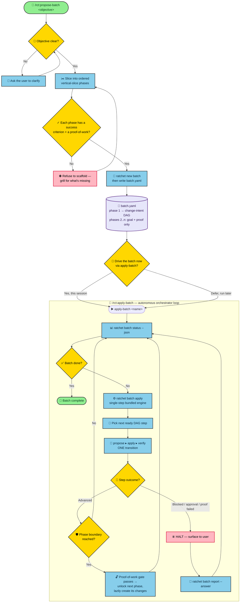

<p align="center">
  
</p>

<h1 align="center">ratchet</h1>

**AI-native, BDD-flavored spec-driven development.** A lightweight CLI that lets you and your coding agent agree on *behavior* — written as executable [Gherkin](https://cucumber.io/docs/gherkin/) — before any code is written, then drive the change from proposal to merged spec.

ratchet keeps a lean, behavior-first model: every change is just **two artifacts** — feature files and a plan — and completed work ratchets forward into a permanent, living feature store.

📖 **Read the documentation at:  [ratchet-ai.dev](https://ratchet-ai.dev/)**

```
You: /rct:propose add dark mode
AI:  Created .ratchet/changes/add-dark-mode/
     ✓ features/theming/dark-mode.feature   — behavior as Given/When/Then
     ✓ plan.md                              — why, what, design, tasks
     Ready for implementation.

You: /rct:apply
AI:  ✓ 1.1 Add theme context provider
     ✓ 1.2 Wire up the toggle + persistence
     All tasks complete.

You: /rct:archive
AI:  Synced features → .ratchet/features/theming/dark-mode.feature
     Archived to .ratchet/changes/archive/2026-06-05-add-dark-mode/
```

---

## Why ratchet?

AI coding assistants are powerful but unpredictable when the spec lives only in chat history. ratchet adds a thin spec layer so intent is explicit and verifiable:

- **Behavior is the contract.** Requirements are Gherkin scenarios (`Given/When/Then`) — concrete, testable, and unambiguous for both humans and agents.
- **Two artifacts, no ceremony.** A change is `features/` + `plan.md`. That's it.
- **From fuzzy idea to spec.** Not sure of the shape yet? `/rct:brainstorm` explores the project, clarifies one question at a time, weighs 2–3 approaches, and designs the change with you — then recommends and routes into `propose` (one change) or `propose-batch` (a phased effort).
- **A living spec that ratchets forward.** Archiving a change copies its features into a permanent `.ratchet/features/` store — your project's always-current behavioral spec.
- **Big work ships in phases, not waterfalls.** [Batch orchestration](#batch-orchestration) slices an objective into ordered vertical-slice phases, each gated by an executable proof-of-work, and drives them to completion autonomously — changes are created lazily as the batch advances.
- **The spec is also a regression suite.** [`ratchet eval`](#eval-suite) turns your `.feature` files into a scored, baseline-diffed eval run, judged against fixtures by the bundled engine — so behavior that passes today can't silently regress.
- **Works with the tools you already use.** Slash commands and skills for Claude Code, OpenCode, Cursor, GitHub Copilot, and Codex.

## The model

Each change has exactly two artifacts, with a clear dependency:

```
features/**/*.feature  ──▶  plan.md  ──▶  apply  ──▶  archive
   (Gherkin behavior)      (why+what         (tasks         (whole-file copy into
                            +design+tasks)    tracked)        .ratchet/features/)
```

- **`features/`** — one or more Gherkin `.feature` files, grouped by capability (`features/<capability>/<name>.feature`). Each scenario must have at least one `Given`, one `When`, and one `Then`.
- **`plan.md`** — a single document combining `## Why`, `## What Changes`, `## Design`, and a `## Tasks` checklist. The apply phase tracks progress by reading the `- [ ]` boxes here.
- **`apply`** requires `plan`; it implements against the scenarios and checks off tasks.
- **`archive`** validates, copies the change's features into the permanent store (add / overwrite by path, or remove via a `features/.deleted` tombstone), and moves the change into `changes/archive/<date>-<name>/`.

### Batches: the propose → apply loop

A single change is one trip through `propose → apply → archive`. A **batch**
composes many such trips into a phased program of work, driven by two workflows
that bracket the same loop — see [Batch orchestration](#batch-orchestration) for
the full picture.

```
/rct:propose-batch  ──▶  batch.yaml  ──▶  /rct:apply-batch  ──▶  done
  (author manifest:        (manifest of      (autonomous loop)
   phases + proofs,          intent)
   shallow DAG)                │
                              ╭┘
   ┌──────────────────────────▼──────────────────────────────┐
   │  loop until the batch is done:                           │
   │    batch status   → read live phase/DAG state            │
   │    batch apply    → advance ONE step (propose▸apply▸      │
   │                     verify for one ready change)          │
   │    halt?  ─ blocked / awaiting-approval / proof failed ─┐ │
   │             → surface to user → batch report → resume   │ │
   └─────────────────────────────────────────────────────────┘
```

- **`/rct:propose-batch`** is guided, anti-waterfall authoring: it explores the
  objective, slices it into ordered **vertical-slice** phases, **hard-gates**
  every phase on a success criterion + an executable proof-of-work, and writes
  the manifest with a **shallow DAG** — only phase one is decomposed into change
  intents. Its sole artifact is `batch.yaml`; it creates no change directories.
- **`/rct:apply-batch`** is the autonomous orchestrator. It **loops** the
  single-step `ratchet batch apply` — read status → advance one transition
  (`propose → apply → verify` for one ready DAG step) → interpret the outcome —
  until the batch is done. It does **no coding itself** (only `ratchet` CLI
  commands), runs autonomously between halts, and on a halt (blocked /
  awaiting-approval / proof-of-work failure) **stops**, surfaces it, records your
  answer via `ratchet batch report`, and resumes. Changes are created **lazily**
  as the loop reaches them.

### Standards

Standards are project-level guidelines kept at `.ratchet/standards/*.md` — a sibling of the feature store, **not** a per-change artifact. A standard can cover any concern (testing, security, architecture, design, …). `ratchet init` creates the directory empty; author standards with `/rct:propose-standard`.

Ratchet's own repository ships a **`testing` standard** that codifies its test pyramid, what to test where, a 95% minimum line-coverage floor, and its fixture / end-to-end test patterns — see the [Testing standard](https://ratchet-ai.dev/standards/testing) Reference page (`docs/standards/testing.md`).

Each standard carries a stable **`tag`** in its frontmatter (`tag: security`); the tag falls back to the file name when omitted. The tag — not the file name — is how changes and features reference a standard, so a standard can be renamed without breaking links. Tags must be unique across the library (`validate` errors on a duplicate).

Standards are loaded automatically where the agent has discretion:

- **propose** reads the active standards, bakes the applicable ones into `plan.md` (Design + Tasks) and the features, and records the tags the change follows as `standards: [<tag>…]` in the change's `.ratchet.yaml`.
- **verify** scopes its check to the change's declared tags (falling back to all standards when none are declared).
- **apply** never reads standards — the plan already embedded them, so it just follows the plan.

**Bidirectional links, materialized on archive.** A change declares which standards it follows; `validate` errors if it references an unknown tag. On **archive** that link is written into the permanent store in both directions:

- **Forward** — a per-capability sidecar `.ratchet/features/<capability>/.ratchet.yaml` maps each feature file to the change's standard tags.
- **Reverse** — a generated `## Implemented by` block in each `.ratchet/standards/<tag>.md` lists the features that satisfy it.

The reverse block is a pure projection of the forward sidecars: it is **regenerated from the store on every archive, never hand-edited or appended**. Rename or tombstone a feature and its entry drops out on the next archive, so a standard's implementing-features list can't go stale. A change that declares no standards changes nothing.

## Install

Requires **Node.js ≥ 20.19**.

Install the published CLI from npm. The package is **`ratchet-ai`** (the names `ratchet` and `ratchet-cli` were already taken); the command it installs is **`ratchet`**.

```bash
# one-off, no install
npx ratchet-ai@beta init --tools claude

# or install the command globally
npm install -g ratchet-ai@beta
ratchet --version
```

> `ratchet-ai` is currently a **beta** prerelease, so pin the `@beta` tag — plain `ratchet-ai` will resolve to the latest stable once one ships.

### Requirements

`npm install` only pulls the npm dependencies. The pieces that actually run code generation are external and must be installed separately:

| Requirement | Why | Needed when |
|---|---|---|
| **Node.js ≥ 20.19** | Runs the `ratchet` CLI. | Always |
| **A supported coding-agent CLI** — Claude Code (`claude`), Codex (`codex`), Gemini (`gemini`), or Cursor (`cursor-agent`) | ratchet drives a coding agent for batch changes; at least one must be on your PATH. Install it from the agent's own docs. | To run batch changes |
| **Python 3.10+ (with `venv` + `pip`), or [`uv`](https://docs.astral.sh/uv/) (preferred)** | Bootstraps the isolated SWE-ReX sidecar runtime. `uv` is preferred for faster, more reliable builds. | To run batch changes |
| **Docker** | Only needed for the `docker` execution locus. Local runs never use it. | Optional |
| **Playwright** | Drives the Given/When/Then browser scenarios of a `kind: web` eval binding. | Only when a `kind: web` eval binding is in scope |

Run **`ratchet doctor`** to validate your setup — it checks each of these and prints an actionable remedy for anything missing. `ratchet init` also runs these checks once, automatically, the first time you initialize a project (advisory only — it never blocks setup).

### From source (development)

Also needs **pnpm**.

```bash
git clone https://github.com/joctaTorres/ratchet.git
cd ratchet
pnpm install
make install          # build + link the `ratchet` command onto your PATH
```

`make install` builds the project and globally links `ratchet` from the **currently checked-out branch** — switch branches and re-run it to install that version. Manage the local install with:

| Command | What it does |
|---|---|
| `make install` | Build + globally link `ratchet` (prints the installed branch + commit) |
| `make uninstall` | Remove the global `ratchet` link |
| `make reinstall` | `uninstall` then `install` |

These wrap the `link`/`unlink` package scripts plus a guarded `asdf reshim` (skipped automatically if you don't use asdf). Prefer no global install? After `pnpm build`, run directly with `node bin/ratchet.js …`.

## Quick start

```bash
cd your-project
ratchet init --tools claude          # scaffold .ratchet/ + agent skills/commands
```

Then tell your agent what to build: `/rct:propose <your idea>` — or, when the shape isn't clear yet, start with `/rct:brainstorm <rough idea>` to explore and design first, then route into propose. Or drive it by hand:

```bash
ratchet new change add-login                      # scaffold a change
# write features/auth/login.feature  (Gherkin)
# write plan.md                      (Why / What Changes / Design / Tasks)
ratchet validate add-login                        # check Gherkin + plan structure
ratchet status --change add-login                 # artifact completion + applyRequires
ratchet instructions apply --change add-login     # task list for implementation
# ...implement, check off tasks in plan.md...
ratchet archive add-login -y                      # sync features → store, archive change
```

## What `init` creates

```
.ratchet/
├── features/                 # permanent, living feature store (the spec)
├── standards/                # project guidelines, loaded by propose + verify (starts empty)
├── changes/
│   └── archive/              # completed changes land here, date-prefixed
├── evals/
│   └── invariants.yaml       # anti-gaming invariant manifest (spec-not-weakened active, rest scaffolded inert)
└── config.yaml               # schema + project context/rules

.claude/                      # (per selected tool)
├── skills/ratchet-{brainstorm,propose,apply-change,verify-change,archive-change,propose-standard,propose-batch,apply-batch}/
└── commands/rct/{brainstorm,propose,apply,verify,archive,propose-standard,propose-batch,apply-batch}.md
```

The `core` profile installed by a stock `ratchet init` ships the change workflows, the `brainstorm` front door, **and** the batch workflows (`propose-batch` + `apply-batch`). `eval` is the one opt-in workflow — request it with a custom profile.

**Supported tools** (`--tools`): `claude`, `opencode`, `cursor`, `github-copilot`, `codex`.

## Commands

| Command | Purpose |
|---|---|
| `init [path]` | Initialize ratchet + generate agent skills/commands |
| `update [path]` | Refresh generated skills/commands |
| `new change <name>` | Scaffold a new change directory |
| `validate [item]` | Validate a change's features + plan (`--all`, `--changes`, `--specs`) |
| `status --change <name>` | Artifact completion status + what apply requires (`--json`) |
| `instructions [artifact\|apply]` | Enriched, schema-driven guidance for an agent (`--json`) |
| `template <name>` | Print a canonical schema template (e.g. `standard`) so authoring follows the schema |
| `list` | List active changes (or `--specs` for the feature store) |
| `view` | Interactive dashboard of changes and features |
| `archive [name]` | Sync features into the store and archive the change |
| `propose "<objective>"` | Headlessly create a single change from a free-text objective (`--name`, repeatable `-m`, `--agent`/`--locus`/`--image`, `--json`) |
| `apply <change>` | Headlessly implement an existing change — forced apply step (`--force`, repeatable `-m`, `--agent`/`--locus`/`--image`, `--json`) |
| `verify <change>` | Headlessly verify an existing change — forced verify step (`--force`, repeatable `-m`, `--agent`/`--locus`/`--image`, `--json`) |
| `new batch <name>` | Scaffold a batch manifest (`.ratchet/batches/<name>/batch.yaml`) |
| `batch status [name]` | Live phase/change status derived from disk, incl. parked gates/blockers (`--json`) |
| `batch view` / `batch list` | Rich dashboards of a batch (or all batches) |
| `batch config [name]` | Resolved batch settings: project defaults + manifest overrides + agent permissions |
| `batch apply [name]` | Advance the batch by **one** transition via the bundled engine (single-step) |
| `batch report [name]` | Record an agent answer / approval to cross a halt (`--change`, `--answer`) |
| `batch rerun-proof [name]` | Invalidate a phase's recorded proof-of-work (`--phase`, `--json`) so the next `batch apply` re-runs its boundary proof |
| `eval set` | List eval cases (one per Scenario) from `.feature` files (`--changes`, `--change <name>`, `--path`, `--holdout`/`--no-holdout`, `--json`) |
| `eval run` | Judge every bound case through the engine and persist a scored run (`--gate <ids>`, `--only <ids>`, `--no-llm-judge`, `--no-invariants`, deprecated `--judge auto\|deterministic\|llm-judge`, `--include-skipped`, `--holdout`/`--no-holdout`, `--json`) |
| `eval record` | Manually override one case's verdict in a run (`fail` requires `--evidence`) |
| `eval report --run <id>` | Scorecard, failing cases with evidence, and the baseline regression diff (`--json`) |
| `eval baseline <run-id>` | Promote a run to the baseline future runs are compared against |

In `ratchet --help`, the workflow commands `propose`, `apply`, `verify`, `batch`, and `eval` are gathered (in that order) under a single **`Workflow:`** heading; every other command keeps its default placement.

### Reference documentation

Full per-command and internals reference lives in [`docs/`](docs/) and is published at [ratchet-ai.dev](https://ratchet-ai.dev/). It is organized into three areas:

- **[Commands](docs/commands/)** — one Reference entry per command and flag: `init`, `update`, `list`, `view`, `status`, `instructions`, `validate`, `doctor`, `archive`, `template`, `new`, the headless `propose`/`apply`/`verify` verbs, and the `batch` and `eval` groups.
- **[Engine API](docs/engine/)** — the bundled in-process engine and the SWE-ReX agent runtime that every workflow verb spawns through: [engine overview](docs/engine/overview.md), [change-step core](docs/engine/change-step.md), [agent runtime (SWE-ReX)](docs/engine/agent-runtime.md), [run-state locus](docs/engine/run-state.md), and [standalone settings](docs/engine/standalone-settings.md).
- **[Configuration](docs/configuration/)** — the [`.ratchet/config.yaml`](docs/configuration/config-yaml.md) keys and the [generated artifacts](docs/configuration/generated-artifacts.md) `init`/`update` write to disk.

Per the project's `documentation` standard, every code change that touches a command, flag, config key, generated artifact, or engine behavior updates the matching `docs/` entry and this README in the same change.

### Headless workflow verbs

`propose`, `apply`, and `verify` drive the `propose → apply → verify` loop on a **single change with no batch manifest**. Each runs exactly one agent for a **forced** transition through the bundled engine's change-scoped core (`runChangeStep`) — the same single-step path `batch apply` delegates to — and keeps run state **change-locally** under `.ratchet/changes/<change>/.run/` (`journal.jsonl` + `state.json`), never under `.ratchet/batches/`, so a blocked or awaiting-approval step stays resumable.

```bash
ratchet propose "add a dark-mode toggle"     # derive a change name, scaffold features + plan
ratchet apply add-a-dark-mode-toggle         # implement the planned tasks
ratchet verify add-a-dark-mode-toggle        # check the implementation against its scenarios
```

- **`propose "<objective>"`** derives a kebab-case change name from the objective (or `--name <change>`), refuses to clobber an existing change, and runs a forced `propose`. A blank/unsluggable objective with no `--name` fails with no spawn.
- **`apply <change>`** requires the change to exist and (unless `--force`) to have a `plan.md`.
- **`verify <change>`** requires the change to exist and (unless `--force`) every `## Tasks` checkbox to be checked.
- All three accept repeatable **`-m, --message`** guidance (joined into one block for the agent), **`--json`**, and the standalone settings flags **`--agent`**, **`--locus`** (`local`/`docker`/`remote`), and **`--image`** — which resolve `flag → project config → default` (no manifest), validated before any agent is spawned.

## Batch orchestration

A **batch** ships a large objective as an ordered sequence of **phases**, where
each phase is a **vertical slice** — runnable software a user can exercise end to
end — gated by an **executable proof-of-work**. It's deliberately
**anti-waterfall**: only the current phase is decomposed into concrete change
intents; later phases stay as goal + proof, and their changes are created
**lazily** as the batch advances with real outcomes in hand.

```
batch.yaml
├── phase 1  goal · success · proofOfWork{kind,run,pass}     ← decomposed now
│     └── changes: DAG of { name, after: [...], done }  ──▶ propose ▶ apply ▶ verify
├── phase 2  goal · success · proofOfWork (refined at entry) ← changes: lazy
└── phase 3  …
      ⮑ each phase boundary is a proof-of-work gate that unlocks the next
```

The manifest lives at `.ratchet/batches/<name>/batch.yaml` and **references
changes by name — it never owns them**; status is derived live from disk. Each
change intent carries a required one-line `done` criterion of its own, distinct
from the phase's. A batch is intent you can revise before applying.

### The two batch workflows

| Workflow | Command | What it does |
|---|---|---|
| **propose-batch** | `/rct:propose-batch <objective>` | Guided, anti-waterfall authoring: explores the objective, slices it into ordered vertical-slice phases, **hard-gates** each phase on a success criterion + a proof-of-work (`integration` / `blackbox`), then scaffolds the manifest with a **shallow DAG** (only phase one decomposed). Its only artifact is the manifest — never change directories. Ends with a **gated hand-off into `/rct:apply-batch`** to drive the batch now (this session as orchestrator) or defer it to a later run. |
| **apply-batch** | `/rct:apply-batch <name>` | Autonomous orchestrator that drives the batch to completion. It **loops** `ratchet batch apply` (which stays single-step) until done, surfacing halts (blocked / awaiting-approval) and proof-of-work failures to you, recording your answers via `ratchet batch report`, then resuming. The orchestrator does **no coding itself** — it only runs `ratchet` CLI commands and talks to you; the coding happens inside the engine-spawned agent. When the next step is a reachable phase whose changes are still empty, `batch apply` decomposes it **natively** — spawning an agent that delegates to the canonical `decompose-phase` skill to author that phase's change intents from the prior phase's shipped results — then the loop continues into the new changes, with no manual stop/propose/resume detour. |

```
You: /rct:propose-batch ship a checkout flow
AI:  Sliced into 3 vertical-slice phases, each with a proof-of-work.
     ✓ .ratchet/batches/checkout-flow/batch.yaml
     Drive the batch now with /rct:apply-batch, or run it yourself later?

You: /rct:apply-batch checkout-flow
AI:  Driving batch: checkout-flow
     ✓ phase 1 · add-cart-model      proposed → applied → verified
     ✓ phase 1 · proof-of-work       PASS — unlocking phase 2
     ⏸ awaiting approval: phase 2 gate. Approve to continue?
```

### The flow end to end



### Single-step engine + the loop

`ratchet batch apply` advances **exactly one transition** (propose → apply →
verify for one ready DAG step) via a **bundled, in-process engine** — no separate
package, install, or activation. The continuous loop lives in the **apply-batch
skill**, not in the CLI. The engine appends to a resumable journal + run-state
behind a per-batch lock, and halts on gates and agent-raised blockers; default
gate is `voluntary` (`after-propose` / `every-phase` / `autonomous` are config
dials under `.ratchet/config.yaml` `batch:`, with manifest-level overrides).

The coding agent itself runs through a **SWE-ReX agent runtime** with live
output streaming, configurable to execute **locally**, in **Docker**, or on a
**remote** host — with pluggable adapters (claude / codex / gemini / cursor). The
per-agent timeout defaults to 10 minutes and is raised with the
`batch.agentTimeoutMs` config key or the `RATCHET_AGENT_TIMEOUT_MS` environment
variable (env wins) when a slow-but-passing proof-of-work needs more time.

## Eval suite

`ratchet eval` turns the project's `.feature` files into a scored, reproducible,
baseline-diffed regression suite. The CLI is deterministic plumbing; **judging is
delegated to the bundled batch engine, run against fixtures** — never the live
working tree — so a scenario that passes today can't silently regress tomorrow.

```bash
ratchet eval set --json                 # one case per Scenario, with binding + hold-out status
ratchet eval run --json                 # judge bound cases through the engine, persist a run
ratchet eval report --run <run-id> --json   # scorecard + baseline regression diff
ratchet eval baseline <run-id>          # promote a clean run as the baseline
```

**Cases & ids.** Each Scenario becomes one case with a stable id
`<feature-path-sans-ext>#<scenario-slug>` (e.g. `features/cli/status#status-as-json`;
duplicate scenario names in a file get an ordinal `-2`, `-3` suffix). Baseline
diffing keys on this id, so a renamed scenario surfaces as retired + new.

**Bindings (`.ratchet/evals/specs/*.yaml`).** A case is unjudged until an
eval-spec says how to judge it. Each binding maps a case id to a **fixture**
(a checked-in codebase under `.ratchet/evals/fixtures/<name>/`) and a judging kind:

```yaml
# .ratchet/evals/specs/status.yaml
features/cli/status#status-as-json:
  fixture: status-ok          # .ratchet/evals/fixtures/status-ok/
  kind: deterministic         # preferred
  setup: pnpm install         # optional: runs ONCE into a cached working copy
  check:
    run: ratchet status --json
    pass: contains:applyRequires   # exit-zero (or "exit code 0 — ..." prose) | contains:<text> | regex:<pattern>

features/cli/status#status-as-text:
  fixture: verify-sample
  kind: llm-judge             # spawned-judge fallback for prose-y scenarios
  success: the status output is human-readable text
  jury:                       # optional: overrides the project's eval.jury default
    votes: 3
    quorum: unanimous         # majority (default) | unanimous
  rubric:                     # optional: overrides the auto-derived Then-clause rubric
    - "Output is readable prose, not raw JSON"
```

A third kind, `web`, declares a browser-scenario lifecycle instead of a check or
a judge — `start` (boot command), `readiness` (a `url`-or-`command` probe with a
required `timeoutMs`), and `spec` (the Playwright test that drives the case). It
gates as a `deterministic` contributor case (exit-zero Playwright run = pass; a
non-zero exit or a readiness timeout = fail). A failure persists its captured
Playwright trace (and a screenshot, when the project's own Playwright config
captures one) as durable run evidence, referenced by path from the run record.
See [`ratchet eval`](docs/commands/eval.md#bindings) for its full field shape.

**Fixtures run isolated.** Before judging, the fixture is materialized into a
throwaway temp working copy that becomes the judging cwd, so a check or agent may
build/run/mutate freely without touching the checked-in fixture or the host repo.
An optional `setup` bootstraps a fixture **once** into a copy cached by
fixture+setup and reused across every case bound to it.

**The agent judge is rubric-driven and guarded.** Each case is judged against a
binary rubric — one item per Gherkin `Then`-clause by default, or an explicit
`rubric:` list. The judge reasons step by step about each clause before stating
its verdict (CoT-before-verdict) and judges the evidence on its own merits
instead of trusting the scenario's framing (anti-sycophancy). A vote **fails
closed on uncertainty**: a clause judged `"no"`/`"can't-tell"`, left
unaddressed, or claimed `"yes"` with no concrete evidence, does not pass, and a
vote passes only when every clause does (all-yes). A configurable **jury**
(`votes`, default 1; `quorum`, `majority` (default) or `unanimous`) resolves
the cast votes into one verdict — layered from a project-level `eval.jury`
default down to a per-binding `jury:` override; when the votes do not reach
the configured quorum, the case is recorded `unjudged` — never silently `fail`
— so judge noise can't manufacture a regression. Prefer a `deterministic`
binding. The run JSON persists this structured detail per judged case — the
resolved rubric, each clause's boolean pass/fail with its cited evidence, and
every juror's individual vote — surfaced via `eval run --json`/`eval report
--json`'s `cases[]`.

**Verdicts & baseline.** Each case is `pass`, `fail`, `unjudged`, or `skipped`. A
regression is a case that **passed in the baseline and fails now**; new/retired
cases are diffed, not failed. `unjudged` keeps a run incomplete and never counts
as a pass. Unbound cases (no fixture) can take a manual verdict via `ratchet
eval record` (a `fail` requires `--evidence`).

**Skip filters.** A case tagged `@skip` in its `.feature` file, or whose id
matches a project `eval.skip` glob pattern, is excluded from judging by
default and recorded `skipped` — counted in the scorecard, never silently
dropped, and never blocking baseline promotion. `--include-skipped` overrides
both sources for a run. Skipping a case that was `pass` in the promoted
baseline prints a visible warning naming it. The run JSON persists a skipped
case's skip source (`tag` or `config`) and matched detail, surfaced via `eval
run --json`/`eval report --json`'s `cases[]`.

**Hold-out scenarios.** A Scenario tagged `@holdout` is an anti-overfitting
visibility split, not a skip: `ratchet instructions apply` hands the building
agent a materialized copy of each `.feature` artifact with `@holdout`-tagged
content stripped out, so the agent implementing a change never sees a
held-out case, while `eval run`/`ratchet verify` keep reading the real source
file and gate it exactly like any other case. `ratchet eval set` reports each
case's hold-out status alongside its binding kind — `holdout: true`/`false`
in JSON, a `[holdout]` tag in text — reporting only, with no effect on
gating. `--holdout`/`--no-holdout` on `eval set`/`eval run` restrict the
in-scope set to just the held-out or just the non-held-out cases, composing
with the existing `--changes`/`--change`/`--path` scope flags.

**One verdict, contributor-shaped.** A run's overall pass/fail is decided in one
place — the [verdict-aggregation core](docs/eval-verdict-aggregation.md) — as a
logical **AND over named contributors** (`deterministic`, `llm-judge`,
`invariants`, `regression`): the run passes only when every contributor passes,
and `eval run` reports the verdict with its per-contributor breakdown.
Contributors are the extension point for future gate capabilities. An
**incomplete** run (any case `unjudged`) **cannot be promoted to baseline** — so
an unfinished run can never become the regression baseline future runs are judged
against.

**Invariants (`.ratchet/evals/invariants.yaml`).** The `invariants` contributor
draws its run-level, anti-gaming checks from a checked-in manifest: a YAML list
of invariants, each one of three kinds — `deterministic` (an absolute predicate),
`monotonic` (a named measure that must not decrease vs the baseline), `snapshot`
(output diffed against a checked-in golden) — and each carrying an `active` flag
so an invariant can be scaffolded inert before it is turned on. On every `eval
run` the contributor evaluates the manifest's **active** invariants run-level and
**hard-fails the run — surfaced first, as a sibling to a regression** — when any
is violated, unevaluable, or the manifest can't be loaded; inert invariants are
skipped, never counted as vacuous passes. It is **fail-closed** at both layers: an
absent manifest is the only path to an empty (passing) set, while a malformed
manifest or an uncheckable active invariant fails the run rather than degrading to
a vacuous pass. `--no-invariants` (or `eval.gate.invariants: false`) disables the
gate for a run. See the [eval invariant manifest](docs/eval-invariants.md)
Reference doc for the schema, the gate contributor, and the loader contract.

**The gate is configurable.** Which contributors execute and gate a run is
selectable, generalizing the old `--judge` flag: set `eval.gate` in
`.ratchet/config.yaml` (a `contributor → boolean` map; unset ⇒ all enabled) and
override per run with `--gate <ids>`, `--only <ids>`, `--no-llm-judge`, or
`--no-invariants`. A disabled contributor records its cases `unjudged` — leaving
the run incomplete and unpromotable — and takes no part in the AND (a disabled
`invariants` contributor simply isn't evaluated). `--judge` remains as a
deprecated alias mapped onto the gate.

## Agent workflows (skills / `/rct:` commands)

| Workflow | What it does |
|---|---|
| **brainstorm** | Front door for an open-ended idea: explores context, clarifies one question at a time, weighs 2–3 approaches, designs section-by-section, then recommends + gates a route into `propose` or `propose-batch` (does no implementation itself) |
| **propose** | Clarifies intent (explore-first when unclear), then generates `features/` + `plan.md` |
| **apply** | Implements against each scenario's `Given/When/Then`, checking off plan tasks |
| **verify** | Confirms the implementation satisfies every scenario and all tasks are done |
| **archive** | Runs `ratchet archive` to ratchet features into the permanent store |
| **propose-standard** | Authors a new standard into `.ratchet/standards/` for propose + verify to apply |
| **propose-batch** | Slices an objective into ordered vertical-slice phases with per-phase proofs-of-work and writes a batch manifest (not change directories) |
| **apply-batch** | Autonomously drives a batch to completion — loops the single-step `ratchet batch apply`, surfaces halts/approvals + proof-of-work failures, records answers, resumes |
| **eval** | Runs the engine-backed eval, surfaces regressions first, and guides authoring bindings for unjudged cases |

> `explore` exists as an internal stance used by **propose** — it is not a standalone command (`brainstorm` is the standalone front door for open-ended design). `brainstorm`, `propose-batch`, + `apply-batch` all ship in the default `core` profile; `eval` is opt-in.

## Development

```bash
pnpm build          # compile TypeScript → dist/
pnpm test           # run the vitest suite
pnpm test:coverage  # coverage report
pnpm lint           # eslint
pnpm dev            # tsc --watch
```

CI enforces a minimum line-coverage floor through the coverage gate
(`node dist/core/ci/coverage-gate.js`). The enforced floor is raisable via the
`COVERAGE_THRESHOLD` environment variable (default `95`) and sits at the testing
standard's permanent 95% minimum, reached and locked in, never lowered — see the
[Coverage gate](https://ratchet-ai.dev/engine/coverage-gate) Reference page
(`docs/engine/coverage-gate.md`).

The CLI is built on `commander`, `@inquirer/prompts`, `zod`, `yaml`, `fast-glob`, `chalk`, and `ora`. The artifact graph is schema-driven (`schemas/ratchet/schema.yaml`); Gherkin is parsed by a hand-rolled parser in `src/core/parsers/`.

## Credits & license

ratchet is a fork of [OpenSpec](https://github.com/Fission-AI/OpenSpec) by Fission-AI. Licensed under MIT.
