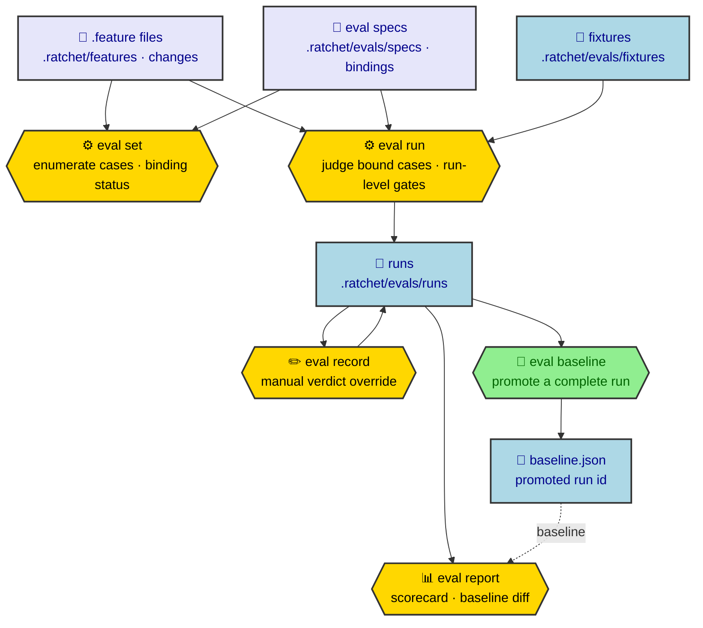

# `ratchet eval`

Turn `.feature` files into a scored, baseline-diffed regression suite. Judging
is delegated to the bundled batch engine seams run against checked-in fixture
working copies; the live repository is never read or mutated during judging.

## Overview

An eval turns behavioral `.feature` specifications into a graded, tracked
regression suite. Every Scenario becomes one **eval case**. A **binding** in
`.ratchet/evals/specs/` attaches a case to a checked-in **fixture** (a sample
codebase) and to a judging method — a `deterministic` command whose exit/output
decides pass, or an `llm-judge` agent that reads success criteria. Judging never
touches the working repository: each case is judged in a throwaway copy of its
fixture.

The five subcommands are one lifecycle. `eval set` lists the cases in scope and
whether each is bound. `eval run` judges every bound case, applies the run-level
gates (invariants and baseline regression), and persists the result as a **run**.
`eval record` manually overrides a single case's verdict in a stored run. `eval
report` prints a run's scorecard and its diff against the promoted baseline.
`eval baseline` promotes a complete run so later runs are diffed against it.



---

## `eval set`

Enumerate eval cases (one per Scenario) from `.feature` files and report each
case's binding status.

### Synopsis

```bash
ratchet eval set [--changes | --change <name> | --path <dir-or-file>] [--json]
```

### Options

| Option | Argument | Description |
|---|---|---|
| `--changes` | | Include active changes alongside the feature store. |
| `--change` | `<name>` | Scope to a single active change. |
| `--path` | `<dir-or-file>` | Narrow to a capability directory or `.feature` file within the feature store. |
| `--json` | | Output as JSON: `{ scope, count, cases[] }`. |

The three scope flags are mutually exclusive; supplying more than one is an
error.

### Behavior

1. **Scope resolution.** Without a scope flag, cases are drawn from the
   permanent feature store (`.ratchet/features/**`). `--changes` appends all
   active change feature directories (`changes/<name>/features/`). `--change`
   restricts to one change's features directory. `--path` narrows within the
   store to a subdirectory or single file.
2. **Enumeration.** Every `.feature` file in scope is parsed. One `EvalCase` is
   produced per Scenario, assigned its stable case id, and sorted by id for
   deterministic output.
3. **Binding status.** Each case id is looked up in the loaded eval specs. The
   reported binding is `deterministic`, `llm-judge`, or `unbound`.
4. **Archive exclusion.** The archive (`changes/archive/`) is never a scope
   root regardless of flags.

---

## `eval run`

Judge every bound in-scope case through the engine seams against its fixture
working copy and persist the run.

### Synopsis

```bash
ratchet eval run [--changes | --change <name> | --path <dir-or-file>] [--gate <ids> | --only <ids> | --no-llm-judge | --no-invariants] [--judge <mode>] [--json]
```

### Options

| Option | Argument | Description |
|---|---|---|
| `--changes` | | Include active changes alongside the feature store. |
| `--change` | `<name>` | Scope to a single active change. |
| `--path` | `<dir-or-file>` | Narrow to a capability directory or `.feature` file within the feature store. |
| `--gate` | `<ids>` | Set the enabled contributor set outright (comma-separated ids from `deterministic`, `llm-judge`, `invariants`, `regression`). |
| `--only` | `<ids>` | Restrict the enabled set to the listed contributor ids (intersection with the config default). |
| `--no-llm-judge` | | Disable the `llm-judge` contributor for this run. |
| `--no-invariants` | | Disable the `invariants` contributor for this run (the manifest is not evaluated and no invariant command runs). |
| `--judge` | `auto \| deterministic \| llm-judge` | **Deprecated** legacy alias mapped onto the gate: `deterministic` disables `llm-judge`, `llm-judge` disables `deterministic`, `auto` enables both. Prefer `--gate`/`--only`/`--no-llm-judge`. |
| `--json` | | Output as JSON: `{ runId, overall, scorecard, contributors, invariants, regressions, warnings }` (`invariantLoadError` is added when the manifest could not be loaded). |

The contributor gate selects which verdict contributors execute and gate the
run. Resolution precedence is default (all contributors enabled) ◁ the project
config `eval.gate` map ◁ these CLI flags. An unknown id in `--gate`/`--only`
fails the command with the valid ids listed. See
[Eval verdict aggregation](../eval-verdict-aggregation.md#contributor-selection-the-gate).

### Behavior

1. **Scope and enumeration.** Same as `eval set`.
2. **Spec loading.** All YAML files under `.ratchet/evals/specs/` are loaded.
   Invalid bindings and duplicate case ids are collected as warnings and
   surfaced in output.
3. **Fixture materialization.** For each bound case, the named fixture is
   copied into a throwaway temp working copy. When the binding declares a
   `setup` command, setup runs once into a cached copy for that
   fixture+setup pair; subsequent cases bound to the same fixture+setup reuse
   the cached copy. Each case judges in an isolated working copy; the
   checked-in fixture and host repository are never modified.
4. **Contributor gating.** The enabled contributor set (resolved from config and
   CLI flags, persisted on the run as `gate`) decides what runs. It has two
   distinct effects:
   - *Per-case judging.* A bound case is judged by its binding kind — a
     `deterministic` binding runs its check command, an `llm-judge` binding spawns
     the judge agent. If that case's binding-kind contributor is **disabled**, the
     case is not judged at all: it is recorded `unjudged` (the reason names the
     disabled contributor) with no fixture materialized and no judge spawned, which
     leaves the run **incomplete**.
   - *Run-level gates.* The `invariants` and `regression` contributors judge the
     run as a whole rather than any single case, so disabling them changes only the
     aggregated verdict, never per-case execution. When `invariants` is enabled, the
     run-level gate loads `.ratchet/evals/invariants.yaml` **fail-closed** and checks
     only its **active** invariants; any violated, unevaluable, or unloadable
     invariant fails the run, while inert (`active: false`) invariants are skipped.
     See [Eval invariant manifest](../eval-invariants.md#gate-contributor).
5. **Unbound cases.** A case with no binding in any spec is recorded `unjudged`
   with reason `"No eval-spec binding for this case"` and is never passed.
6. **Persistence.** The completed run is persisted atomically to
   `.ratchet/evals/runs/<run-id>.json`. The run id is a UTC timestamp plus a
   3-byte hex suffix (`YYYYMMDDTHHMMSSmmmZ-<hex>`), ensuring chronological
   sort order and no collisions.
7. **Output.** The run id, the aggregated overall verdict, the
   pass/fail/unjudged scorecard, and a per-contributor breakdown are printed
   (`deterministic`, `llm-judge`, `invariants`, `regression`). Run-level gate
   violations — a violated/unevaluable invariant (or an unloadable manifest), then
   a regression — are surfaced **first**, ahead of the per-case detail. The overall
   verdict is decided by the [verdict-aggregation core](../eval-verdict-aggregation.md)
   as a logical AND over the contributors. Any spec-load warnings are printed as
   dim lines.

---

## `eval record`

Manually override a single case's verdict in a persisted run.

### Synopsis

```bash
ratchet eval record --run <id> --case <id> --verdict <pass|fail|unjudged> [--evidence <text>] [--json]
```

### Options

| Option | Argument | Description |
|---|---|---|
| `--run` | `<id>` | Run id to amend. Required. |
| `--case` | `<id>` | Case id to override. Required. |
| `--verdict` | `pass \| fail \| unjudged` | New verdict. Required. |
| `--evidence` | `<text>` | Evidence text. Required when `--verdict fail`. |
| `--json` | | Output as JSON: `{ runId, caseId, verdict, source: "manual" }`. |

### Behavior

1. The run is loaded from `.ratchet/evals/runs/<run-id>.json`. If the run does
   not exist, the command fails non-zero and the file is left unchanged.
2. The case id must be present in the run's case list; an unknown id is an
   error.
3. A `fail` verdict without `--evidence` (or with blank evidence) is an error.
4. The verdict record is written with `source: "manual"`. The run is persisted
   atomically (write to temp, rename); on any rejection the run is unchanged.

---

## `eval report`

Print the scorecard and baseline regression diff for a run.

### Synopsis

```bash
ratchet eval report --run <id> [--json]
```

### Options

| Option | Argument | Description |
|---|---|---|
| `--run` | `<id>` | Run id to report. Required. |
| `--json` | | Output the full `EvalReport` object as JSON. |

### Behavior

1. The run is loaded. The promoted baseline run (if any) is loaded from the
   path recorded in `.ratchet/evals/baseline.json`.
2. **Scorecard.** Pass/fail/unjudged counts are derived from the run's verdict
   map; a missing verdict entry is treated as `unjudged`. A run is `complete`
   when no case is unjudged.
3. **Baseline diff.** The current run's case ids are compared against the
   baseline run's case ids:
   - **Regression** — present in both, verdict was `pass` in baseline and is
     `fail` now. Regressions are surfaced first in text output.
   - **New** — present in the current run but not in the baseline.
   - **Retired** — present in the baseline but not in the current run.
   - When no baseline is promoted, the diff is empty (no regressions).
4. **Overall verdict.** The run-level verdict is decided by the
   [verdict-aggregation core](../eval-verdict-aggregation.md) as a logical AND
   over named contributors: it is `pass` only when every contributor passes. The
   `EvalReport` carries the per-contributor breakdown under `contributors`.

---

## `eval baseline`

Promote a run to the baseline.

### Synopsis

```bash
ratchet eval baseline <run-id> [--json]
```

### Arguments

| Argument | Description |
|---|---|
| `<run-id>` | Id of the run to promote. Required. |

### Options

| Option | Description |
|---|---|
| `--json` | Output as JSON: `{ baseline: { runId } }`. |

### Behavior

1. The run is loaded to verify it exists; a non-existent run id fails
   non-zero.
2. **Completeness guard.** An incomplete run — one with any case still
   `unjudged`, per the [verdict-aggregation core](../eval-verdict-aggregation.md)'s
   `complete` signal — is rejected with an error naming the run as incomplete,
   and `baseline.json` is left unchanged. An incomplete run can never become the
   regression baseline.
3. `.ratchet/evals/baseline.json` is written (or overwritten) with
   `{ "runId": "<run-id>" }`.
4. Subsequent `eval report` calls diff against this run.

---

## Cases and ids

A case id has the form:

```
<relative-feature-path-sans-ext>#<scenario-slug>
```

The path component is the `.feature` file's path relative to the
`.ratchet/` directory, using posix separators, with the `.feature` extension
removed. Examples:

| Source | Case id prefix |
|---|---|
| `.ratchet/features/auth/login.feature` | `features/auth/login#…` |
| `.ratchet/changes/my-change/features/search.feature` | `changes/my-change/features/search#…` |

The scenario component is the Scenario name lower-cased, trimmed, and
kebab-cased (`[^a-z0-9]+` replaced by `-`, leading/trailing hyphens stripped).
A name that produces an empty slug becomes `scenario`.

When two scenarios in the same file produce the same slug, the second and later
occurrences receive ordinal suffixes in document order: `-2`, `-3`, and so on.
A renamed scenario surfaces as a retired id plus a new id; rename and ordinal
shifts never produce a silent mismatch.

---

## Bindings

Bindings are authored YAML under `.ratchet/evals/specs/` (any `.yaml` or
`.yml` file). A spec file is a mapping of case id to binding object, optionally
nested under a top-level `bindings:` key. All spec files are loaded and merged;
when the same case id appears in more than one file, the last file in
alphabetical sort order wins and a warning is emitted.

### Deterministic binding

```yaml
"features/auth/login#valid-credentials":
  fixture: auth-app
  kind: deterministic
  setup: "pnpm install"       # optional; runs once per fixture+setup pair
  check:
    run: "pnpm test"
    pass: "exit-zero"         # default
```

| Field | Type | Description |
|---|---|---|
| `fixture` | string | Name of the fixture directory under `.ratchet/evals/fixtures/`. Required. |
| `kind` | `"deterministic"` | Discriminant. Required. |
| `setup` | string | Shell command run once to bootstrap the fixture working copy. Optional. |
| `check.run` | string | Shell command executed in the fixture working copy. Required. |
| `check.pass` | string | Pass condition. Default `exit-zero`. See pass conditions below. |

**Pass conditions for `check.pass`:**

| Value | Passes when |
|---|---|
| `exit-zero` / `exit 0` / `exit code 0` | Command exits with code 0. |
| leading exit-zero directive (e.g. `exit code 0 — tests pass`, `exit-zero: suite green`) | Command exits with code 0. A condition that *begins* with an `exit 0` / `exit-zero` / `exit code 0` directive — optionally followed by punctuation/prose — gates on the exit status and is **not** matched against stdout. |
| `contains:<text>` | Stdout contains the literal text after the prefix. |
| `regex:<pattern>` | Stdout matches the regex pattern after the prefix. |
| anything else (not an exit-code directive) | Treated as a stdout substring: command exits 0 and stdout contains the string. |

### LLM-judge binding

```yaml
"features/search#full-text-results":
  fixture: search-app
  kind: llm-judge
  setup: "pnpm install --frozen-lockfile"   # optional
  success: "The search endpoint returns ranked results for multi-word queries."
  agentVotes: 3    # optional; default 1
```

| Field | Type | Description |
|---|---|---|
| `fixture` | string | Name of the fixture directory under `.ratchet/evals/fixtures/`. Required. |
| `kind` | `"llm-judge"` | Discriminant. Required. |
| `setup` | string | Shell command run once to bootstrap the fixture working copy. Optional. |
| `success` | string | Success criteria passed to the spawned judge agent. Required. |
| `agentVotes` | integer ≥ 1 | Number of independent judge votes to cast. Default `1`. |

---

## Fixtures

A fixture is a checked-in codebase directory under
`.ratchet/evals/fixtures/<name>/`. Before each case is judged, the fixture is
copied into a throwaway temp working copy (`ratchet-eval-*` under the system
temp directory). The judge runs in that copy as its working directory; it may
freely build, run, or mutate files without affecting the checked-in fixture or
the host repository.

When a binding declares `setup`, the setup command is run in a cached working
copy keyed by `(fixture, setup)`. Each subsequent case bound to the same
fixture+setup receives a fresh copy of the post-setup cache, so setup runs at
most once per fixture+setup pair within a single `eval run` invocation.

---

## Verdicts and baseline

### Verdicts

Each case in a run carries one of three verdicts:

| Verdict | Meaning |
|---|---|
| `pass` | The case was judged and satisfied its pass condition or success criteria. |
| `fail` | The case was judged and did not satisfy its pass condition or success criteria. |
| `unjudged` | The case was not judged: unbound, excluded by judge mode, or agent votes disagreed. |

Each verdict record carries a `source` field: `"judged"` for engine-produced
verdicts or `"manual"` for overrides written by `eval record`.

### Agent judge guarantees

The agent judge fails closed:

- A judge response with no parseable verdict JSON records `fail`.
- A judge response reporting `pass` without stating concrete evidence records
  `fail`.
- When `agentVotes > 1`, votes are resolved by majority: strictly more passes
  than fails → `pass`; all votes fail (no passes) → `fail`; any other
  outcome (tie, or mixed-leaning with at least one pass) → `unjudged` with a
  disagreement note. Agent vote disagreement is never silently treated as
  `fail`.

### Baseline regression

A regression is a case that was `pass` in the promoted baseline run and is
`fail` in the current run. `unjudged` in either run is not a regression. The
overall verdict is decided by the
[verdict-aggregation core](../eval-verdict-aggregation.md) as a logical AND over
named contributors; the `regression` contributor fails the run while any
regression exists.

The baseline is stored at `.ratchet/evals/baseline.json` as
`{ "runId": "<id>" }`. Promoting a new baseline with `eval baseline` overwrites
this file, but only a **complete** run (no case `unjudged`) may be promoted.
