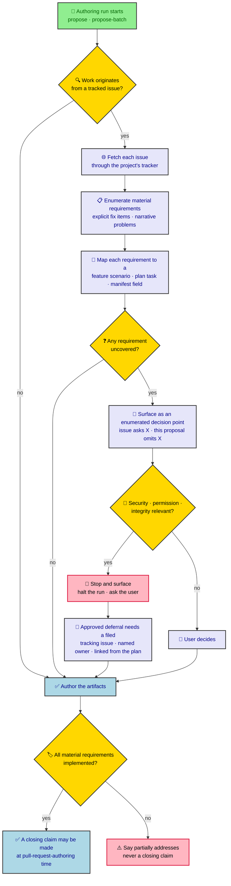

# Generated artifacts

`ratchet init` and `ratchet init` re-runs (update mode) produce two categories of output: the `.ratchet/` directory tree that holds all planning and spec data, and per-tool skill and command files written under each selected AI tool's configuration directory.

## `.ratchet/` directory layout

`init` creates the following directories at the project root. `batches/` and `evals/` are created lazily by the commands that need them.

```
.ratchet/
├── features/               # permanent, living feature store
├── standards/              # project standards library (empty at init)
├── changes/
│   └── archive/            # completed changes, date-prefixed
├── batches/                # batch manifests (created lazily by ratchet new batch)
├── evals/
│   ├── specs/              # eval-spec YAML bindings (opt-in)
│   └── fixtures/           # checked-in fixture codebases (opt-in)
└── config.yaml             # project config (schema + optional context/rules)
```

`init` also ensures the project-root `.gitignore` ignores the transient eval
run-records directory (see the table below).

| Path | Description |
|---|---|
| `features/` | Permanent Gherkin feature store. `ratchet archive` copies a change's `.feature` files here by whole-file replacement. Organized by capability: `features/<capability>/<name>.feature`. |
| `standards/` | Project-level guideline documents. Created empty by `init`; populated by `/rct:propose-standard`. Each file is a Markdown document with an optional `tag:` frontmatter field. |
| `changes/` | Active change directories. Each subdirectory is one change (`changes/<name>/`). |
| `changes/archive/` | Completed changes moved here by `ratchet archive`. Directory name is `YYYY-MM-DD-<name>`. |
| `batches/` | Batch manifests. Each batch is `batches/<name>/batch.yaml`. Created when `ratchet new batch` first runs, not by `init`. |
| `evals/specs/` | YAML eval-spec files. Each file maps case IDs to judge bindings (`fixture`, `kind`, `check` or `success`). Read by `ratchet eval`. |
| `evals/fixtures/` | Checked-in fixture codebases. Each fixture is a directory (`evals/fixtures/<name>/`) that eval materializes into a throwaway working copy before judging. |
| `config.yaml` | Project configuration. Contains at minimum `schema: ratchet`. May include `batch.permissions` for agent sandbox policy. Created by `init` when it does not already exist; never overwritten on re-runs. |
| `.gitignore` (project root) | `init` idempotently ensures the project-root `.gitignore` contains `.ratchet/evals/runs/`, so transient eval run records never dirty the working tree or the mutation invariant gate. The file is created if absent and the entry appended only if missing; a re-run never duplicates it. |

## Per-tool skills and commands

For each AI tool selected during `init`, ratchet writes two kinds of generated files: **skills** (agent skill markdown files under the tool's `skills/` directory) and **commands** (slash-command or prompt files in the tool's command directory). Both are fully regenerated on every `init` re-run.

### Skill files

Each skill is a `SKILL.md` file inside a named subdirectory under `<tool-dir>/skills/`. The file contains a YAML frontmatter block followed by the skill instructions.

Frontmatter fields written by ratchet:

| Field | Value |
|---|---|
| `name` | Skill name (e.g. `ratchet-propose`) |
| `description` | One-sentence description of the skill |
| `license` | `MIT` |
| `compatibility` | Requires ratchet CLI. |
| `metadata.author` | `ratchet` |
| `metadata.version` | `1.0` |
| `metadata.generatedBy` | Installed ratchet version (e.g. `0.9.0`) |

### Command files

Each command is a Markdown file with YAML frontmatter. The file path and frontmatter format vary by tool; the body content is the same workflow instruction.

### Tool paths

| Tool | `skillsDir` | Skill path pattern | Command path pattern |
|---|---|---|---|
| Claude Code | `.claude` | `.claude/skills/<dir>/SKILL.md` | `.claude/commands/rct/<id>.md` |
| Cursor | `.cursor` | `.cursor/skills/<dir>/SKILL.md` | `.cursor/commands/rct-<id>.md` |
| Codex | `.codex` | `.codex/skills/<dir>/SKILL.md` | `~/.codex/prompts/rct-<id>.md` (global; respects `CODEX_HOME`) |
| Gemini | `.gemini` | `.gemini/skills/<dir>/SKILL.md` | `.gemini/commands/rct-<id>.md` |
| GitHub Copilot | `.github` | `.github/skills/<dir>/SKILL.md` | `.github/prompts/rct-<id>.prompt.md` |
| OpenCode | `.opencode` | `.opencode/skills/<dir>/SKILL.md` | `.opencode/commands/rct-<id>.md` |

### Workflows: core profile vs. eval opt-in

The `core` profile (the default) installs eleven workflows. The `eval` workflow is opt-in and only installed when a `custom` profile explicitly lists it.

**Core profile workflows** (installed by `ratchet init` by default):

| Workflow ID | Skill directory | `/rct:` command |
|---|---|---|
| `propose` | `ratchet-propose` | `propose` |
| `apply` | `ratchet-apply-change` | `apply` |
| `verify` | `ratchet-verify-change` | `verify` |
| `archive` | `ratchet-archive-change` | `archive` |
| `propose-standard` | `ratchet-propose-standard` | `propose-standard` |
| `brainstorm` | `ratchet-brainstorm` | `brainstorm` |
| `apply-batch` | `ratchet-apply-batch` | `apply-batch` |
| `archive-batch` | `ratchet-archive-batch` | `archive-batch` |
| `propose-batch` | `ratchet-propose-batch` | `propose-batch` |
| `decompose-phase` | `ratchet-decompose-phase` | `decompose-phase` |
| `open-pr` | `ratchet-open-pr` | `open-pr` |

The `open-pr` command is also the artifact the batch engine renders into the spawn
locus for the whole-batch PR step: at batch completion the engine spawns a PR agent
that delegates to `/rct:open-pr` to commit the accumulated work in the repo's
`git log` commit style, push the work branch, and open exactly one forge-agnostic PR
to its base branch. Like every command it is generated for every tool above at the
tool's command path (e.g. claude `.claude/commands/rct/open-pr.md`, cursor
`.cursor/commands/rct-open-pr.md`).

The `decompose-phase` command is also the artifact the batch engine renders into
the spawn locus when `batch apply` drives a phase decomposition (it delegates to
`/rct:decompose-phase <phase>` to author a reachable empty phase's change intents
into `batch.yaml`). The decomposition spawn routes through the `decompose` agent
stage — so `agent.decompose` (or a scalar `agent`) selects which agent runs it,
exactly as the `pr` stage selects the PR agent. Like every command it is
generated for every tool above at the tool's command path (e.g. claude
`.claude/commands/rct/decompose-phase.md`, cursor
`.cursor/commands/rct-decompose-phase.md`).

**Opt-in workflow** (custom profile only):

| Workflow ID | Skill directory | `/rct:` command |
|---|---|---|
| `eval` | `ratchet-eval` | `eval` |

The active profile is read from the global ratchet config. Pass `--profile core` or `--profile custom` to `ratchet init` to override it for that run.

### Scope reconciliation in the change-authoring workflows

The `propose`, `propose-batch`, and `decompose-phase` workflows carry a shared set of
scope-reconciliation rules. The rules are authored once in
`src/core/templates/workflows/scope-reconciliation.ts` and interpolated into each
workflow body, so every generated skill and command for every tool in the table above
renders the same text.

#### Overview



#### Originating-issue reconciliation

`propose` and `propose-batch` each run an originating-issue reconciliation step before
any artifact is authored — in `propose` it is step 2, before the change directory is
created; in `propose-batch` it is step 4, before `ratchet new batch` scaffolds the
manifest. The step requires:

| Sub-step | Requirement |
|---|---|
| Identify | Collect every originating issue — referenced by the user, by a manifest phase or change intent, or by an injected `done` criterion. |
| Fetch | Read each issue through the project's issue tracker. `gh issue view <n>` is named as a GitHub example; no tracker or command is required. When no tracker client is available, the user is asked to paste the issue text. |
| Enumerate | List the issue's material requirements from both its explicit fix items and the problems named in its narrative. Hedged wording (`consider`, `maybe`, `optionally`) does not lower the bar for a security-, permission-, or integrity-relevant requirement. |
| Map | Point every enumerated requirement at the feature scenario or plan task that covers it. In `propose-batch` the target is the phase `goal`, the phase `success` criterion, or the change-level `done`. |
| List | Write out every requirement the authored scope does not cover. |
| Surface | Present each uncovered requirement to the user as an enumerated `"issue asks X, this proposal does not include X"` decision point before artifacts are finalized. Writing an omission into plan prose as self-approval is prohibited. |

#### Close-claim rules

A `Fixes #N` / `Closes #N` claim — in a batch manifest `done`, in a plan, or in a
pull-request body — is permitted only when the issue's material requirements are
actually implemented. A close-claim is an output of verification, never an input of
planning. Work covering only part of an issue states `"partially addresses #N"` and
does not state `Fixes #N` or `Closes #N`.

`propose-batch` applies this to the manifest specifically: `Closes #N` / `Fixes #N`
must not be hard-coded into a phase `goal`, a phase `success` criterion, or a
change-level `done` for work not yet scoped and verified. Phase contracts reference an
issue as `"targets #N"` or `"addresses #N"`; the closing linkage is earned at
pull-request-authoring time.

#### Stop-and-surface guardrail

All three workflows carry the guardrail in their **Guardrails** section. A de-scope of
security-, permission-, or integrity-relevant work halts the workflow and asks the
user rather than proceeding on momentum. An approved deferral requires a tracking
issue that is explicitly filed, carries a named owner, and is linked from the change
plan before the workflow proceeds; a prose bullet in `plan.md` is not a deferral
mechanism.

#### Deferral carry-forward in `decompose-phase`

`decompose-phase` grounds a phase in the prior phases' shipped results. Its grounding
step additionally requires:

- Reading each prior phase's shipped change `plan.md`, not only the injected `done`
  criteria. The injected criteria are a paraphrase in which deferrals recorded as plan
  prose are invisible.
- Extracting every `## Out of scope`, `deferred`, `revisit`, `later phase`,
  `follow-up`, or equivalent item recorded in those plans.
- Resolving each extracted item as exactly one of three outcomes: **carried forward**
  as a change intent in the phase being decomposed, **tracked** against an existing
  open tracking issue, or **explicitly dropped** by the user. Silently ignoring an
  extracted item is not an available outcome.
- Verifying that a prior phase's `Fixes #N` / `Closes #N` claim was earned before the
  issue is treated as shipped. An unearned claim is surfaced and its remaining scope
  carried forward, never inherited as fact.


## Change directory artifacts

`ratchet new change <name>` scaffolds a change directory at `.ratchet/changes/<name>/`. The propose workflow writes the two required artifacts into it.

```
.ratchet/changes/<name>/
├── features/
│   └── <capability>/
│       └── <name>.feature      # Gherkin: Feature / Scenario / Given-When-Then
├── plan.md                     # ## Why / ## What Changes / ## Design / ## Tasks
├── .ratchet.yaml               # change metadata
└── .run/
    ├── journal.jsonl           # append-only engine run log
    └── state.json              # current change state snapshot
```

### `features/<capability>/<name>.feature`

Gherkin feature file. One or more files may exist under `features/` grouped by capability. Each scenario must contain at least one `Given`, one `When`, and one `Then` step. The `features/` directory may also contain a `.deleted` tombstone file listing store-relative paths to remove from the permanent feature store on archive (one path per line; blank lines and `#`-prefixed lines are ignored).

### `plan.md`

Plan document with four required top-level sections:

| Section | Purpose |
|---|---|
| `## Why` | Motivation and problem statement |
| `## What Changes` | Scope description |
| `## Design` | Technical design; active standards are embedded here by propose |
| `## Tasks` | Markdown checklist (`- [ ]`) tracked by the apply phase |

### `.ratchet.yaml`

Change metadata file. Fields:

| Field | Type | Description |
|---|---|---|
| `schema` | string (required) | Workflow schema name (e.g. `ratchet`) |
| `created` | string (`YYYY-MM-DD`) | Date the change was created |
| `standards` | string array | Tags of standards this change follows (e.g. `[security, testing]`) |

### `.run/` (change-local run state)

`journal.jsonl` and `state.json` hold the engine run state for the change when it is driven by a headless verb (`ratchet propose`, `ratchet apply`, `ratchet verify`). When a change is driven inside a batch, run state is written at `.ratchet/batches/<batch>/run/` instead. See [Run-state locus](../engine/run-state.md).

## Standards model

Each standard is a Markdown file at `.ratchet/standards/<name>.md` with an optional YAML frontmatter block.

Frontmatter field:

| Field | Description |
|---|---|
| `tag` | Stable identifier for the standard. Falls back to the file-name stem when absent. Changes and features reference standards by tag, not by file name. |

Example:

```markdown
---
tag: security
---

# Security standard

...
```

### Bidirectional links materialized on archive

When `ratchet archive` runs and the change declares one or more standard tags in its `.ratchet.yaml`, two link structures are written into the permanent store:

**Forward links — per-capability sidecar**

`.ratchet/features/<capability>/.ratchet.yaml` maps each feature file within that capability to the standard tags the contributing change declared. The sidecar YAML structure:

```yaml
features:
  <feature-file-relative-to-capability>:
    - <tag>
    - <tag>
```

Tombstoned features (listed in `features/.deleted`) have their entries removed from the sidecar on the same archive run.

**Reverse links — `## Implemented by` block**

Each `.ratchet/standards/<tag>.md` that has at least one implementing feature receives a generated `## Implemented by` section appended by ratchet. The block lists the store-relative paths of all feature files that implement the standard. It is regenerated from the forward sidecars on every archive run — ratchet never appends to it incrementally. Standards with no implementing features have the block removed or never gain one.

The block is delimited by an HTML comment marker so ratchet can locate and replace it idempotently:

```markdown
## Implemented by

<!-- ratchet:implemented-by — generated from .ratchet/features/<capability>/.ratchet.yaml; do not edit by hand -->

- <capability>/<name>.feature
```
