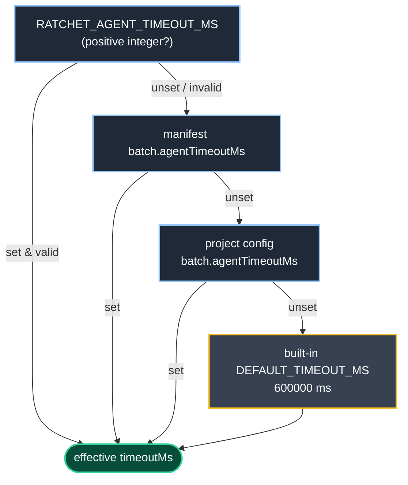
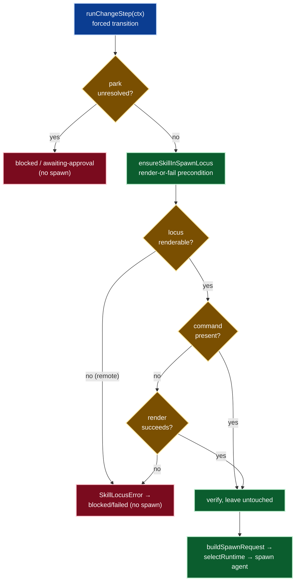

# Agent runtime (SWE-ReX)

The agent runtime is the layer beneath the engine that actually spawns coding
agents. When the engine runs a step it selects exactly one runtime implementation
based on the resolved `locus` setting, then drives exactly one agent through that
runtime for the transition. The runtime is injected into the engine as a seam so
tests can supply a fake without starting Python.

Defined in `src/core/batch/engine/runtime/`.

## Runtime contract

Defined in `src/core/batch/engine/runtime/contract.ts`.

```ts
interface AgentEvent {
  kind: 'stdout' | 'exit' | 'error';
  /** Present for kind 'stdout' — one line of agent output (no trailing newline). */
  line?: string;
  /** Present for kind 'exit' — the agent's process exit code. */
  exitCode?: number;
  /** Present for kind 'error' — an actionable failure message. */
  message?: string;
}

type AgentRuntime = (
  req: AgentSpawnRequest,
  onEvent: (e: AgentEvent) => void
) => Promise<AgentSpawnResult>;
```

The spawn request and result types are defined in
`src/core/batch/engine/agent.ts`:

```ts
interface AgentSpawnRequest {
  command: string;
  args: string[];
  /** Instructions passed to the agent via stdin. */
  instructions: string;
  cwd: string;
  env: NodeJS.ProcessEnv;
}

interface AgentSpawnResult {
  /** Process exit code (null if killed by signal). */
  exitCode: number | null;
  signal: NodeJS.Signals | null;
  stdout: string;
  stderr: string;
}
```

`AgentRuntime` streams `AgentEvent`s live to the `onEvent` callback as the agent
runs and simultaneously accumulates the full `AgentSpawnResult` (stdout
newline-joined, exitCode from the exit event). A bootstrap failure or sidecar
`error` event resolves with a non-zero `exitCode` and the message in `stderr` —
no new outcome states — so the engine maps it to blocked/failed and the step
remains resumable.

## SWE-ReX sidecar

For the `local` and `docker` loci, ratchet bootstraps an isolated Python sidecar
(`sidecar.py`) that wraps SWE-ReX. The Node side manages the sidecar lifecycle;
the Python side drives the SWE-ReX deployment.

### Bootstrap (`rex-bootstrap.ts`)

`bootstrapRexRuntime` provisions a ratchet-owned virtual environment on first use
and returns a `ResolvedLaunch` (the command, args, and env to spawn the sidecar).
It is lazy and idempotent: a ready venv is reused without a rebuild.

```ts
interface ResolvedLaunch {
  /** The venv's Python interpreter (absolute path). */
  command: string;
  /** Arguments — the resolved sidecar.py path. */
  args: string[];
  /** Environment for the sidecar (REX_* passthrough + venv on PATH). */
  env: NodeJS.ProcessEnv;
}
```

Bootstrap behavior:

1. The venv lives at `$XDG_CACHE_HOME/ratchet/rex/venv` (falling back to
   `~/.cache/ratchet/rex/venv` when `XDG_CACHE_HOME` is unset). It never touches
   the user's global Python environment.
2. A JSON readiness marker (`.ratchet-rex-ready.json`) inside the venv dir is
   written last, after a successful import check. A missing or stale marker
   (wrong `sweRexVersion` or missing required extras) triggers a full rebuild
   after clearing the directory so no partial venv is mistaken for ready.
3. The pinned swe-rex version is `1.4.0` (`SWE_REX_VERSION`). A version change
   forces a rebuild.
4. `uv` is preferred for creating the venv and installing packages. When `uv`
   is not on PATH, bootstrap falls back to `python -m venv` and the venv's own
   pip.
5. Python candidates are probed in order — `python3`, `python`, `python3.12`,
   `python3.11`, `python3.10` — and the first interpreter that reports Python
   >= 3.10 is used. A `pythonOverride` skips the probe.
6. After install, bootstrap verifies `import swerex` succeeds from the venv
   interpreter before writing the marker. For the docker locus it additionally
   verifies `import swerex.deployment.docker`.
7. The venv's `bin` directory is prepended to `PATH` and `VIRTUAL_ENV` is set
   in the sidecar's environment.

Environment variables threaded to the sidecar:

| Variable | Set when | Value |
|---|---|---|
| `REX_LOCUS` | always | `'local'` or `'docker'` |
| `REX_WORKDIR` | always | project root (local) or `/workspace` (docker) |
| `REX_IMAGE` | docker only | configured image, or `DEFAULT_DOCKER_IMAGE` (`python:3.12`) |
| `REX_MOUNT_HOST` | docker only | project root (host path bind-mounted into the container) |
| `REX_MOUNT_CONTAINER` | docker only | `/workspace` (in-container mount point) |

### Sidecar process (`sidecar.py`)

The sidecar is a Python script driven over a newline-delimited JSON protocol on
stdio. It starts a SWE-ReX deployment (local or docker), runs shell commands
through it on demand, streams output back, and shuts down cleanly.

The sidecar suppresses SWE-ReX's Rich console logger before import
(`SWE_REX_LOG_STREAM_LEVEL=CRITICAL`) so no non-JSON output contaminates the
protocol channel.

**Node → sidecar (stdin):**

| Message | Effect |
|---|---|
| `{"op":"run","id":N,"command":"<shell>"}` | Launch the shell command, stream stdout, emit exit. |
| `{"op":"shutdown"}` | Stop the deployment and exit 0. |

**Sidecar → Node (stdout):**

| Event | Emitted when |
|---|---|
| `{"event":"ready","locus":"local"\|"docker"}` | Deployment started; emitted once before any `run` op. |
| `{"event":"stdout","id":N,"line":"..."}` | One complete line of command output. |
| `{"event":"exit","id":N,"exit_code":N}` | Command finished; exactly once per `run` op. |
| `{"event":"closed"}` | Clean shutdown complete. |
| `{"event":"error","id":N\|null,"message":"...",...}` | Any caught exception. |

Streaming model: the sidecar launches each shell command detached to a per-run
logfile and tail-polls that logfile at 300 ms intervals (`POLL_INTERVAL = 0.3`)
via the SWE-ReX `execute()` API. It advances a byte cursor over the logfile so
only new bytes are read each poll, and emits complete lines as `stdout` events.
The exit sentinel file signals completion; the sidecar drains any final bytes
before emitting the `exit` event.

## Execution loci

The `locus` setting selects the runtime implementation. The default locus is
`local`.

### `local` — `RexSidecarRuntime` (`rex-sidecar-runtime.ts`)

The local runtime bootstraps the SWE-ReX sidecar, spawns it as a child process,
and drives the JSON-lines protocol described above.

Prompt delivery: the agent's instructions are written to a temporary prompt file
at `.ratchet/batches/<batch>/.run/<id>/prompt.txt` on the host. The run command
sent to the sidecar is `cd <cwd>; cat <promptfile> | <agent argv>`. The prompt
file is removed after the run (in a `finally` block).

The overall run timeout defaults to `600000` ms (10 minutes) and is configurable
via `batch.agentTimeoutMs` or the `RATCHET_AGENT_TIMEOUT_MS` environment variable
(see [Per-agent timeout](#per-agent-timeout) below). On completion or timeout the
sidecar receives `SIGTERM` followed (after a 2 s grace) by `SIGKILL` if it has not
exited.

### `docker` — `RexSidecarRuntime` with `DockerDeployment`

The docker locus runs the same local sidecar but selects `DockerDeployment`
(via `REX_LOCUS=docker`). The project root is bind-mounted into the container
at `/workspace` (`DOCKER_MOUNT_CONTAINER`).

Additional behavior specific to the docker locus:

1. A `docker info` pre-flight runs before any venv work. A non-zero result
   throws `RexBootstrapError` immediately, so the run never hangs on
   SWE-ReX's own startup timeout.
2. The venv must carry the `docker` extra, which installs `aiohttp` explicitly.
   (`swe-rex` 1.4.0 does not declare `aiohttp` in its package metadata, but
   `swerex.deployment.docker` imports it at runtime.) A local-only venv is
   rebuilt the first time the docker locus is requested.
3. `REX_WORKDIR` is set to `/workspace` (the in-container path), not the host
   project root. The prompt file is written on the host and its path is
   translated to the in-container equivalent before it is passed to the sidecar.
4. `REX_IMAGE` is set to the configured `image`, or `DEFAULT_DOCKER_IMAGE`
   (`python:3.12`) when none is configured.

### `remote` — `RexRemoteRuntime` (`rex-remote-runtime.ts`)

The remote runtime drives an external `swerex-remote` server over its REST API
using the Node global `fetch`. No local Python sidecar is started; the Python
lives on the server.

Required settings: `host`, `port`, and `authToken`. The auth token is sent as
the `X-API-Key` request header and is never printed in any error message.

Transport scheme selection:

- A bare loopback host (`localhost`, `127.x.x.x`, `::1`) defaults to `http`.
- A bare non-local host defaults to `https`.
- An explicit `https://` prefix is honored.
- An explicit `http://` prefix to a non-local host is refused unless `insecure:
  true` is set in the settings.

The remote runtime reproduces the sidecar's tail-poll streaming over REST:

1. `GET /is_alive` — health check with a short per-request timeout (30 s default).
2. `POST /create_session` — create the bash session.
3. Write the prompt onto the server filesystem via `POST /execute` (mkdir + `POST /write_file`).
4. `POST /execute` (non-blocking) — detach the agent command to a logfile + exit sentinel.
5. `POST /execute` in a poll loop (300 ms default) — `tail -c +<offset+1>` to
   advance a byte cursor; emit `stdout` events as complete lines arrive.
6. Read the exit sentinel. Drain final bytes, emit `exit`, then close the session
   and runtime (`POST /close_session`, `POST /close`).

The overall run timeout defaults to `600000` ms (10 minutes) and is configurable
via `batch.agentTimeoutMs` or the `RATCHET_AGENT_TIMEOUT_MS` environment variable
(see [Per-agent timeout](#per-agent-timeout) below). A `swerexception` body on any
response is surfaced as an actionable `AgentEvent{kind:'error'}` with the engine
mapped to blocked/failed and no hang.

## Per-agent timeout

Every runtime applies a per-agent timeout — the guard against a hung agent. It is
locus-uniform and agent-neutral: the same resolved value applies to `local`,
`docker`, and `remote`, and to every coding agent. The built-in default is
`600000` ms (10 minutes); each runtime keeps applying that default whenever no
value is configured.

`selectRuntime` resolves the effective timeout once (via `resolveAgentTimeoutMs`)
and threads it into the chosen runtime's `timeoutMs` option, omitting the option
entirely when nothing is set so the runtime's own default applies. Resolution
precedence is **env > manifest > project config > built-in default**:

- `RATCHET_AGENT_TIMEOUT_MS` wins when it parses to a positive integer. A zero,
  negative, non-numeric, or empty value is ignored (a typo never shortens or
  removes the guard) and resolution falls through to the config layers.
- Otherwise `batch.agentTimeoutMs` from the per-change manifest, then the project
  config (`.ratchet/config.yaml`).
- Otherwise the runtime's built-in `DEFAULT_TIMEOUT_MS` (`600000` ms).



## Agent adapters

An adapter knows how to build the spawn request for one coding agent. The engine
resolves the adapter by name from the resolved settings before any spawn, and
throws `UnknownAgentError` (listing available adapters) when the name is not
registered.

The default agent when no adapter is configured is `claude`.

Built-in adapters:

| Agent | Command | Base args | Stream-JSON |
|---|---|---|---|
| `claude` | `claude` binary | `-p --output-format stream-json --verbose --include-partial-messages` | yes |
| `codex` | `codex` binary | `exec -` | no |
| `gemini` | `gemini` binary | `-p` | no |
| `cursor` | `cursor` binary | `-p` | no |

All adapters pass the agent instructions on stdin. The binary name for each
adapter is read from the `AI_TOOLS` registry in `src/core/config.ts`
(`agentBinary` field); the adapter code does not hardcode binary names. The same
registry drives `ratchet doctor`'s PATH checks, so the two cannot drift.

Permission flags resolved from the active policy (see
[Agent permissions](#agent-permissions) below) are appended to the base args
after the adapter's own argv.

## Skill-in-spawn-locus guarantee

Defined in `src/core/batch/engine/skill-locus.ts`.

Engine-spawned change-verb agents delegate the lifecycle to the canonical ratchet
skill rather than re-authoring it inline (see the `delegated-lifecycle` standard):
the spawned-agent prompt tells a headless agent to invoke `/rct:<transition>
<change>`. That delegation is only safe if the rct command for the transition
**actually exists** in the locus where the agent runs. Before spawning, the engine
therefore guarantees that command is present — rendering it when absent, verifying
it when present, and failing loudly (never spawning) when it cannot. This is a
render-or-fail **precondition**, evaluated inside `runChangeStep` **before** the
spawn request is built and before the runtime is selected/invoked.

The engine drives **two** spawn kinds, both routed through this one guarantee
(`ensureCommandInSpawnLocus`, with `ensureSkillInSpawnLocus` as the per-change
wrapper):

- **Change-scoped** propose/apply/verify spawns (`runChangeStep`) — delegate to
  `/rct:<transition> <change>`.
- **Phase-scoped** decomposition spawns (`runDecompositionStep`) — delegate to
  `/rct:decompose-phase <phase>` to author a reachable empty phase's concrete
  change intents into `batch.yaml`. The guarantee renders/verifies the
  `decompose-phase` command the same way before that spawn.

The prompt itself now **delegates** to that command: `buildAgentInstructions`
emits the `/rct:<transition> <change>` invocation instead of a hand-built inline
recipe — see [Agent instructions](#agent-instructions) below. This guarantee is
its precondition: it ensures the command the prompt names actually exists in the
spawn locus before the agent is told to run it.

The caller's `-m` guidance and any resolved resume answer are injected as
ARGUMENTS of that `/rct:<transition> <change>` invocation — handed to the skill
as `$ARGUMENTS` rather than floated off in a detached block (see
[Agent instructions](#agent-instructions) below for the argument-injection
contract).

### Step kind → rct command

The forced transition selects exactly its own canonical rct command, kept in one
place (`rctCommandIdForTransition`) so it stays aligned with the prompt-delegation
change; the phase-scoped decomposition step uses its own single-source id
(`DECOMPOSE_COMMAND_ID`):

| Step kind | rct command |
|---|---|
| `propose` | `/rct:propose` |
| `apply` | `/rct:apply` |
| `verify` | `/rct:verify` |
| `decompose` (phase) | `/rct:decompose-phase` |

### Per-agent command path

The command file path is resolved through the **command-generation registry**
(`src/core/command-generation/`), never a hard-coded single-agent path. The
guarantee resolves the configured spawn agent's adapter (default `claude`) and
computes the path via `adapter.getFilePath(<command-id>)`, then renders the file
from the **shared** command definition (`getCommandContents` → `adapter.formatFile`)
— the same content `ratchet init` writes, so there is one author of the lifecycle
text. The applicable set is the batch-engine spawnable agents (the `BUILTIN_ADAPTERS`):

| Agent | Rendered command path (apply) |
|---|---|
| `claude` | `.claude/commands/rct/apply.md` |
| `cursor` | `.cursor/commands/rct-apply.md` |
| `gemini` | `.gemini/commands/rct-apply.md` |
| `codex` | `<CODEX_HOME>/prompts/rct-apply.md` (global-scoped, absolute) |

`github-copilot` and `opencode` have command-generation adapters but **no
batch-engine spawn adapter**, so `resolveAdapter` rejects them with
`UnknownAgentError` before any spawn — they can never be the spawn agent and are
out of scope for this spawn-time guarantee.

### Behavior and the bootstrap-failure contract

`ensureSkillInSpawnLocus(ctx, projectRoot, deps)` (side effects through an
injectable `exists`/`writeText` seam, mirroring `rex-bootstrap.ts`):

- **Absent** → render the command from the shared definition into the spawn locus,
  then spawn.
- **Present** → verify and leave the existing file untouched (no re-render), then
  spawn.
- **Unrenderable locus** (`remote` — the agent runs in a remote workdir the engine
  does not control on disk) → throw `SkillLocusError`. `local` and `docker` are
  renderable (docker bind-mounts the project root, so a file rendered there is
  visible in the container).
- **Render/write failure** → throw `SkillLocusError` naming the failing path and
  the underlying detail.

A `SkillLocusError` short-circuits the step to a blocked/failed `StepResult`
carrying the actionable message — the **same** bootstrap-error contract as
`UnknownAgentError` / the locus `failingRuntime` path: no agent is spawned, the
message is surfaced live on the engine's line sink, no new outcome state is
introduced, and the step stays resumable. The message names the missing rct
command, the spawn locus, and the remedy, and never instructs the agent to invoke
a skill it cannot run.

### Spawn flow



The guarantee adds no user-facing command, flag, or config key — it is internal
engine behavior — so `README.md` needs no edit.

## Agent instructions

Defined in `src/core/batch/engine/instructions.ts` (`buildAgentInstructions`).

The spawned-agent prompt **delegates** each transition to the canonical ratchet
skill rather than re-authoring the lifecycle inline (`delegated-lifecycle`
standard: the engine orchestrates the lifecycle, it does not re-author it).
`transitionGuidance` no longer hand-builds the propose/apply/verify steps (no
"write files directly on disk", no inline `## Tasks` recipe); instead it emits a
single instruction to invoke `/rct:<transition> <change>`, which loads
`.ratchet/standards/` and authors/advances the change to its canonical definition
of done.

- **Command id** comes from the single-source `rctCommandIdForTransition` map
  (shared with the [skill-in-spawn-locus guarantee](#skill-in-spawn-locus-guarantee)),
  so the invocation and the rendered command can never drift.
- **Invocation token** is resolved from the **configured spawn agent's** command
  adapter via `adapter.getInvocation(<command-id>)` — claude `/rct:<id>`,
  cursor/gemini/codex `/rct-<id>` — never a hard-coded literal, because the syntax
  genuinely differs per agent (`multi-agent-support`). The surrounding prose names
  no coding agent.
- **Delegation is context-preserving.** The invocation sits alongside the prompt's
  existing top block — phase goal/success/proof-of-work and the per-change
  `Definition of done:` line — plus any strategy guidance. It is never reduced to
  a bare, context-free skill call.
- **Caller guidance and resume answer ride along as invocation ARGUMENTS.** The
  caller's `-m` guidance and any resolved resume answer/feedback are appended to
  the invocation by `invocationArguments`, so the agent passes them to the skill
  as `$ARGUMENTS` rather than reading them from a detached prose block
  (`delegated-lifecycle`: "it hands that context to the skill as arguments").
  The parts join with a single newline into one contiguous block glued to the
  invocation, distinct from the blank-line-separated sections around it. When
  both a `-m` message and a resume answer exist, both are injected (neither
  dropped); the answer/feedback no longer re-appears in the resume block, which
  keeps only the intent framing (the original question/proposal plus the
  incorporate-the-answer / revise-don't-restart directive). With no guidance and
  no resume context — the plain `batch apply` path — the invocation stays the
  bare `/rct:<transition> <change>` with no trailing argument noise.
- **Argument injection stays agent-neutral.** Only the trailing arguments are
  appended; the invocation TOKEN still resolves from the configured spawn agent's
  adapter (claude `/rct:<id>`, cursor/gemini/codex `/rct-<id>`), so injecting a
  guidance argument never smuggles in another agent's syntax.

The **decomposition** spawn has its own prompt builder,
`buildDecompositionInstructions`, following the same delegation contract: it emits
`/rct:decompose-phase <phase>` (token resolved through the configured agent's
adapter) and injects the empty phase's goal/success/proof-of-work plus the prior
phases' shipped results as the delegation context — never an inline re-description
of the decomposition steps. A decomposition has no change, so its report channel
and journal key are the **phase name** (`decompositionJournalKey`).

This change adds no user-facing command, flag, or config key — it is internal
prompt-builder behavior — so `README.md` needs no edit.

## Streaming

Defined in `src/core/batch/engine/runtime/stream-json-renderer.ts`.

When an adapter's `emitsStreamJson` capability is `true`, the engine routes each
stdout line through `makeStreamJsonRenderer` rather than printing it raw. The
renderer parses one-event-per-line NDJSON (Claude's `--output-format stream-json`
format) and writes polished output to the engine's line printer. The gating is on
the adapter capability flag, not on the agent name, so any future adapter that
sets `emitsStreamJson: true` reuses the same renderer.

Event handling:

| Top-level `type` | Behavior |
|---|---|
| `system`, `rate_limit_event` | Recognized control noise; silently skipped. |
| `stream_event` | `content_block_delta` with `text_delta` → text streamed live and accumulated. |
| `assistant` | `text` items printed as prose; `tool_use` items printed with glyph + name + target field. |
| `user` | `tool_result` items printed (truncated to 200 chars / 3 lines; errors in red). |
| `result` | Closing summary line with success/error, token counts, and USD cost. |
| Unknown or non-JSON | Raw line printed as fallback; renderer never throws. |

The renderer never mutates the accumulated `AgentSpawnResult.stdout`; the raw
NDJSON transcript that `mapSessionToOutcome` reads is byte-identical with or
without rendering.

## Agent permissions

Defined in `src/core/batch/permissions-policy.ts` (policy schema and types) and
`src/core/batch/runtime/agent-permissions.ts` (per-agent translator).

### Policy shape

```ts
interface ResolvedPermissionsPolicy {
  posture: PermissionPosture;     // 'repo-sandboxed-permissive' | 'curated-allowlist' | 'full-autonomy'
  allow: string[];                // tool-pattern allowlist (agent-neutral)
  deny: string[];                 // tool-pattern denylist (agent-neutral)
  raw: Partial<Record<'claude' | 'codex' | 'gemini' | 'cursor', string[]>>;
}
```

The default posture is `repo-sandboxed-permissive`.

### Postures

- **`repo-sandboxed-permissive`** (default): edits and ordinary build/test shell
  commands run unprompted; the agent is scoped to the repo; a baseline denylist
  forbids destructive/exfiltrating operations.
- **`curated-allowlist`**: nothing runs unprompted except an explicit `allow`
  list; the deny list still applies. Operators must include a `Bash(...)` entry
  in `allow` or any shell step will stall headless.
- **`full-autonomy`**: all permission checks are bypassed.

### Baseline deny patterns (`repo-sandboxed-permissive`)

The following patterns are merged into the effective denylist for the sandboxed
and curated postures (not for `full-autonomy`):

```
Bash(rm -rf *)
Bash(sudo *)
Bash(* > /*)
Bash(curl * | sh)
Bash(curl * | bash)
Bash(wget * | sh)
Bash(wget * | bash)
```

### Per-agent flag translation

`resolvePermissionFlags(agentName, policy, repoRoot)` returns a concrete argv
fragment appended to each adapter's base args. The translation is pure (no I/O).

**claude:**

| Posture | Flags emitted |
|---|---|
| `repo-sandboxed-permissive` | `--permission-mode acceptEdits --add-dir <repoRoot> --allowedTools Bash [<allow>] --disallowedTools <deny>` |
| `curated-allowlist` | `--permission-mode default [--allowedTools <allow>] [--disallowedTools <deny>]` |
| `full-autonomy` | `--dangerously-skip-permissions` |

For `repo-sandboxed-permissive`, `--allowedTools` defaults to `['Bash']` when
the operator's `allow` list is empty. `acceptEdits` covers file edits only;
`Bash` must be explicitly allowed or headless shell calls are denied.

**gemini:**

| Posture | Flags emitted |
|---|---|
| `repo-sandboxed-permissive` | `--approval-mode auto_edit` |
| `curated-allowlist` | `--approval-mode default` |
| `full-autonomy` | `--yolo` |

Known limitation: gemini's `auto_edit` covers file edits only and does not
unblock headless shell calls. An argv-only bounded shell allowance is not
available for gemini (the `--allowed-tools` flag is deprecated; the Policy Engine
is file-based). The sandboxed mapping stays `auto_edit` — it may prompt or stall
on shell steps in headless mode.

**codex:**

| Posture | Flags emitted |
|---|---|
| `repo-sandboxed-permissive` | `--sandbox workspace-write --ask-for-approval never` |
| `curated-allowlist` | `--sandbox workspace-write --ask-for-approval on-request` |
| `full-autonomy` | `--full-auto` |

**cursor:**

| Posture | Flags emitted |
|---|---|
| `repo-sandboxed-permissive` | _(none — cursor's default per-action gating applies; a one-time warning is emitted)_ |
| `curated-allowlist` | _(none — same)_ |
| `full-autonomy` | `--force` |

cursor's allow/deny is config-file only and cannot be injected via argv; the
sandboxed and curated postures rely on cursor's built-in approval prompting.

### Raw override escape hatch

The `raw` field carries per-agent argv fragments appended after the posture-derived
flags for that specific agent. Entries for other agents are ignored. An
unrecognized agent name receives no posture flags but honors its `raw` entry.

### Batch config permissions feed-in

`batch config permissions` sets the `permissions` key in `.ratchet/config.yaml`
under the `batch:` section. The resolved policy from that config is merged with
the user/global scope and per-manifest scope before being injected into the spawn
request. See [batch command](../commands/batch.md).

## Settings resolution

Agent, locus, and image resolve across four scopes in increasing precedence:

```
built-in default ← user/global ← project config (.ratchet/config.yaml batch:) ← per-change manifest
```

Scalar settings (including `locus`, `agent`, `image`, `host`, `port`,
`authToken`, `insecure`) are nearest-wins. Permissions use per-field merge
semantics: posture nearest-wins, `deny` is the union of all scopes, `allow` is
replaced by the nearest defining scope, and each agent's `raw` entry is
nearest-wins.

Built-in defaults:

| Setting | Default |
|---|---|
| `locus` | `local` |
| `agent` | `claude` (via `DEFAULT_AGENT` when settings name none) |
| `image` | `python:3.12` (`DEFAULT_DOCKER_IMAGE`, docker locus only) |
| `permissions.posture` | `repo-sandboxed-permissive` |

For standalone (headless) steps the cascade is `flag → project config → default`
with no manifest scope. See [Standalone settings](./standalone-settings.md) and
[batch command](../commands/batch.md).

## Requirements

- **Agent CLI on PATH**: one of `claude`, `codex`, `gemini`, or `cursor` matching
  the configured `agent`. See [doctor](../commands/doctor.md), which probes each
  registered agent binary.
- **Python >= 3.10**: required for the `local` and `docker` loci. Bootstrap
  probes `python3`, `python`, `python3.12`, `python3.11`, `python3.10` in order.
  `uv` is preferred for venv creation and package install; it falls back to
  `python -m venv` + pip when `uv` is not available.
- **Docker daemon**: required for `locus: docker` only. The bootstrap runs a
  `docker info` pre-flight before any other work; a non-zero result surfaces as
  an actionable error.
- No local Python is required for `locus: remote`; all Python runs on the remote
  server.

See [doctor](../commands/doctor.md) for the full runtime requirements check.
