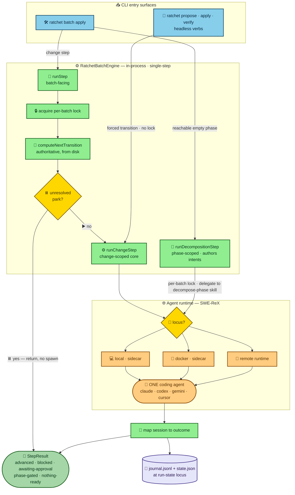
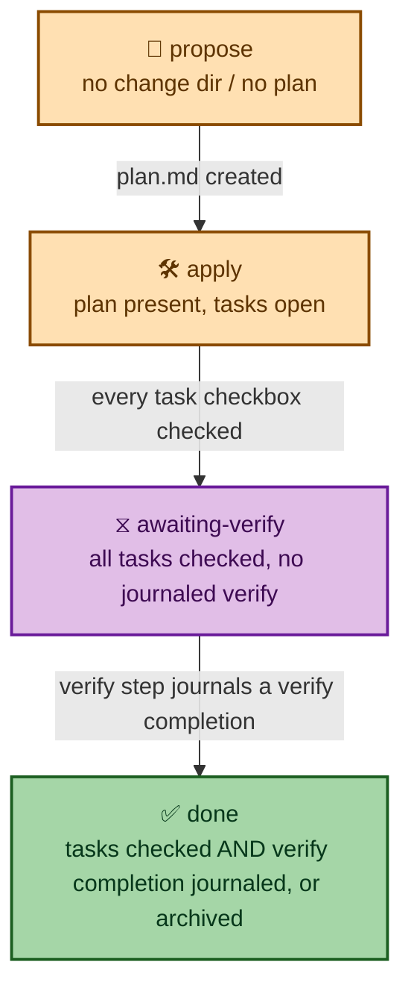
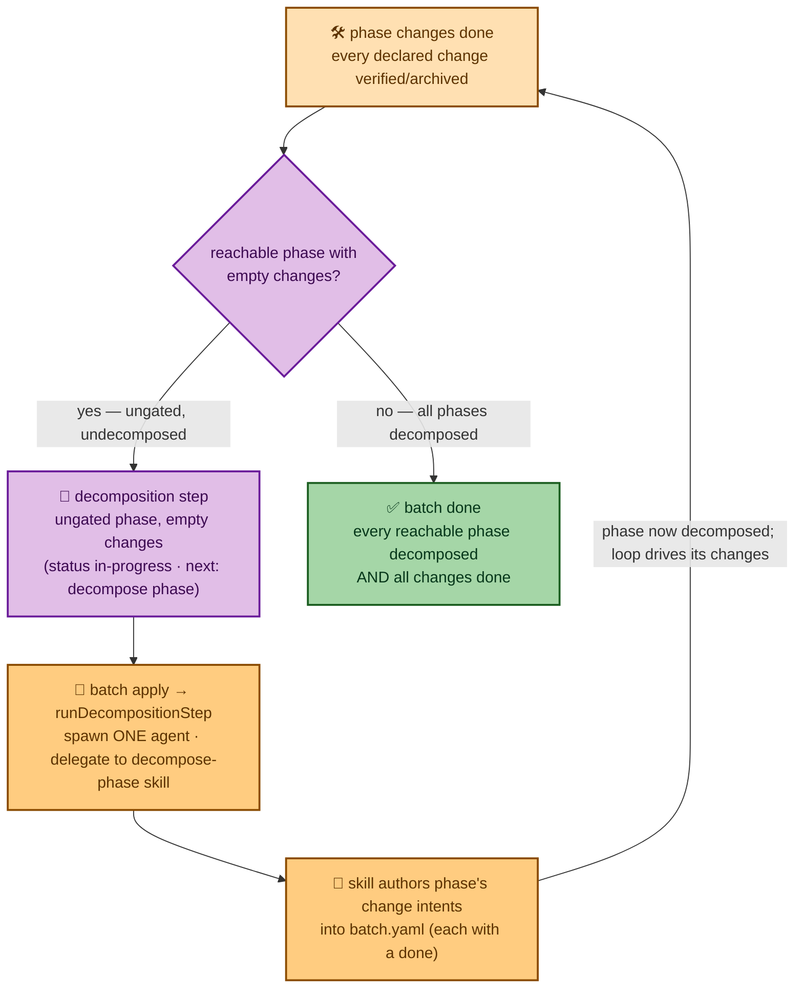
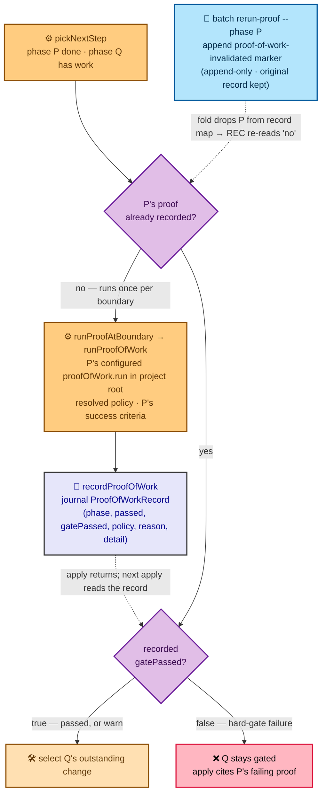

# Engine overview

`RatchetBatchEngine` is the bundled batch execution engine. It ships inside the
main `ratchet` package (`src/core/batch/engine/`) — there is no separate
install, no optional dynamic import, and no activation step. When `batch apply`
or a headless verb runs, the engine is constructed and called in-process.

The engine's contract is **one forced transition per call**: it spawns exactly
one [agent](./agent-runtime.md) for the chosen transition, maps the session to a
structured result, and returns. The autonomous loop that calls it repeatedly is
the `apply-batch` skill, not the CLI.

## Architecture at a glance

Both entry surfaces converge on the change-scoped core, which spawns a single
agent through the SWE-ReX runtime and maps the session to a `StepResult`. Only
`runStep` (the batch-facing surface) takes the lock and derives the transition;
the headless verbs reuse `runChangeStep` directly with a forced transition.



## The two entry surfaces

### `runStep` — batch-facing

```ts
runStep(context: ResolvedStepContext): Promise<StepResult>
```

Called by `ratchet batch apply` (`src/commands/batch/apply.ts`). Its
responsibilities before delegating to the core:

1. Acquires the **per-batch single-flight lock** (see [Lock](#lock)).
2. Re-derives the **authoritative transition** from on-disk state via
   `computeNextTransition`, overriding the coarse hint in `context.transition`.
3. Checks for an **unresolved park** and returns without spawning if one is
   present.
4. Adapts `ResolvedStepContext` into a `ChangeStepContext` (with the derived
   transition) and delegates the spawn-and-map body to `runChangeStep`.

`ResolvedStepContext` requires a `batch` field; the lock, transition derivation,
and park-precedence are deliberately `runStep`'s concern and stay outside the
core so the headless verbs can reuse `runChangeStep` directly.

### `runChangeStep` — change-scoped core

```ts
runChangeStep(ctx: ChangeStepContext): Promise<StepResult>
```

The shared core both `runStep` and the headless verbs invoke. It **does not**
acquire the per-batch lock and **does not** call `computeNextTransition` — the
transition in `ctx.transition` is treated as forced and final. See
[Change-step core](./change-step.md) for the full interface and behavior.

**Headless verbs** (`ratchet propose`, `ratchet apply`, `ratchet verify` — in
`src/commands/propose.ts` and via `src/commands/change-step-common.ts`) call
`runChangeStep` directly with a `ChangeStepContext` that has no `batch`, forcing
exactly the verb's own transition. Run state is kept change-locally under
`.ratchet/changes/<change>/.run/`. See [Standalone settings](./standalone-settings.md)
for how settings are resolved without a manifest.

### `runDecompositionStep` — phase-scoped

```ts
runDecompositionStep(context: DecompositionStepContext): Promise<StepResult>
```

Called by `ratchet batch apply` when the next runnable step is a reachable,
ungated phase whose `changes` list is still empty (a **decomposition step**, not
a change step). Unlike the change path it is keyed off the **phase**, not a
change: it carries no `change` and no `transition`. Its responsibilities mirror
`runStep` but author a phase's intents rather than advance a change:

1. Acquires the **per-batch single-flight lock** (same lock as `runStep`).
2. Guarantees the canonical decomposition command (`decompose-phase`) is present
   in the spawn locus (same render-or-fail discipline as the per-change
   transitions — see [Skill in spawn locus](./agent-runtime.md#skill-in-spawn-locus-guarantee)).
3. Builds **decomposition instructions** that delegate to the canonical
   `decompose-phase` skill (`/rct:decompose-phase <phase>`, resolved per agent),
   injecting the empty phase's goal/success/proof-of-work and the prior phases'
   shipped results as context (`delegated-lifecycle`: the engine orchestrates the
   spawn; the skill authors the intents).
4. Spawns **exactly one** agent through the same runtime selection,
   streaming/rendering, and journal-delta snapshot the change path uses.
5. Maps the session to a `StepResult` (`transition: 'decompose'`). It **never**
   calls `computeNextTransition` and **never** authors `batch.yaml` itself — the
   skill writes the phase's concrete change intents.

A decomposition has no change, so its journal/park state is keyed by the **phase
name** (the decomposition agent reports with `ratchet batch report <batch>
--change <phase> ...`). Once the intents are authored, the next `batch apply`
selects the phase's first ready change as an ordinary propose/apply/verify step —
the loop continues with no manual stop/propose/resume detour (#30).

## Single-step contract

`batch apply` advances exactly **one** transition per invocation. No internal
loop exists in the CLI or the engine. The caller — typically the `apply-batch`
skill — is responsible for invoking `batch apply` repeatedly until the batch
completes.

## Transition derivation

`computeNextTransition` (`src/core/batch/engine/transition.ts`) reads the live
change directory to decide the authoritative next transition:

| On-disk state | Next transition |
|---|---|
| No change directory | `propose` |
| Change directory exists, no `plan.md` | `propose` |
| `plan.md` present, not all task checkboxes checked | `apply` |
| All task checkboxes checked, no `verify` completion in journal | `verify` |
| Archived, or `verify` completion already in journal | `undefined` (nothing runnable) |

"All task checkboxes checked" is tested by counting `- [ ]` / `- [x]` lines in
`plan.md`; every task must be checked (`tasksComplete === tasksTotal > 0`).

`runStep` calls `computeNextTransition` after acquiring the lock and uses the
result as the authoritative transition, falling back to `context.transition` only
when the function returns `undefined` (i.e., the change is already done).
`runChangeStep` never calls it.

## The single journal-aware done-rule

"Done" has **one** definition, computed in one place
(`hasJournaledVerify` / `isChangeDone` in
`src/core/batch/engine/transition.ts`) and honored uniformly by status
derivation (`computeBatchStatus`), step selection (`selectRunnableStep` /
`pickNextStep`), and `computeNextTransition`. A change is done only when its plan
tasks are all checked **and** the run journal carries a `completion` entry for
the `verify` transition — or the change is archived.

The in-between state — tasks all checked but **no journaled verify** — is the
derived `awaiting-verify` status (`ChangeStatus` in `src/core/batch/status.ts`).
It is explicitly NOT done: status reports `awaiting-verify`, and `verify` is the
next runnable transition, so verify actually runs as a gate before a change is
done rather than being skipped on task-checkboxes alone.



## Step selection

`selectRunnableStep` (`src/core/batch/engine/selection.ts`) picks the first
runnable change across phases. `batch apply` uses `computeBatchStatus` and
`pickNextStep` rather than calling `selectRunnableStep` directly, but they
operate on the same semantics:

```ts
interface SelectableChange {
  name: string;
  after: string[]; // dependency names within the same phase
  done: boolean;   // verified/archived
  parked: boolean; // blocked or awaiting input
}

interface SelectablePhase {
  name: string;
  gated: boolean;     // prior phase incomplete, or its recorded hard-gate proof failed
  changes: SelectableChange[];
  decomposed?: boolean; // has concrete change intents; defaults to changes.length > 0
}
```

Selection proceeds in phase order:

1. Skip any phase where `gated` is `true`.
2. If an ungated phase is **undecomposed** (`decomposed` is `false`, i.e. its
   `changes` list is empty), return it as a decomposition step
   (`{ step: { phase, decompose: true } }`) — a reachable empty phase is
   outstanding work, not vacuously done.
3. Within an ungated, decomposed phase, build the set of `done` changes.
4. Iterate changes in manifest order; select the first change where:
   - every `after[]` dependency name is in the `done` set, and
   - the change is not `done`, and
   - the change is not `parked`.
5. Return `{ step: { phase, change } }` on the first match.

Because `done` is the [single journal-aware
predicate](#the-single-journal-aware-done-rule), an `awaiting-verify` change
(tasks all checked, no journaled verify) is `done: false` and is therefore
**selectable** — selection schedules its `verify` transition as the gate that
must run before it can be done, rather than skipping it on task-checkboxes
alone. `batch apply`'s `pickNextStep` mirrors this on the derived status: it
returns a change whose status is `ready`, `in-progress`, **or**
`awaiting-verify`, so the same verify gate is scheduled through the CLI seam.

Before returning a runnable change in phase `Q`, `pickNextStep` interposes the
immediately-preceding phase `P`'s **proof-of-work** as a boundary step: `P` is
`done` (else `Q` would be gated), so when `P` has no recorded proof outcome yet,
`pickNextStep` returns a `{ kind: 'proof-of-work'; phase: P }` target *before*
`Q`'s change. The set of already-recorded phases is passed in (built from
`readProofOfWorkByPhase`), so the boundary runs once. Once `P`'s proof is
recorded, the next apply consults the recorded verdict: a passing proof (or
`warn`) advances into `Q`, while a failing `hard-gate` proof leaves `Q` `gated`
and `pickNextStep` returns no `Q` change — `batchApplyCommand`'s no-step branch
then cites `P`'s failing proof. The first phase has no predecessor, so it yields
no proof step. See [Phase gates and
proof-of-work](#phase-gates-and-proof-of-work).

When no runnable step is found, `SelectionResult.reason` is one of:
`all-done` | `all-gated` | `all-blocked-or-parked` | `empty`. `all-done` is
returned **only** when every reachable phase is decomposed and all its changes
are done — a reachable phase with an empty `changes` list keeps selection out of
`all-done` (it is returned as a decomposition step instead). This mirrors the
batch-done rule in [batch status](#batch-status-and-the-decomposition-step):
status and selection key off the same two facts — "phase decomposed?"
(`changes.length > 0`) and "phase reachable?" (ungated) — so they cannot disagree
about whether a reachable empty phase is outstanding work.

## Batch status and the decomposition step

A multi-phase batch is `done` only once **every reachable phase is decomposed AND
all its changes are done**. The old done arithmetic counted only declared change
intents (`doneCount === changeCount`), so a later phase with an empty `changes`
list contributed zero and the batch flipped `done` the moment the first phase's
changes finished — even though the later phase had no concrete intents yet
(#30). `computeBatchStatus` now folds in whether any reachable (ungated) phase is
still undecomposed: such a phase keeps the batch `in-progress` and is surfaced as
`next` (a decomposition step carrying the phase, no `change`).



`batch apply` **drives** the decomposition natively: when `pickNextStep` surfaces
a decomposition step it calls `runDecompositionStep`, which spawns one agent that
delegates to the canonical `decompose-phase` skill to author the phase's concrete
change intents into `batch.yaml` from the prior phases' shipped results. The next
`batch apply` then selects the phase's first ready change — no manual
stop/propose/resume detour (#30).

A still-**gated** empty phase (its prior phase has unfinished work) is NOT
surfaced as a decomposition step yet — the unfinished prior-phase change is
selected first.

## Phase gates and proof-of-work

Phase boundaries are enforced through two independent mechanisms:

### Gate modes

The `gate` field in `BatchSettings` (set in the batch manifest or project
config) controls when the engine parks for human approval:

| Mode | Behavior |
|---|---|
| `voluntary` | Never parks for approval automatically. |
| `after-propose` | Parks for approval after each completed `propose` transition, before `apply`. |
| `every-phase` | Same as `after-propose`. |
| `autonomous` | Never parks for approval; agent blockers still park. |

Under `after-propose` and `every-phase`, a completed `propose` transition causes
`runStep` / `runChangeStep` to return `awaiting-approval` instead of `advanced`.
The step does not re-run until the park is cleared.

### Proof-of-work

Each phase in the manifest carries a `proofOfWork` definition. The engine
exposes `runProofOfWork` (`src/core/batch/engine/proof-of-work.ts`) for running
it once all changes in a phase are done:

| Kind | Behavior |
|---|---|
| `integration` | Runs a bash command; evaluates a pass condition against exit status and stdout. |
| `blackbox` | Same execution path as `integration`. |
| `llm-judge` | Spawns an agent that exercises the software and returns a pass/fail verdict against the phase success criteria. |

**Pass conditions** (for `integration`/`blackbox`):

| Condition string | Passes when |
|---|---|
| `""` / `exit 0` / `exit-zero` / `exit code 0` | Command exits 0. |
| leading exit-zero directive (e.g. `exit code 0 — new tests pass`, `exit-zero: suite green`) | Command exits 0. A condition that *begins* with an `exit 0` / `exit-zero` / `exit code 0` directive — optionally followed by punctuation/prose — gates on the exit status and is **not** substring-matched against stdout. |
| `contains:<text>` | Command exits 0 and stdout contains `<text>`. |
| `regex:<pattern>` | Command exits 0 and stdout matches the regex. |
| anything else (not an exit-code directive) | Treated as substring: command exits 0 and stdout contains the string. |

**Gate policy** (`ProofOfWorkPolicy`):

| Policy | Behavior |
|---|---|
| `hard-gate` (default) | A failed proof blocks the phase and prevents the next phase from starting. |
| `warn` | A failed proof is recorded but the phase is allowed to complete. |

`gatePassed` is `true` when the proof passed, or when the policy is `warn`.

#### Execution at the phase boundary

`batch apply` is `runProofOfWork`'s live caller. When phase `P`'s changes are all
done and the next reachable phase `Q` still has outstanding work, the host loop
(`pickNextStep` / `batchApplyCommand` in `src/commands/batch/apply.ts`) runs `P`'s
proof-of-work **at the boundary** before entering `Q`:



The executed command is the phase's **configured** `proofOfWork.run`, run in the
project root — ratchet injects no package manager, test runner, or command string
of its own. The boundary check runs **at most once per boundary**: the verdict is
journaled as a `proof-of-work` entry carrying a `ProofOfWorkRecord`, and the next
`batch apply` reads the recorded set (`readProofOfWorkByPhase`). The verdict
therefore survives across the stateless single-step apply invocations. See
[Run-state locus](./run-state.md#proof-of-work-records).

A recorded verdict is **not permanent**. When a proof was recorded `FAILED` for a
fixable cause (a misconfigured `pass`, a flaky run, an env fix), the operator runs
`ratchet batch rerun-proof [name] --phase P` (see [commands: `batch
rerun-proof`](../commands/batch.md#batch-rerun-proof)). It appends an append-only
`proof-of-work-invalidated` marker that **supersedes** the record — the original
entry is left in place for the audit trail. Because the single record fold
(`proofRecordsFromEntries`) treats the marker as removing `P` from the record map,
the next `batch apply` sees `P` as not-recorded (the `REC` decision re-reads
"no"), re-runs `P`'s **configured** boundary proof, and records a fresh verdict
that re-derives the gate. No journal surgery, no second gate path.

The recorded verdict **drives the phase gate**. `computeBatchStatus` derives `Q`'s
gate from `P`'s recorded `gatePassed`: a failing `hard-gate` proof
(`gatePassed: false`) keeps `Q` `blocked` with a `gatedBy` report citing `P`'s
failing proof and its detail, while a passing proof — or any `warn` verdict, which
the recorder always stores as `gatePassed: true` — opens `Q`. Both selection seams
(`pickNextStep` and the pure `selectRunnableStep`) read that single derived gate,
so what status reports `blocked` is exactly what selection refuses to run. Under
`warn` the failure is surfaced when the boundary proof runs (rendered as
`⚠ failed (warn)`) but never blocks progression.

## Outcomes

### `StepResult` (public contract)

```ts
type StepState =
  | 'advanced'
  | 'blocked'
  | 'awaiting-approval'
  | 'phase-gated'
  | 'nothing-ready';

interface StepResult {
  state: StepState;
  change: string;          // the decomposed phase's name on a decomposition step
  transition: StepKind;    // 'propose' | 'apply' | 'verify' | 'decompose'
  blocker?: string;         // present when state is 'blocked'
  approvalRequest?: string; // present when state is 'awaiting-approval'
  journalRefs?: number[];   // indices of journal entries this step wrote
  message?: string;
}
```

| State | Meaning |
|---|---|
| `advanced` | The transition completed; the agent reported a `completion` journal entry. |
| `blocked` | The step requires attention: the agent raised a blocker, the agent crashed, or an internal `failed` state was mapped here (see below). The step is resumable. |
| `awaiting-approval` | `propose` completed under an `after-propose` / `every-phase` gate; parked until approved or feedback is recorded. |
| `phase-gated` | The selected change's phase is gated by an incomplete prior phase. |
| `nothing-ready` | No runnable step exists (all done, all gated, or all blocked/parked). |

### `EngineStepOutcome` (internal)

The engine computes an `EngineStepOutcome` (in `src/core/batch/engine/context.ts`)
with an additional internal state `failed`. The `toStepResult` function maps
`failed` → `blocked` before returning the public `StepResult`, so a crashed or
non-zero agent surfaces as `blocked` (keeping the batch resumable) rather than
a clean advance.

### Session-to-outcome mapping

`mapSessionToOutcome` (`src/core/batch/engine/outcome.ts`) examines the journal
entries the agent wrote during the session and the process exit status:

1. A `blocker` or `needs-input` journal entry → `blocked`.
2. A `completion` journal entry under an `after-propose` gate → `awaiting-approval`.
3. A `completion` journal entry → `advanced`.
4. Non-zero exit without a `completion` → `failed` (surfaces as `blocked`).
5. Zero exit without a `completion` → `blocked`; on-disk evidence (plan.md
   appeared, task checkboxes advanced) is surfaced in the message but the step
   **never auto-advances** on unreported work.

## Journal, run-state, and lock

### Journal and state

The engine is resumable across crashes. Two files live at the run-state locus
(see [Run-state locus](./run-state.md)):

| File | Contents |
|---|---|
| `journal.jsonl` | Append-only log of agent reports (`progress`, `blocker`, `needs-input`, `completion`) and user answers/feedback. Read tolerantly: a partial trailing line from a mid-crash write is silently dropped. |
| `state.json` | Currently parked steps (`blocked` / `awaiting-approval`) for resume. |

The locus is:

| Step kind | Run directory |
|---|---|
| Batch step | `.ratchet/batches/<batch>/run/` |
| Standalone change step (headless verbs) | `.ratchet/changes/<change>/.run/` |

### Lock

`runStep` guards each batch step with an exclusive per-batch lock file at
`.ratchet/batches/<batch>/run/step.lock`. The lock holds the owning `pid` and
`at` timestamp. A stale lock left by a dead process (pid no longer alive) is
reclaimed automatically. Concurrent calls from live processes throw
`BatchLockedError`. The lock is local-host only; it is not NFS- or multi-host-safe.

Headless verbs call `runChangeStep` directly and do not acquire this lock.

## One `batch apply` tick end-to-end

```
ratchet batch apply <name>
│
├─ 1. Load manifest + batch settings
├─ 2. computeBatchStatus → pickNextStep → select first ready/in-progress/
│      awaiting-verify change (skips gated phases; picks first change with deps
│      done and not parked) — an awaiting-verify change schedules its verify gate.
│      If no change is runnable but a reachable phase has empty `changes`,
│      pickNextStep returns a DECOMPOSE target → engine.runDecompositionStep
│      (spawns one agent delegating to the decompose-phase skill), then exit
│
├─ 3. Pre-check park (CLI): if unresolved blocked/awaiting-approval → print hint, exit
│
├─ 4. Build ResolvedStepContext (coarse transition hint from computeNextTransition)
│
└─ 5. engine.runStep(context)
       │
       ├─ 5a. Acquire .ratchet/batches/<batch>/run/step.lock
       │
       ├─ 5b. computeNextTransition → authoritative transition from disk
       │
       ├─ 5c. Check park (engine): if unresolved → return blocked StepResult (no spawn)
       │
       └─ 5d. runChangeStep(changeStepContext)
               │
               ├─ Resolve locus: { batch } → .ratchet/batches/<batch>/run/
               ├─ Build agent instructions (transition, phase, change, guidance, resume)
               ├─ Resolve runtime (local → ReX sidecar; docker → ReX sidecar;
               │  remote → RexRemoteRuntime) — see Agent runtime
               ├─ Spawn ONE agent; stream output live
               ├─ Snapshot journal delta + on-disk state delta
               ├─ mapSessionToOutcome → EngineStepOutcome
               ├─ Stamp .ratchet.yaml metadata (propose only)
               ├─ Append outcome journal entry at locus
               └─ toStepResult → StepResult

       └─ 5e. Release lock

├─ 6. persistStepOutcome: parkStep / clearParkedStep in state.json
└─ 7. Render result (text or --json)
```
