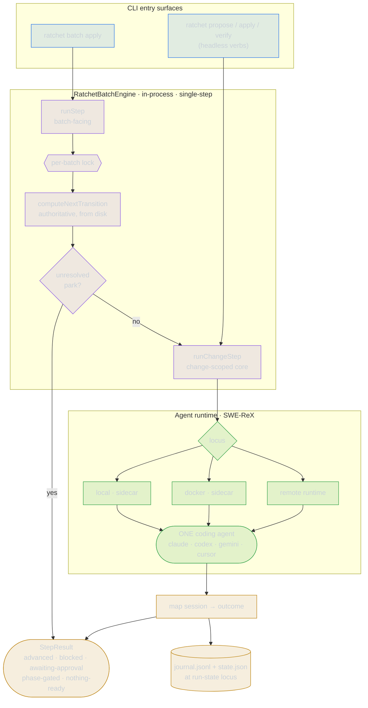

# Engine overview

`RatchetBatchEngine` is the bundled batch execution engine. It ships inside the
main `ratchet` package (`src/core/batch/engine/`) — there is no separate
install, no optional dynamic import, and no activation step. When `batch apply`
or a headless verb runs, the engine is constructed and called in-process.

The engine's contract is **one forced transition per call**: it spawns exactly
one [agent](./agent-runtime.md) for the chosen transition, maps the session to a
structured result, and returns. The autonomous loop that calls it repeatedly is
the `apply-batch` skill, not the CLI.

## Architecture at a glance

Both entry surfaces converge on the change-scoped core, which spawns a single
agent through the SWE-ReX runtime and maps the session to a `StepResult`. Only
`runStep` (the batch-facing surface) takes the lock and derives the transition;
the headless verbs reuse `runChangeStep` directly with a forced transition.



## The two entry surfaces

### `runStep` — batch-facing

```ts
runStep(context: ResolvedStepContext): Promise<StepResult>
```

Called by `ratchet batch apply` (`src/commands/batch/apply.ts`). Its
responsibilities before delegating to the core:

1. Acquires the **per-batch single-flight lock** (see [Lock](#lock)).
2. Re-derives the **authoritative transition** from on-disk state via
   `computeNextTransition`, overriding the coarse hint in `context.transition`.
3. Checks for an **unresolved park** and returns without spawning if one is
   present.
4. Adapts `ResolvedStepContext` into a `ChangeStepContext` (with the derived
   transition) and delegates the spawn-and-map body to `runChangeStep`.

`ResolvedStepContext` requires a `batch` field; the lock, transition derivation,
and park-precedence are deliberately `runStep`'s concern and stay outside the
core so the headless verbs can reuse `runChangeStep` directly.

### `runChangeStep` — change-scoped core

```ts
runChangeStep(ctx: ChangeStepContext): Promise<StepResult>
```

The shared core both `runStep` and the headless verbs invoke. It **does not**
acquire the per-batch lock and **does not** call `computeNextTransition` — the
transition in `ctx.transition` is treated as forced and final. See
[Change-step core](./change-step.md) for the full interface and behavior.

**Headless verbs** (`ratchet propose`, `ratchet apply`, `ratchet verify` — in
`src/commands/propose.ts` and via `src/commands/change-step-common.ts`) call
`runChangeStep` directly with a `ChangeStepContext` that has no `batch`, forcing
exactly the verb's own transition. Run state is kept change-locally under
`.ratchet/changes/<change>/.run/`. See [Standalone settings](./standalone-settings.md)
for how settings are resolved without a manifest.

## Single-step contract

`batch apply` advances exactly **one** transition per invocation. No internal
loop exists in the CLI or the engine. The caller — typically the `apply-batch`
skill — is responsible for invoking `batch apply` repeatedly until the batch
completes.

## Transition derivation

`computeNextTransition` (`src/core/batch/engine/transition.ts`) reads the live
change directory to decide the authoritative next transition:

| On-disk state | Next transition |
|---|---|
| No change directory | `propose` |
| Change directory exists, no `plan.md` | `propose` |
| `plan.md` present, not all task checkboxes checked | `apply` |
| All task checkboxes checked, no `verify` completion in journal | `verify` |
| Archived, or `verify` completion already in journal | `undefined` (nothing runnable) |

"All task checkboxes checked" is tested by counting `- [ ]` / `- [x]` lines in
`plan.md`; every task must be checked (`tasksComplete === tasksTotal > 0`).

`runStep` calls `computeNextTransition` after acquiring the lock and uses the
result as the authoritative transition, falling back to `context.transition` only
when the function returns `undefined` (i.e., the change is already done).
`runChangeStep` never calls it.

## Step selection

`selectRunnableStep` (`src/core/batch/engine/selection.ts`) picks the first
runnable change across phases. `batch apply` uses `computeBatchStatus` and
`pickNextStep` rather than calling `selectRunnableStep` directly, but they
operate on the same semantics:

```ts
interface SelectableChange {
  name: string;
  after: string[]; // dependency names within the same phase
  done: boolean;   // verified/archived
  parked: boolean; // blocked or awaiting input
}

interface SelectablePhase {
  name: string;
  gated: boolean;  // prior phase not yet complete
  changes: SelectableChange[];
}
```

Selection proceeds in phase order:

1. Skip any phase where `gated` is `true`.
2. Within an ungated phase, build the set of `done` changes.
3. Iterate changes in manifest order; select the first change where:
   - every `after[]` dependency name is in the `done` set, and
   - the change is not `done`, and
   - the change is not `parked`.
4. Return `{ step: { phase, change } }` on the first match.

When no runnable step is found, `SelectionResult.reason` is one of:
`all-done` | `all-gated` | `all-blocked-or-parked` | `empty`.

## Phase gates and proof-of-work

Phase boundaries are enforced through two independent mechanisms:

### Gate modes

The `gate` field in `BatchSettings` (set in the batch manifest or project
config) controls when the engine parks for human approval:

| Mode | Behavior |
|---|---|
| `voluntary` | Never parks for approval automatically. |
| `after-propose` | Parks for approval after each completed `propose` transition, before `apply`. |
| `every-phase` | Same as `after-propose`. |
| `autonomous` | Never parks for approval; agent blockers still park. |

Under `after-propose` and `every-phase`, a completed `propose` transition causes
`runStep` / `runChangeStep` to return `awaiting-approval` instead of `advanced`.
The step does not re-run until the park is cleared.

### Proof-of-work

Each phase in the manifest carries a `proofOfWork` definition. The engine
exposes `runProofOfWork` (`src/core/batch/engine/proof-of-work.ts`) for running
it once all changes in a phase are done:

| Kind | Behavior |
|---|---|
| `integration` | Runs a bash command; evaluates a pass condition against exit status and stdout. |
| `blackbox` | Same execution path as `integration`. |
| `llm-judge` | Spawns an agent that exercises the software and returns a pass/fail verdict against the phase success criteria. |

**Pass conditions** (for `integration`/`blackbox`):

| Condition string | Passes when |
|---|---|
| `""` / `exit 0` / `exit-zero` | Command exits 0. |
| `contains:<text>` | Command exits 0 and stdout contains `<text>`. |
| `regex:<pattern>` | Command exits 0 and stdout matches the regex. |
| anything else | Treated as substring: command exits 0 and stdout contains the string. |

**Gate policy** (`ProofOfWorkPolicy`):

| Policy | Behavior |
|---|---|
| `hard-gate` (default) | A failed proof blocks the phase and prevents the next phase from starting. |
| `warn` | A failed proof is recorded but the phase is allowed to complete. |

`gatePassed` is `true` when the proof passed, or when the policy is `warn`.
Proof-of-work is not currently invoked inside `runStep`; the single-step path
advances changes only. Wiring proof-of-work into the gate belongs to the future
host loop.

## Outcomes

### `StepResult` (public contract)

```ts
type StepState =
  | 'advanced'
  | 'blocked'
  | 'awaiting-approval'
  | 'phase-gated'
  | 'nothing-ready';

interface StepResult {
  state: StepState;
  change: string;
  transition: Transition; // 'propose' | 'apply' | 'verify'
  blocker?: string;         // present when state is 'blocked'
  approvalRequest?: string; // present when state is 'awaiting-approval'
  journalRefs?: number[];   // indices of journal entries this step wrote
  message?: string;
}
```

| State | Meaning |
|---|---|
| `advanced` | The transition completed; the agent reported a `completion` journal entry. |
| `blocked` | The step requires attention: the agent raised a blocker, the agent crashed, or an internal `failed` state was mapped here (see below). The step is resumable. |
| `awaiting-approval` | `propose` completed under an `after-propose` / `every-phase` gate; parked until approved or feedback is recorded. |
| `phase-gated` | The selected change's phase is gated by an incomplete prior phase. |
| `nothing-ready` | No runnable step exists (all done, all gated, or all blocked/parked). |

### `EngineStepOutcome` (internal)

The engine computes an `EngineStepOutcome` (in `src/core/batch/engine/context.ts`)
with an additional internal state `failed`. The `toStepResult` function maps
`failed` → `blocked` before returning the public `StepResult`, so a crashed or
non-zero agent surfaces as `blocked` (keeping the batch resumable) rather than
a clean advance.

### Session-to-outcome mapping

`mapSessionToOutcome` (`src/core/batch/engine/outcome.ts`) examines the journal
entries the agent wrote during the session and the process exit status:

1. A `blocker` or `needs-input` journal entry → `blocked`.
2. A `completion` journal entry under an `after-propose` gate → `awaiting-approval`.
3. A `completion` journal entry → `advanced`.
4. Non-zero exit without a `completion` → `failed` (surfaces as `blocked`).
5. Zero exit without a `completion` → `blocked`; on-disk evidence (plan.md
   appeared, task checkboxes advanced) is surfaced in the message but the step
   **never auto-advances** on unreported work.

## Journal, run-state, and lock

### Journal and state

The engine is resumable across crashes. Two files live at the run-state locus
(see [Run-state locus](./run-state.md)):

| File | Contents |
|---|---|
| `journal.jsonl` | Append-only log of agent reports (`progress`, `blocker`, `needs-input`, `completion`) and user answers/feedback. Read tolerantly: a partial trailing line from a mid-crash write is silently dropped. |
| `state.json` | Currently parked steps (`blocked` / `awaiting-approval`) for resume. |

The locus is:

| Step kind | Run directory |
|---|---|
| Batch step | `.ratchet/batches/<batch>/run/` |
| Standalone change step (headless verbs) | `.ratchet/changes/<change>/.run/` |

### Lock

`runStep` guards each batch step with an exclusive per-batch lock file at
`.ratchet/batches/<batch>/run/step.lock`. The lock holds the owning `pid` and
`at` timestamp. A stale lock left by a dead process (pid no longer alive) is
reclaimed automatically. Concurrent calls from live processes throw
`BatchLockedError`. The lock is local-host only; it is not NFS- or multi-host-safe.

Headless verbs call `runChangeStep` directly and do not acquire this lock.

## One `batch apply` tick end-to-end

```
ratchet batch apply <name>
│
├─ 1. Load manifest + batch settings
├─ 2. computeBatchStatus → pickNextStep → select first ready/in-progress change
│      (skips gated phases; picks first change with deps done and not parked)
│
├─ 3. Pre-check park (CLI): if unresolved blocked/awaiting-approval → print hint, exit
│
├─ 4. Build ResolvedStepContext (coarse transition hint from computeNextTransition)
│
└─ 5. engine.runStep(context)
       │
       ├─ 5a. Acquire .ratchet/batches/<batch>/run/step.lock
       │
       ├─ 5b. computeNextTransition → authoritative transition from disk
       │
       ├─ 5c. Check park (engine): if unresolved → return blocked StepResult (no spawn)
       │
       └─ 5d. runChangeStep(changeStepContext)
               │
               ├─ Resolve locus: { batch } → .ratchet/batches/<batch>/run/
               ├─ Build agent instructions (transition, phase, change, guidance, resume)
               ├─ Resolve runtime (local → ReX sidecar; docker → ReX sidecar;
               │  remote → RexRemoteRuntime) — see Agent runtime
               ├─ Spawn ONE agent; stream output live
               ├─ Snapshot journal delta + on-disk state delta
               ├─ mapSessionToOutcome → EngineStepOutcome
               ├─ Stamp .ratchet.yaml metadata (propose only)
               ├─ Append outcome journal entry at locus
               └─ toStepResult → StepResult

       └─ 5e. Release lock

├─ 6. persistStepOutcome: parkStep / clearParkedStep in state.json
└─ 7. Render result (text or --json)
```
