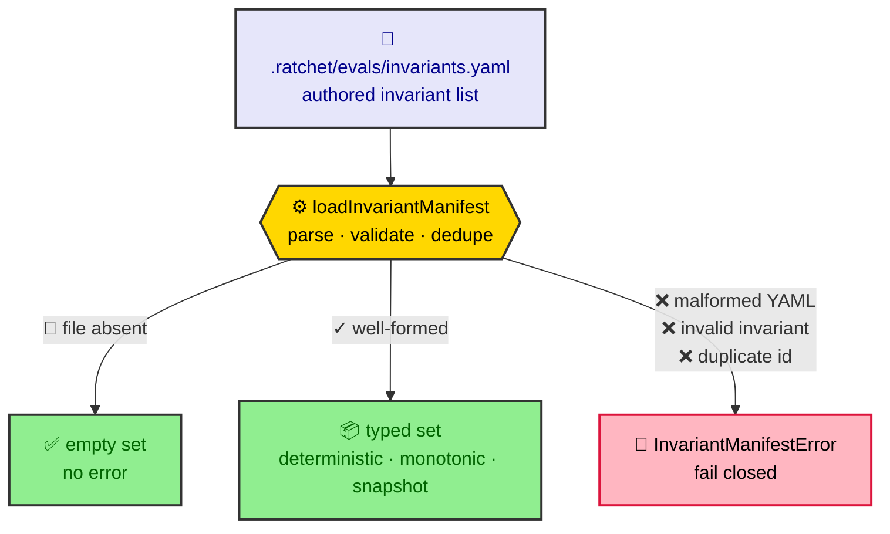

# Eval invariant manifest

The invariant manifest (`.ratchet/evals/invariants.yaml`) declares the run-level,
anti-gaming invariants the eval gate's `invariants` contributor enforces. The
typed loader (`src/core/eval/invariants.ts`) parses the manifest into three
invariant kinds and decides exactly one thing: whether the manifest is
well-formed. It is **fail-closed** — an absent file is the only path to an empty
set; a present-but-broken manifest raises an error rather than degrading to a
vacuous pass.

Evaluating the invariants and gating the verdict are downstream of this loader;
this Reference entry documents the manifest schema and the loader's contract.

## Overview



## Manifest schema

The manifest top level is a single key, `invariants:`, holding a YAML **list**.
List order is preserved (violations are surfaced in declared order). An absent
file, an empty file, and `invariants: []` all resolve to an empty set.

Every invariant carries the shared fields:

| Field         | Type      | Required | Description                                              |
| ------------- | --------- | -------- | -------------------------------------------------------- |
| `id`          | string    | yes      | Unique identifier (min length 1); duplicates are rejected. |
| `kind`        | string    | yes      | `deterministic`, `monotonic`, or `snapshot`.             |
| `active`      | boolean   | yes      | Whether the invariant is enforced; never active-by-default. |
| `description` | string    | no       | Free-form note.                                          |

The remaining fields are determined by `kind`.

### `kind: deterministic`

An absolute predicate that must hold. Carries a `check`:

| Field        | Type   | Required | Default     | Description                                                    |
| ------------ | ------ | -------- | ----------- | -------------------------------------------------------------- |
| `check.run`  | string | yes      | —           | Command evaluated as the predicate.                            |
| `check.pass` | string | no       | `exit-zero` | Pass condition: `exit-zero` \| `contains:<text>` \| `regex:<pattern>` \| substring. |

```yaml
invariants:
  - id: tests-still-exist
    kind: deterministic
    active: false
    check:
      run: test -d test
      pass: exit-zero
```

### `kind: monotonic`

A named measure whose current value must be non-decreasing versus the baseline
run's recorded value.

| Field     | Type   | Required | Description                              |
| --------- | ------ | -------- | ---------------------------------------- |
| `measure` | string | yes      | Name of the tracked metric (min length 1). |

```yaml
invariants:
  - id: spec-not-weakened
    kind: monotonic
    active: true
    measure: scenario-count
```

### `kind: snapshot`

Current output diffed against a checked-in golden.

| Field         | Type   | Required | Description                                          |
| ------------- | ------ | -------- | ---------------------------------------------------- |
| `golden`      | string | yes      | Path to the checked-in golden (min length 1).        |
| `produce.run` | string | yes      | Command emitting the current value to diff (min length 1). |

```yaml
invariants:
  - id: public-api-unchanged
    kind: snapshot
    active: false
    golden: .ratchet/evals/golden/public-api.txt
    produce:
      run: ratchet api --json
```

## Loader contract

`loadInvariantManifest(projectRoot)` resolves the manifest at
`invariantsManifestPath(projectRoot)` —
`<projectRoot>/.ratchet/evals/invariants.yaml` — and returns an
`InvariantManifest` (`{ invariants: Invariant[] }`) in declared order:

| Manifest state                                                              | Result                                              |
| --------------------------------------------------------------------------- | --------------------------------------------------- |
| Absent file                                                                 | `{ invariants: [] }` — the only empty-set path.     |
| Present, valid                                                              | Typed set in declared order.                        |
| Malformed YAML                                                              | Throws `InvariantManifestError`.                    |
| Invalid invariant (unknown kind, missing `active`, missing a kind-required field) | Throws `InvariantManifestError` naming the invariant. |
| Duplicate `id`                                                              | Throws `InvariantManifestError` naming the id.      |

The loader never returns a silently empty set for a present-but-broken manifest:
an empty active set is a vacuous pass, so any failure to parse or validate raises
`InvariantManifestError` and the caller fails closed.

## API

| Export                            | Description                                                         |
| --------------------------------- | ------------------------------------------------------------------- |
| `loadInvariantManifest(root)`     | Loads and validates the manifest; fail-closed.                      |
| `invariantsManifestPath(root)`    | Resolves the manifest path under `.ratchet/evals/`.                 |
| `InvariantManifestError`          | Error raised for any present-but-broken manifest.                   |
| `Invariant`                       | Discriminated union of the three invariant kinds.                   |
| `DeterministicInvariant` / `MonotonicInvariant` / `SnapshotInvariant` | Per-kind types.                 |
| `InvariantManifest`               | Load result: `{ invariants: Invariant[] }`.                         |
| `InvariantSchema`                 | The zod discriminated union backing validation.                     |
