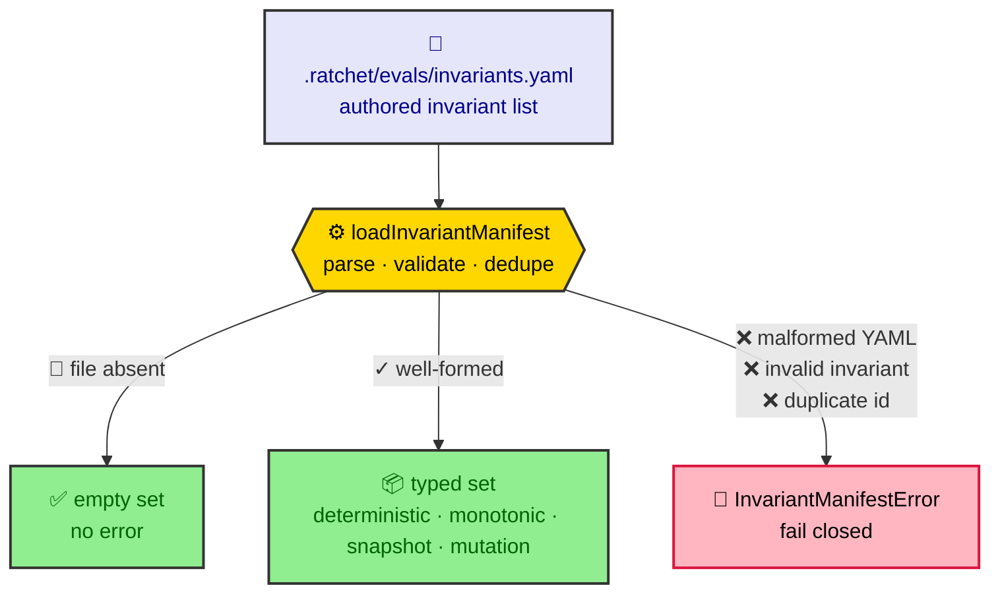
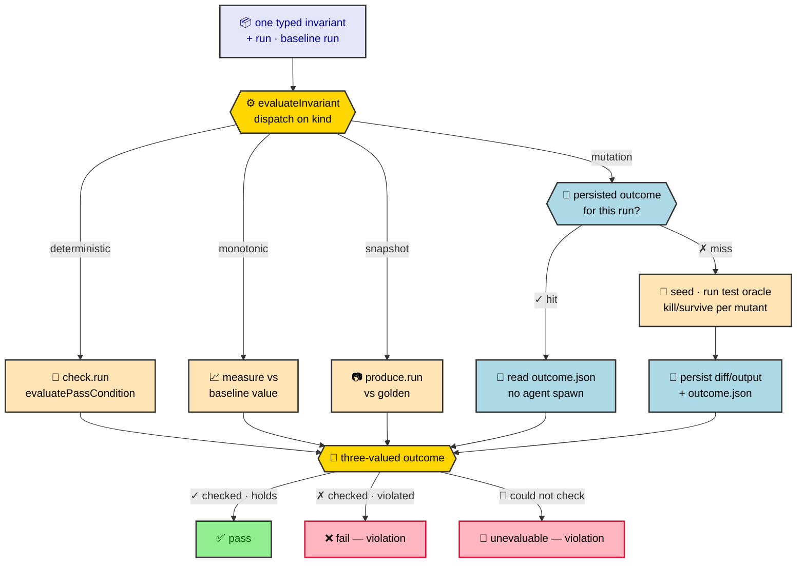
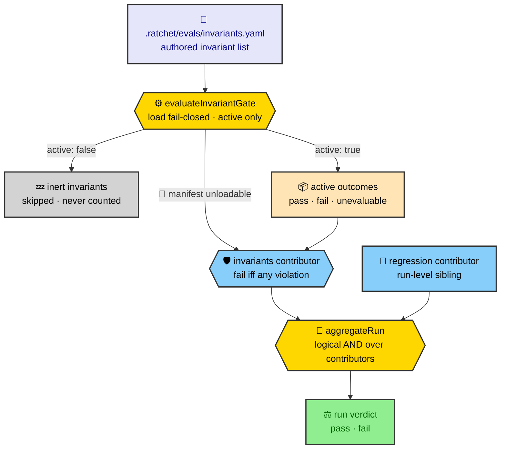

# Eval invariant manifest

An **invariant** is a property of the project that a run must always uphold, no
matter what a change did to make the per-case suite pass. Its purpose is
**anti-gaming**: it closes the ways an eval can *look* green without the project
actually being sound. Two failure modes it guards against are a **vacuous pass**
(the gate passes because nothing was really checked) and **spec weakening** (a
change quietly deletes or waters down scenarios so fewer things are tested). The
invariant manifest (`.ratchet/evals/invariants.yaml`) declares these run-level
invariants; the eval gate's `invariants` contributor enforces them.

Key terms used throughout this document:

- **invariant kinds** — the four shapes an invariant can take. A
  **`deterministic`** invariant is an absolute predicate (a command that must
  pass). A **`monotonic`** invariant is a named measure that must never decrease
  versus the baseline (e.g. `scenario-count` — the anti-spec-weakening check). A
  **`snapshot`** invariant diffs current output against a checked-in golden file.
  A **`mutation`** invariant carries a `test`/`budget`/`threshold` triple that
  types a mutation-testing invariant (seed a small fault, run the user's own
  `test` command as the oracle, hard-fail a survived mutant); evaluation is
  wired (see [`kind: mutation`](#kind-mutation)).
- **`active` flag** — a per-invariant boolean, required on every entry and never
  active-by-default. Only `active: true` invariants are enforced; **inert**
  (`active: false`) ones are declared but skipped, so activating one is always a
  deliberate edit.
- **fail-closed** — when the system cannot be sure a property holds, it fails
  rather than passes. An absent manifest is the *only* way to reach an empty set;
  a present-but-broken manifest raises an error instead of degrading to a vacuous
  pass, and an invariant that cannot be checked at all counts as a violation, not
  a pass.

Three components implement this, each with a single job:

- The typed **loader** (`src/core/eval/invariants.ts`) parses the manifest into
  the four invariant kinds and decides exactly one thing — whether the manifest
  is well-formed — fail-closed.
- The per-invariant **evaluator** (`src/core/eval/invariant-evaluator.ts`) takes
  one typed invariant at a time and computes a `pass` / `fail` / `unevaluable`
  outcome (see [Evaluator outcome model](#evaluator-outcome-model)).
- The run-level **gate** (`src/core/eval/invariant-gate.ts`) ties the two
  together: on every `eval run` (and any batch `verify` that surfaces an eval
  verdict) it loads the manifest fail-closed, evaluates **only the active
  invariants**, and reduces them to one pass/fail signal the verdict-aggregation
  core consumes as the `invariants` contributor — a sibling to `regression`. See
  [Gate contributor](#gate-contributor).

## Overview

The loader turns the authored YAML into a typed set, failing closed on anything
broken:



Each typed invariant is then evaluated against the run to one outcome. All four
kinds — `deterministic`/`monotonic`/`snapshot`/`mutation` — resolve dynamically
into the same three-valued outcome. Anything that cannot be checked fails closed
to a violation rather than a pass. The diagram funnels every kind through a
single outcome node rather than fanning each to its own result:



Run-level, the gate reduces the manifest's active invariants to the `invariants`
contributor, which the verdict-aggregation core ANDs with its siblings —
`regression` first among them — to decide the run's pass:



## Manifest schema

The manifest top level is a single key, `invariants:`, holding a YAML **list**.
List order is preserved (violations are surfaced in declared order). An absent
file, an empty file, and `invariants: []` all resolve to an empty set.

Every invariant carries the shared fields:

| Field         | Type      | Required | Description                                              |
| ------------- | --------- | -------- | -------------------------------------------------------- |
| `id`          | string    | yes      | Unique identifier (min length 1); duplicates are rejected. |
| `kind`        | string    | yes      | `deterministic`, `monotonic`, `snapshot`, or `mutation`. |
| `active`      | boolean   | yes      | Whether the invariant is enforced; never active-by-default. |
| `description` | string    | no       | Free-form note.                                          |

The remaining fields are determined by `kind`.

### `kind: deterministic`

An absolute predicate that must hold. Carries a `check`:

| Field        | Type   | Required | Default     | Description                                                    |
| ------------ | ------ | -------- | ----------- | -------------------------------------------------------------- |
| `check.run`  | string | yes      | —           | Command evaluated as the predicate.                            |
| `check.pass` | string | no       | `exit-zero` | Pass condition: `exit-zero` \| `contains:<text>` \| `regex:<pattern>` \| substring. |

```yaml
invariants:
  - id: tests-still-exist
    kind: deterministic
    active: false
    check:
      run: test -d test
      pass: exit-zero
```

### `kind: monotonic`

A named measure whose current value must be non-decreasing versus the baseline
run's recorded value.

| Field     | Type   | Required | Description                              |
| --------- | ------ | -------- | ---------------------------------------- |
| `measure` | string | yes      | Name of the tracked metric (min length 1). |

```yaml
invariants:
  - id: spec-not-weakened
    kind: monotonic
    active: true
    measure: scenario-count
```

### `kind: snapshot`

Current output diffed against a checked-in golden.

| Field         | Type   | Required | Description                                          |
| ------------- | ------ | -------- | ---------------------------------------------------- |
| `golden`      | string | yes      | Path to the checked-in golden (min length 1).        |
| `produce.run` | string | yes      | Command emitting the current value to diff (min length 1). |

```yaml
invariants:
  - id: public-api-unchanged
    kind: snapshot
    active: false
    golden: .ratchet/evals/golden/public-api.txt
    produce:
      run: ratchet api --json
```

### `kind: mutation`

A mutation-testing invariant: seed a small fault (a mutant), run the user's own
test suite as the oracle, and hard-fail if a mutant survives. `test` is a bare
command string, not a `check`-style pass condition — a mutation invariant's
pass/fail is decided per-mutant (kill vs survive) by the downstream harness, not
by the test command's own exit code in isolation.

| Field       | Type   | Required | Description                                                          |
| ----------- | ------ | -------- | --------------------------------------------------------------------- |
| `test`      | string | yes      | The user's test command (min length 1) — the oracle every seeded mutant is run against. No auto-detection, author-supplied, mirroring `check.run`. |
| `budget`    | number | yes      | Positive integer ceiling: at most this many mutants are seeded per run. |
| `threshold` | number | yes      | Positive integer floor: at least this many mutants must reach a kill/survive verdict for the invariant to be evaluable. |

```yaml
invariants:
  - id: mutants-are-killed
    kind: mutation
    active: false
    test: pnpm test
    budget: 5
    threshold: 3
```

The seed/run-oracle/classify/revert harness exists standalone at
`src/core/eval/mutation-harness.ts` — see [Mutation harness](eval-mutation-harness.md).
It drives the configured coding agent through the same spawn seam the
`llm-judge` binding uses to seed one fault at a time, runs `test` as the
deterministic oracle, and classifies each fault killed or survived.
`evaluateInvariant` runs this harness and reduces its per-mutant results to a
real `pass`/`fail`/`unevaluable` outcome, persisting each mutant's diff and test
output as replayable run evidence — see
[How each kind is evaluated](#how-each-kind-is-evaluated). Scaffolding a `kind:
mutation` entry from `ratchet init` remains a follow-on change.

## Loader contract

`loadInvariantManifest(projectRoot)` resolves the manifest at
`invariantsManifestPath(projectRoot)` —
`<projectRoot>/.ratchet/evals/invariants.yaml` — and returns an
`InvariantManifest` (`{ invariants: Invariant[] }`) in declared order:

| Manifest state                                                              | Result                                              |
| --------------------------------------------------------------------------- | --------------------------------------------------- |
| Absent file                                                                 | `{ invariants: [] }` — the only empty-set path.     |
| Present, valid                                                              | Typed set in declared order.                        |
| Malformed YAML                                                              | Throws `InvariantManifestError`.                    |
| Invalid invariant (unknown kind, missing `active`, missing a kind-required field) | Throws `InvariantManifestError` naming the invariant. |
| Duplicate `id`                                                              | Throws `InvariantManifestError` naming the id.      |

The loader never returns a silently empty set for a present-but-broken manifest:
an empty active set is a vacuous pass, so any failure to parse or validate raises
`InvariantManifestError` and the caller fails closed.

## Evaluator outcome model

`evaluateInvariant(invariant, context)` computes exactly one **outcome** for a
single loaded invariant against the run state. The outcome is three-valued, and
the third value is the anti-gaming linchpin:

| `status`       | Meaning                                                              | Violation? |
| -------------- | ------------------------------------------------------------------- | ---------- |
| `pass`         | The invariant was checked and the run satisfies it.                 | no         |
| `fail`         | The invariant was checked and the run violates it.                  | yes        |
| `unevaluable`  | The invariant **could not be checked at all** (fail-closed).        | yes        |

`unevaluable` is a first-class status, never folded into `fail`, so the evidence
can distinguish *"checked and violated"* from *"could not be checked"*. Both are
violations: `isInvariantViolation(outcome)` is `status !== 'pass'`, so a kind that
cannot be evaluated can never slip through as a pass — the exact vacuous-pass hole
the invariant set exists to close.

Every outcome records a human-readable `measure` and the `evidence` behind the
status. The `context` (`InvariantEvalContext`) supplies the `projectRoot`, the
`run`, the `baseline` run (or `null`), and injectable `bash` / `readFile` seams
(defaulting to the real runners) so the decision logic is provable without a real
spawn or filesystem.

### How each kind is evaluated

- **deterministic** — runs `check.run` (cwd = project root) through the injected
  `bash` and decides pass/fail with the engine's `evaluatePassCondition` (the same
  `exit-zero` / `contains:` / `regex:` / substring vocabulary the deterministic
  *binding* uses). A predicate that **throws before producing a result** is
  `unevaluable`. Evidence records the pass condition met, or the predicate output,
  or why it could not run.
- **monotonic** — resolves the named `measure` to a current value over the run via
  the extensible `MEASURE_RESOLVERS` registry, then compares it non-decreasing
  against the same measure derived from the **baseline run's recorded state**:
  `current ≥ baseline` is pass, `current < baseline` is fail. A **missing baseline
  run/measure** or an **unknown measure name** is `unevaluable`. `measure` records
  `scenario-count: 12 (baseline 10)`. The only built-in measure is the
  ecosystem-neutral `scenario-count` (`run.cases.length`); new measures register in
  the map without baking any toolchain into the evaluator.
- **snapshot** — reads the checked-in `golden` (resolved relative to the project
  root) via the injected `readFile`, runs `produce.run`, and diffs the produced
  stdout (trimmed) against the golden (trimmed): equal is pass, differing is fail.
  An **absent golden**, or a `produce` command that **throws**, is `unevaluable`.
- **mutation** — checks for a persisted outcome for this `(run.runId,
  invariant.id)` first; a hit is returned verbatim, with no harness call and no
  agent spawn. A miss runs the mutation harness (seeds up to `budget` mutants
  via the agent spawn seam, gates each on `test` as the kill/survive oracle) and
  reduces the per-mutant results: any **survived** mutant is a hard `fail`,
  regardless of how many others were killed. Short of that, **fewer than
  `threshold`** evaluated mutants is `unevaluable` — not enough evidence to trust
  a "no survivors" claim. A harness call that **throws**, or an **unusable
  working tree**, is also `unevaluable` (neither persisted nor cached, since no
  mutant was seeded). Otherwise (at least `threshold` mutants evaluated, none
  survived): pass. Whenever at least one mutant ran, every mutant's diff and
  oracle stdout/stderr — killed or survived alike — is persisted as durable run
  evidence on `InvariantOutcome.artifacts`, and the reduced outcome itself is
  persisted alongside it, so a survived mutant's exact fault and test output is
  reproducible from the run record alone and a repeated evaluation of the same
  run never re-spawns the agent.

## Gate contributor

`evaluateInvariantGate({ projectRoot, run, baseline, bash?, readFile? })` is the
run-level seam that wires the manifest into the verdict. It runs **once per run**,
inside `buildReport` — the single place a run's verdict is aggregated, shared by
`eval run`, `eval report`, and any batch `verify` that surfaces an eval verdict.

1. **Load fail-closed.** A present-but-broken manifest (`InvariantManifestError`)
   returns a non-empty `failing` (the manifest filename) plus a `loadError`, so the
   contributor fails rather than passing on an empty set. An **absent** manifest is
   the only path to a passing, empty gate (nothing declared).
2. **Active only.** Only `active: true` invariants are evaluated; inert invariants
   are skipped — never run, and **never recorded as a passing invariant**. A
   manifest of only inert invariants yields zero outcomes and the contributor
   passes, but no inert invariant is counted as a vacuous pass.
3. **Collect violations.** Each active invariant is evaluated through
   `evaluateInvariant`; every outcome `isInvariantViolation` flags (both `fail` and
   `unevaluable`) has its `id` collected into `failing`.

The result (`InvariantGateResult` = `{ outcomes, failing, loadError? }`) is
precomputed upstream and fed into the pure, synchronous aggregation core through
`ContributorContext.invariants`; the `invariants` contributor merely reads
`failing` — `fail` when non-empty, `pass` otherwise — exactly as `regression`
reads `diff.regressions`. The async command-running stays out of the aggregation
core, which remains I/O-free.

`buildReport` evaluates the gate **only when the `invariants` contributor is in
the run's enabled set** (`run.gate`). A disabled contributor runs no manifest
command and takes no part in the AND. The per-invariant breakdown is exposed on
`EvalReport.invariants` (and `EvalReport.loadError`), and `ratchet eval run`
surfaces a violated/unevaluable invariant — or an unloadable manifest — **first,
as a sibling to a regression**, ahead of the per-case contributor breakdown.

### Toggling the contributor

The `invariants` contributor is enabled by default and toggles through the
standard contributor gate:

- **`eval.gate.invariants: false`** in `.ratchet/config.yaml` disables it for the
  project (see [config-yaml](configuration/config-yaml.md)).
- **`--no-invariants`** on `ratchet eval run` disables it for a single run,
  overriding the config (see [eval command](commands/eval.md)).

When disabled, the gate is not evaluated, no invariant command runs, and the
contributor is absent from the verdict — the same generic mechanism as
`--no-llm-judge` / `eval.gate.llm-judge`.

## API

| Export                            | Description                                                         |
| --------------------------------- | ------------------------------------------------------------------- |
| `evaluateInvariantGate(input)`    | Run-level gate: loads fail-closed, evaluates active invariants, returns `{ outcomes, failing, loadError? }`. |
| `InvariantGateResult` / `InvariantGateInput` | The gate result and its inputs (`projectRoot`, `run`, `baseline`, injectable `bash` / `readFile`). |
| `loadInvariantManifest(root)`     | Loads and validates the manifest; fail-closed.                      |
| `invariantsManifestPath(root)`    | Resolves the manifest path under `.ratchet/evals/`.                 |
| `InvariantManifestError`          | Error raised for any present-but-broken manifest.                   |
| `Invariant`                       | Discriminated union of the four invariant kinds.                    |
| `DeterministicInvariant` / `MonotonicInvariant` / `SnapshotInvariant` / `MutationInvariant` | Per-kind types.  |
| `InvariantManifest`               | Load result: `{ invariants: Invariant[] }`.                         |
| `InvariantSchema`                 | The zod discriminated union backing validation.                     |
| `evaluateInvariant(inv, ctx)`     | Computes one `pass` / `fail` / `unevaluable` outcome for an invariant; fail-closed. |
| `isInvariantViolation(outcome)`   | `status !== 'pass'` — treats both `fail` and `unevaluable` as violations. |
| `MEASURE_RESOLVERS`               | Extensible measure registry; ships the neutral `scenario-count`.    |
| `InvariantOutcome` / `InvariantStatus` | The outcome record and its three-valued status.                |
| `InvariantEvalContext`            | Evaluator inputs: `projectRoot`, `run`, `baseline`, injectable `bash` / `readFile`. |
| `MeasureResolver` / `FileReader` / `realFileReader` | The injectable seam types and the default fs reader. |

## Default manifest

`ratchet init` writes a starter `.ratchet/evals/invariants.yaml` for a project
that has none yet (`src/core/eval/default-manifest.ts`,
`buildDefaultInvariantManifestYaml(projectRoot)`), so the anti-gaming gate is
real from the first run rather than opt-in by omission:

- **`spec-not-weakened`** (`monotonic`, `measure: scenario-count`) is always
  present and **active**. It is the one invariant ratchet can evaluate on
  every project unconditionally — the measure comes from ratchet's own run
  state (`run.cases.length`), not anything stack-specific.
- **`tests-still-exist`** (`deterministic`) is always **inert**
  (`active: false`). `detectTestDirectory(projectRoot)` checks a small,
  ecosystem-neutral set of conventional directory names (`test`, `tests`,
  `spec`, `__tests__`) for existence under the project root. When one is
  found, the entry is emitted as live, uncommented YAML with a concrete
  `check.run: test -d <detected-dir>`, ready to flip to `active: true`. When
  none is found, it is emitted as a commented-out placeholder instead of a
  guessed path — never parsed by the loader.
- **`public-api-unchanged`** (`snapshot`) is always **inert** and always a
  commented-out placeholder. A real `produce.run` needs a toolchain-specific
  command (a TypeScript declaration diff, `cargo public-api`, etc.); ratchet
  cannot pick one without assuming a stack, so this entry is never live YAML
  in the default manifest.

The manifest is written once, only when absent — first init or a project that
has never had one (mirroring how `config.yaml` is scaffolded). A re-run
(extend mode) or any subsequent `ratchet init` leaves an existing
`invariants.yaml` untouched, so a user's later edits (e.g. flipping an
invariant active) are never clobbered.

This is the literal anti-vacuous guarantee the invariant set exists to
enforce: only `spec-not-weakened` is ever scaffolded active, so the default
manifest is never active-but-vacuous, and activating `tests-still-exist` or
`public-api-unchanged` is always a deliberate, informed user edit — never an
init-time guess.
