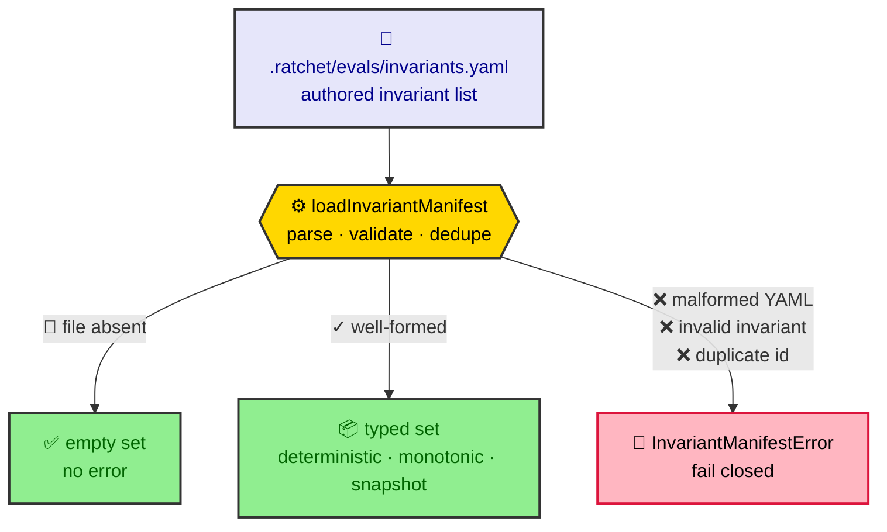
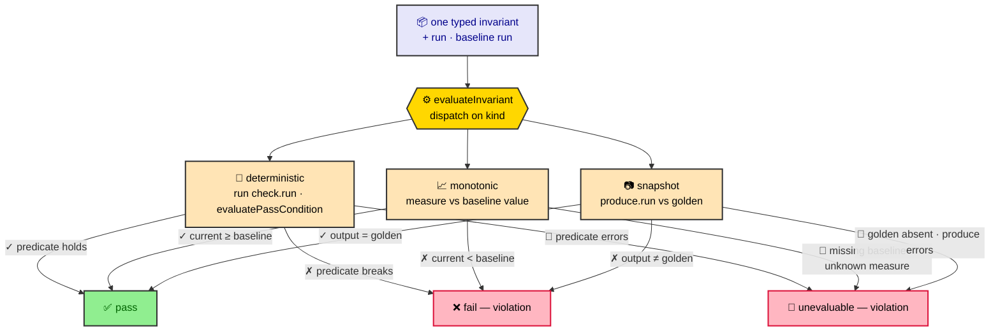

# Eval invariant manifest

The invariant manifest (`.ratchet/evals/invariants.yaml`) declares the run-level,
anti-gaming invariants the eval gate's `invariants` contributor enforces. The
typed loader (`src/core/eval/invariants.ts`) parses the manifest into three
invariant kinds and decides exactly one thing: whether the manifest is
well-formed. It is **fail-closed** — an absent file is the only path to an empty
set; a present-but-broken manifest raises an error rather than degrading to a
vacuous pass.

The typed set the loader produces is then handed one invariant at a time to the
per-invariant **evaluator** (`src/core/eval/invariant-evaluator.ts`), which
computes a `pass` / `fail` / `unevaluable` outcome for each kind (documented under
[Evaluator outcome model](#evaluator-outcome-model)). Threading the evaluator
through the `invariants` gate contributor over the whole manifest, and gating the
run verdict on it, are downstream of this slice.

## Overview

The loader turns the authored YAML into a typed set, failing closed on anything
broken:



Each typed invariant is then evaluated against the run to one outcome — and
anything that cannot be checked fails closed to a violation rather than a pass:



## Manifest schema

The manifest top level is a single key, `invariants:`, holding a YAML **list**.
List order is preserved (violations are surfaced in declared order). An absent
file, an empty file, and `invariants: []` all resolve to an empty set.

Every invariant carries the shared fields:

| Field         | Type      | Required | Description                                              |
| ------------- | --------- | -------- | -------------------------------------------------------- |
| `id`          | string    | yes      | Unique identifier (min length 1); duplicates are rejected. |
| `kind`        | string    | yes      | `deterministic`, `monotonic`, or `snapshot`.             |
| `active`      | boolean   | yes      | Whether the invariant is enforced; never active-by-default. |
| `description` | string    | no       | Free-form note.                                          |

The remaining fields are determined by `kind`.

### `kind: deterministic`

An absolute predicate that must hold. Carries a `check`:

| Field        | Type   | Required | Default     | Description                                                    |
| ------------ | ------ | -------- | ----------- | -------------------------------------------------------------- |
| `check.run`  | string | yes      | —           | Command evaluated as the predicate.                            |
| `check.pass` | string | no       | `exit-zero` | Pass condition: `exit-zero` \| `contains:<text>` \| `regex:<pattern>` \| substring. |

```yaml
invariants:
  - id: tests-still-exist
    kind: deterministic
    active: false
    check:
      run: test -d test
      pass: exit-zero
```

### `kind: monotonic`

A named measure whose current value must be non-decreasing versus the baseline
run's recorded value.

| Field     | Type   | Required | Description                              |
| --------- | ------ | -------- | ---------------------------------------- |
| `measure` | string | yes      | Name of the tracked metric (min length 1). |

```yaml
invariants:
  - id: spec-not-weakened
    kind: monotonic
    active: true
    measure: scenario-count
```

### `kind: snapshot`

Current output diffed against a checked-in golden.

| Field         | Type   | Required | Description                                          |
| ------------- | ------ | -------- | ---------------------------------------------------- |
| `golden`      | string | yes      | Path to the checked-in golden (min length 1).        |
| `produce.run` | string | yes      | Command emitting the current value to diff (min length 1). |

```yaml
invariants:
  - id: public-api-unchanged
    kind: snapshot
    active: false
    golden: .ratchet/evals/golden/public-api.txt
    produce:
      run: ratchet api --json
```

## Loader contract

`loadInvariantManifest(projectRoot)` resolves the manifest at
`invariantsManifestPath(projectRoot)` —
`<projectRoot>/.ratchet/evals/invariants.yaml` — and returns an
`InvariantManifest` (`{ invariants: Invariant[] }`) in declared order:

| Manifest state                                                              | Result                                              |
| --------------------------------------------------------------------------- | --------------------------------------------------- |
| Absent file                                                                 | `{ invariants: [] }` — the only empty-set path.     |
| Present, valid                                                              | Typed set in declared order.                        |
| Malformed YAML                                                              | Throws `InvariantManifestError`.                    |
| Invalid invariant (unknown kind, missing `active`, missing a kind-required field) | Throws `InvariantManifestError` naming the invariant. |
| Duplicate `id`                                                              | Throws `InvariantManifestError` naming the id.      |

The loader never returns a silently empty set for a present-but-broken manifest:
an empty active set is a vacuous pass, so any failure to parse or validate raises
`InvariantManifestError` and the caller fails closed.

## Evaluator outcome model

`evaluateInvariant(invariant, context)` computes exactly one **outcome** for a
single loaded invariant against the run state. The outcome is three-valued, and
the third value is the anti-gaming linchpin:

| `status`       | Meaning                                                              | Violation? |
| -------------- | ------------------------------------------------------------------- | ---------- |
| `pass`         | The invariant was checked and the run satisfies it.                 | no         |
| `fail`         | The invariant was checked and the run violates it.                  | yes        |
| `unevaluable`  | The invariant **could not be checked at all** (fail-closed).        | yes        |

`unevaluable` is a first-class status, never folded into `fail`, so the evidence
can distinguish *"checked and violated"* from *"could not be checked"*. Both are
violations: `isInvariantViolation(outcome)` is `status !== 'pass'`, so a kind that
cannot be evaluated can never slip through as a pass — the exact vacuous-pass hole
the invariant set exists to close.

Every outcome records a human-readable `measure` and the `evidence` behind the
status. The `context` (`InvariantEvalContext`) supplies the `projectRoot`, the
`run`, the `baseline` run (or `null`), and injectable `bash` / `readFile` seams
(defaulting to the real runners) so the decision logic is provable without a real
spawn or filesystem.

### How each kind is evaluated

- **deterministic** — runs `check.run` (cwd = project root) through the injected
  `bash` and decides pass/fail with the engine's `evaluatePassCondition` (the same
  `exit-zero` / `contains:` / `regex:` / substring vocabulary the deterministic
  *binding* uses). A predicate that **throws before producing a result** is
  `unevaluable`. Evidence records the pass condition met, or the predicate output,
  or why it could not run.
- **monotonic** — resolves the named `measure` to a current value over the run via
  the extensible `MEASURE_RESOLVERS` registry, then compares it non-decreasing
  against the same measure derived from the **baseline run's recorded state**:
  `current ≥ baseline` is pass, `current < baseline` is fail. A **missing baseline
  run/measure** or an **unknown measure name** is `unevaluable`. `measure` records
  `scenario-count: 12 (baseline 10)`. The only built-in measure is the
  ecosystem-neutral `scenario-count` (`run.cases.length`); new measures register in
  the map without baking any toolchain into the evaluator.
- **snapshot** — reads the checked-in `golden` (resolved relative to the project
  root) via the injected `readFile`, runs `produce.run`, and diffs the produced
  stdout (trimmed) against the golden (trimmed): equal is pass, differing is fail.
  An **absent golden**, or a `produce` command that **throws**, is `unevaluable`.

## API

| Export                            | Description                                                         |
| --------------------------------- | ------------------------------------------------------------------- |
| `loadInvariantManifest(root)`     | Loads and validates the manifest; fail-closed.                      |
| `invariantsManifestPath(root)`    | Resolves the manifest path under `.ratchet/evals/`.                 |
| `InvariantManifestError`          | Error raised for any present-but-broken manifest.                   |
| `Invariant`                       | Discriminated union of the three invariant kinds.                   |
| `DeterministicInvariant` / `MonotonicInvariant` / `SnapshotInvariant` | Per-kind types.                 |
| `InvariantManifest`               | Load result: `{ invariants: Invariant[] }`.                         |
| `InvariantSchema`                 | The zod discriminated union backing validation.                     |
| `evaluateInvariant(inv, ctx)`     | Computes one `pass` / `fail` / `unevaluable` outcome for an invariant; fail-closed. |
| `isInvariantViolation(outcome)`   | `status !== 'pass'` — treats both `fail` and `unevaluable` as violations. |
| `MEASURE_RESOLVERS`               | Extensible measure registry; ships the neutral `scenario-count`.    |
| `InvariantOutcome` / `InvariantStatus` | The outcome record and its three-valued status.                |
| `InvariantEvalContext`            | Evaluator inputs: `projectRoot`, `run`, `baseline`, injectable `bash` / `readFile`. |
| `MeasureResolver` / `FileReader` / `realFileReader` | The injectable seam types and the default fs reader. |

> **No user-facing CLI/flag/config surface in this slice**, so `README.md` is
> unchanged: the evaluator is pure core logic that the downstream `invariants`
> contributor and default-manifest slices expose to users.
