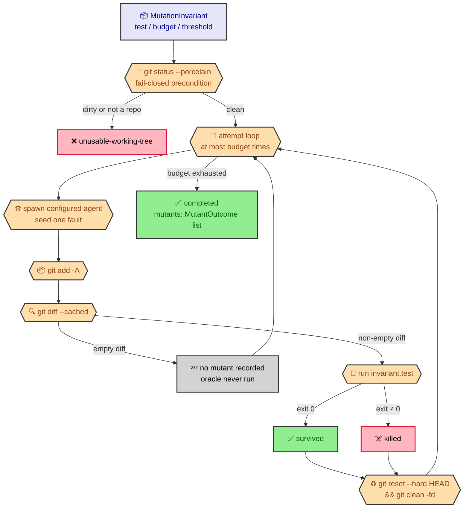

# Mutation harness

The mutation harness (`src/core/eval/mutation-harness.ts`) is the execution
primitive for a `kind: mutation` invariant: it drives the configured coding
agent to seed one small fault at a time into the project's own source, runs
the project's own test command as the deterministic oracle, and classifies
each seeded fault killed (the oracle now fails) or survived (the oracle still
passes) — no external mutation-testing framework. It is the single place a
mutation invariant's seed/detect/classify/revert sequence is implemented;
nothing else in the codebase seeds or reverts a mutant.

**Wired into `evaluateInvariant`.** `evaluateMutation`
(`src/core/eval/invariant-evaluator.ts`) runs this harness and folds its
per-mutant outcomes into an `InvariantOutcome` with budget/threshold semantics:
any survived mutant is a hard `fail`, and fewer than `threshold` evaluated
mutants is `unevaluable` — mirroring how `runWebLifecycle` shipped standalone
before `web-deterministic-fold` wired it into `judgeCase` — see
[eval invariant manifest](eval-invariants.md).

`evaluateMutation` persists every mutant's diff and oracle output under
`.ratchet/evals/runs/<runId>/artifacts/invariants/<id>/` and memoizes the
reduced outcome alongside it, keyed by `(run.runId, invariant.id)`, so a
survived mutant is replayable from disk and a repeated evaluation of the same
run never spawns the agent a second time.

## Overview



## Contract

```ts
export async function runMutationHarness(
  invariant: MutationInvariant,
  cwd: string,
  deps: MutationHarnessDeps = {}
): Promise<MutationHarnessOutcome>;
```

- **`invariant`** — a resolved `MutationInvariant` (`src/core/eval/invariants.ts`):
  `test` (the user's own test command, the oracle), `budget` (positive integer
  ceiling on seed attempts), and `threshold` (not enforced by this harness —
  see [Agent-neutrality](#agent-neutrality) note below).
- **`cwd`** — the working directory every git and test command runs in, and
  the `cwd` the spawned agent is launched in.
- **`deps`** — the injectable seams below; every field defaults to a real
  implementation, so a bare `runMutationHarness(invariant, cwd)` call is
  production behavior and tests override individual seams with fakes.

### Sequence

1. **Fail-closed precondition** — `deps.bash` (default `realBashRunner`) runs
   `git status --porcelain`. A non-zero exit (not a git repository, or git
   unavailable), a thrown call (git binary missing), or non-empty stdout
   (uncommitted changes) all return `{ kind: 'unusable-working-tree', reason }`
   immediately — no agent is spawned and no test command runs.
2. **Seed** — for each of up to `invariant.budget` attempts, the harness
   builds a spawn request the same way `judge.ts`'s `buildVoteRequest` does:
   `RATCHET_EVAL_AGENT_CMD`, when set, stands in for the agent binary
   (deterministic e2e testing); otherwise `resolveAdapter(deps.agentName)`
   resolves the configured coding agent's adapter and `buildRequest` builds
   the request, which `deps.spawner` (default `realSpawner`) runs. The
   instructions (`buildSeedInstructions`) ask the agent to make exactly one
   small, discrete edit to a non-test source file and to not run the test
   suite itself.
3. **Detect** — `git add -A` (stages tracked and untracked changes, so a new
   file the agent created is not silently invisible) followed by
   `git diff --cached` captures the fault as a unified diff. An **empty
   diff** means the agent made no change this attempt: nothing is recorded as
   a mutant, the oracle is never run for it, and the loop moves to the next
   attempt.
4. **Run the oracle, classify** — a non-empty diff runs `invariant.test`
   through `deps.bash`, the same seam `judgeCheck` and `evaluateDeterministic`
   already shell out with. `exitCode === 0` classifies the mutant `survived`;
   any non-zero exit classifies it `killed`. The mutant's `index` (the
   0-based attempt number), `diff`, `outcome`, and `testResult` are recorded.
5. **Revert, unconditionally** — after a mutant is classified (killed or
   survived), `git reset --hard HEAD && git clean -fd` restores both tracked
   and untracked state before the next attempt, so every attempt after the
   first runs against the unmutated project.
6. **Return** — once `invariant.budget` attempts have run (or ended early via
   the precondition), the harness returns `{ kind: 'completed', mutants }`.
   `mutants` may be shorter than `budget` when one or more attempts produced
   an empty diff.

## Injectable seams (`MutationHarnessDeps`)

```ts
export interface MutationHarnessDeps {
  bash?: BashRunner;
  spawner?: Spawner;
  agentName?: string;
}
```

| Field | Default | Purpose |
|---|---|---|
| `bash` | `realBashRunner` (`src/core/batch/engine/proof-of-work.ts`) | Runs `git status --porcelain`, `git add -A`, `git diff --cached`, `invariant.test`, and the revert command. |
| `spawner` | `realSpawner` (`src/core/batch/engine/agent.ts`) | Spawns the coding-agent subprocess built by the resolved adapter's `buildRequest`. |
| `agentName` | the engine's default agent | Selects which registered adapter (`resolveAdapter`) builds the seed request; unset resolves the configured default, exactly like `JudgeDeps.agentName`. |

All defaults are production-real; every field is independently overridable
with a fake so tests never shell out to a real git command or spawn a real
coding agent.

## `MutationHarnessOutcome`

```ts
export interface MutantOutcome {
  index: number;
  diff: string;
  outcome: 'killed' | 'survived';
  testResult: BashResult;
}

export type MutationHarnessOutcome =
  | { kind: 'unusable-working-tree'; reason: string }
  | { kind: 'completed'; mutants: MutantOutcome[] };
```

- **`unusable-working-tree`** — the fail-closed precondition tripped; `reason`
  names why (dirty tree, not a git repository, or git unavailable). No mutant
  was seeded.
- **`completed`** — the budget-bounded loop ran to completion. `mutants` holds
  one `MutantOutcome` per attempt that actually seeded a fault (a non-empty
  diff), in attempt order; an attempt whose diff was empty contributes no
  entry. `MutantOutcome.index` is the 0-based attempt number within the
  budget-bounded loop (not re-indexed past skipped no-diff attempts), so a
  mutant's position in the loop is traceable even when earlier attempts were
  skipped.

`MutationHarnessOutcome` is intentionally not an `InvariantOutcome` itself —
reducing it into that shape, and enforcing `threshold` (the floor on how many
mutants must be evaluated), is `mutation-evaluator-fold`'s job. This harness
stays independently testable in isolation from that reduction.

## Agent-neutrality

Every seed request is built through `resolveAdapter(deps.agentName).buildRequest(...)`
(or the `RATCHET_EVAL_AGENT_CMD` test override) — the same adapter registry
and spawn seam `judge.ts`'s `llm-judge` binding uses. There is no
agent-specific branch anywhere in this module: `runMutationHarness` never
checks which coding agent is configured before seeding, satisfying the
`multi-agent-support` standard by construction.
