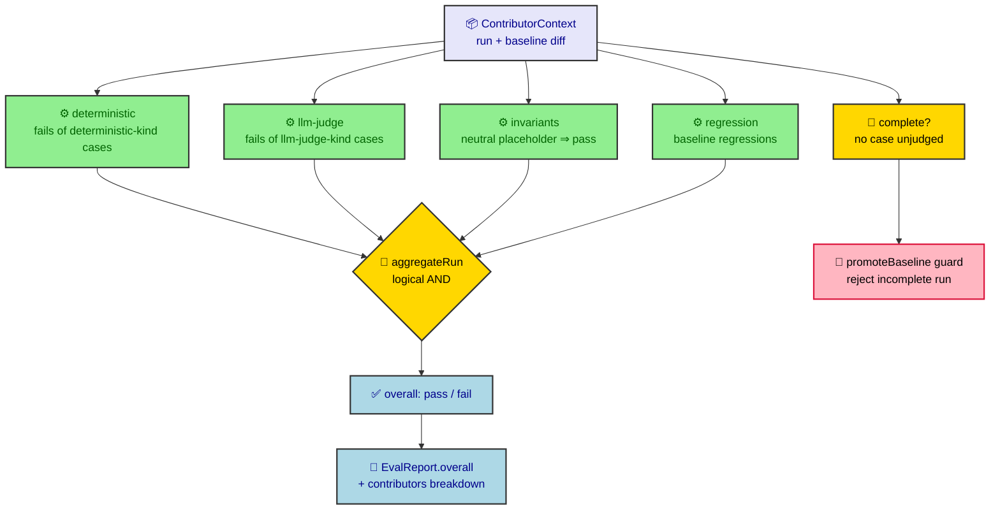

# Eval verdict aggregation

The verdict-aggregation core (`src/core/eval/aggregate.ts`) is the single place an
eval run's overall pass/fail is decided. It computes the run-level verdict as a
logical **AND over named contributors**: the run passes only when every
contributor passes. `report.ts` routes its `overall` verdict through this core
and `promoteBaseline` routes its completeness check through it, so the gate has
one source of truth and new gate capabilities plug in at one defined extension
point.

## Overview



## Contributor model

A **contributor** is a named gate signal that reduces the run context to one
pass/fail outcome. It is the defined extension point: a new gate capability
implements the `Contributor` interface and registers itself in the contributor
set — the aggregation logic does not change.

```ts
type ContributorId = 'deterministic' | 'llm-judge' | 'invariants' | 'regression';

interface ContributorContext {
  run: EvalRun;
  diff: BaselineDiff;
}

interface ContributorOutcome {
  id: ContributorId;
  status: 'pass' | 'fail';
  failing: string[]; // case ids that caused this contributor to fail
}

interface Contributor {
  id: ContributorId;
  evaluate(ctx: ContributorContext): ContributorOutcome;
}
```

The context is assembled in memory by `report.ts` from the already-loaded run and
its baseline diff; contributors do no filesystem or process I/O.

### Built-in contributors

| Contributor | Fails when | Failing ids |
|---|---|---|
| `deterministic` | any `deterministic`-bound case is judged `fail` | those case ids |
| `llm-judge` | any `llm-judge`-bound case is judged `fail` | those case ids |
| `regression` | the baseline diff reports a regression (passed in baseline, fails now) | the regressed case ids |
| `invariants` | never (neutral placeholder with nothing to evaluate) | always empty |

The `deterministic` and `llm-judge` contributors partition the run's cases by
each case snapshot's `bindingKind`. The `invariants` contributor is registered as
a placeholder that always reports `pass`; it is identity to the AND and exists so
a later capability can fill it in without reshaping the aggregation seam.

## The AND rule

```ts
function aggregateRun(
  ctx: ContributorContext,
  contributors: Contributor[] = DEFAULT_CONTRIBUTORS
): { overall: 'pass' | 'fail'; complete: boolean; contributors: ContributorOutcome[] };
```

`aggregateRun` evaluates every contributor and returns:

- `overall` — `pass` if and only if **every** contributor reports `pass`; a
  single failing contributor fails the whole run. AND over an empty or neutral
  contributor is `pass`, so a neutral contributor never changes the verdict.
- `complete` — `true` when no case in the run is `unjudged`. This is the same
  completeness definition used by the baseline-promotion guard.
- `contributors` — the per-contributor breakdown, in display order
  (`deterministic`, `llm-judge`, `invariants`, `regression`), each carrying its
  `status` and the case ids that failed it.

`DEFAULT_CONTRIBUTORS` is the built-in set. Callers may pass an explicit
contributor list to select a subset; selection by config and CLI is layered on
top of this parameter without reshaping the core.

## Routing

- **`report.ts`** builds the `ContributorContext` from the loaded run and the
  baseline diff, calls `aggregateRun`, and sets `EvalReport.overall` to
  `aggregate.overall` and `EvalReport.contributors` to the breakdown. No inline
  pass/fail expression decides the overall verdict.
- **`ratchet eval run`** renders the aggregated `overall` verdict and the
  per-contributor breakdown in both text and `--json` output.
- **`promoteBaseline`** rejects a run whose `complete` signal is `false`,
  throwing an error that names the run as incomplete and leaving
  `.ratchet/evals/baseline.json` unchanged. An incomplete run can therefore never
  become the regression baseline future runs are judged against.
