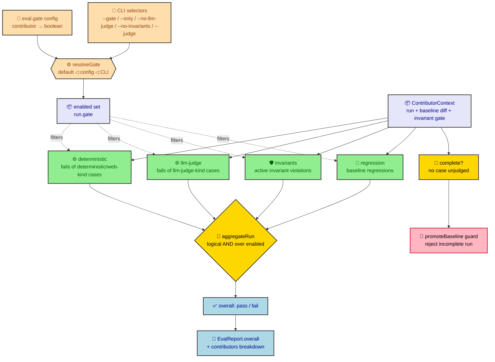

# Eval verdict aggregation

The verdict-aggregation core (`src/core/eval/aggregate.ts`) is the single place an
eval run's overall pass/fail is decided. Rather than scatter pass/fail logic
across the commands, every signal that can fail a run is modelled as a named
**contributor**, and the run's verdict is a logical **AND** over them: the run
passes only when every contributor passes. `report.ts` routes its `overall`
verdict through this core and `promoteBaseline` routes its completeness check
through it, so the gate has one source of truth and new gate capabilities plug in
at one defined extension point.

Key terms used throughout this document:

- **contributor** — a named gate signal that reduces the whole run to one
  pass/fail outcome (e.g. `deterministic`, `llm-judge`, `invariants`,
  `regression`). Contributors are the defined extension point: a new gate
  capability is a new contributor, and the aggregation logic does not change.
- **the AND rule** — the run is `pass` only if *every* evaluated contributor is
  `pass`; a single failing contributor fails the whole run. AND over no
  contributors is `pass`, so a neutral or disabled contributor never changes the
  verdict.
- **enabled set (the gate)** — which contributors actually run and count,
  resolved with precedence `default (all enabled) ◁ config ◁ CLI` and persisted on
  the run as `EvalRun.gate`. A disabled contributor takes no part in the AND.
- **complete** — a run in which no case is left `unjudged`. Completeness is
  separate from the pass/fail verdict and is what the baseline-promotion guard
  requires: only a complete run may be promoted.

## Overview



## Contributor model

A **contributor** is a named gate signal that reduces the run context to one
pass/fail outcome. It is the defined extension point: a new gate capability
implements the `Contributor` interface and registers itself in the contributor
set — the aggregation logic does not change.

```ts
type ContributorId = 'deterministic' | 'llm-judge' | 'invariants' | 'regression';

interface ContributorContext {
  run: EvalRun;
  diff: BaselineDiff;
  invariants?: InvariantGateResult; // precomputed run-level invariant gate
}

interface ContributorOutcome {
  id: ContributorId;
  status: 'pass' | 'fail';
  failing: string[]; // case ids that caused this contributor to fail
}

interface Contributor {
  id: ContributorId;
  evaluate(ctx: ContributorContext): ContributorOutcome;
}
```

The context is assembled in memory by `report.ts` from the already-loaded run, its
baseline diff, and the precomputed invariant gate result; contributors do no
filesystem or process I/O.

### Built-in contributors

| Contributor | Fails when | Failing ids |
|---|---|---|
| `deterministic` | any `deterministic`- or `web`-bound case is judged `fail` | those case ids |
| `llm-judge` | any `llm-judge`-bound case is judged `fail` | those case ids |
| `invariants` | any **active** manifest invariant is violated or unevaluable, or the manifest is unloadable | the violating invariant ids (or the manifest filename) |
| `regression` | the baseline diff reports a regression (passed in baseline, fails now) | the regressed case ids |

The `deterministic` and `llm-judge` contributors partition the run's cases by each
case snapshot's `bindingKind`, via `contributorForBindingKind(kind): ContributorId`
(`src/core/eval/aggregate.ts`) — the single place a binding kind maps to the
contributor that gates it: `deterministic` and `web` both fold to
`'deterministic'` (a `web`-bound case gates exactly like a `deterministic`-bound
one, with no separate `'web'` contributor id), and `llm-judge` maps to itself.
`execute.ts` calls the same function to decide whether a bound case's contributor
is enabled, so the binding-kind-to-contributor mapping has one source of truth
across execution and aggregation. The `invariants` and `regression` contributors
are the two **run-level** gates (their failing ids are invariant/case names, not
per-case verdicts). Like `regression`, which reads the precomputed
`diff.regressions`, the pure `invariants` contributor reads a precomputed
`invariants.failing`: the async manifest load and per-invariant evaluation happen
upstream in the run-level **invariant gate** (`evaluateInvariantGate`, see
[Eval invariant manifest](eval-invariants.md#gate-contributor)), so the
aggregation core stays synchronous and I/O-free. When the contributor is disabled
the gate is not evaluated and `invariants` is absent from the context.

## The AND rule

```ts
function aggregateRun(
  ctx: ContributorContext,
  contributors: Contributor[] = DEFAULT_CONTRIBUTORS
): { overall: 'pass' | 'fail'; complete: boolean; contributors: ContributorOutcome[] };
```

`aggregateRun` evaluates every contributor and returns:

- `overall` — `pass` if and only if **every** contributor reports `pass`; a
  single failing contributor fails the whole run. AND over an empty or neutral
  contributor is `pass`, so a neutral contributor never changes the verdict.
- `complete` — `true` when no case in the run is `unjudged`. This is the same
  completeness definition used by the baseline-promotion guard.
- `contributors` — the per-contributor breakdown, in display order
  (`deterministic`, `llm-judge`, `invariants`, `regression`), each carrying its
  `status` and the case ids that failed it.

`DEFAULT_CONTRIBUTORS` is the built-in set. Callers may pass an explicit
contributor list to select a subset; selection by config and CLI is layered on
top of this parameter without reshaping the core.

## Contributor selection (the gate)

Which contributors execute and gate a run is resolved by `resolveGate`
(`src/core/eval/gate.ts`) into the **enabled contributor set**. The resolution
precedence is `default(all-enabled) ◁ config ◁ CLI`:

1. **Default** — every built-in contributor is enabled.
2. **Config** — the `eval.gate` map in `.ratchet/config.yaml` toggles individual
   contributors (`{ contributor-id: boolean }`); an omitted contributor stays
   enabled.
3. **CLI** — flags on `ratchet eval run` override the config: `--gate <ids>` sets
   the enabled set outright, `--only <ids>` restricts to the listed ids,
   `--no-llm-judge` clears the `llm-judge` contributor, `--no-invariants` clears
   the `invariants` contributor, and the deprecated `--judge <mode>` is mapped onto
   the gate (`deterministic` ⇒ `llm-judge` off, `llm-judge` ⇒ `deterministic` off,
   `auto` ⇒ both on). Unknown ids in `--gate`/`--only` are rejected with the valid
   ids listed.

`ALL_CONTRIBUTOR_IDS` is the contributor vocabulary, derived from
`DEFAULT_CONTRIBUTORS` so there is one source of truth. The resolved enabled set
is persisted on the run as `EvalRun.gate` (display order). Selection effects:

- **Execution** — `executeRun` records a bound case whose binding-kind
  contributor is disabled as `unjudged` (the reason names the disabled
  contributor) instead of executing it; no fixture is materialized and no judge
  is spawned. A disabled contributor therefore leaves the run **incomplete**.
- **Aggregation** — `buildReport` filters `DEFAULT_CONTRIBUTORS` by `run.gate`
  before calling `aggregateRun`, so the AND and the per-contributor breakdown
  cover exactly the enabled contributors. A disabled contributor takes no part in
  the verdict. (A legacy run persisted with no `gate` ANDs over the full set.) When
  the `invariants` contributor survives the filter, `buildReport` evaluates the
  run-level invariant gate once and feeds the result into the context; when it is
  disabled, the gate is not evaluated and no manifest command runs.
- **Promotion** — because a disabled contributor leaves cases `unjudged`, the
  run is incomplete and the `promoteBaseline` guard refuses it (below), so a
  partial run can never become the baseline.

## Routing

- **`report.ts`** builds the `ContributorContext` from the loaded run, the
  baseline diff, and the run-level invariant gate result, calls `aggregateRun`, and
  sets `EvalReport.overall` to `aggregate.overall` and `EvalReport.contributors` to
  the breakdown (plus `EvalReport.invariants` / `EvalReport.loadError`). No inline
  pass/fail expression decides the overall verdict.
- **`ratchet eval run`** renders the aggregated `overall` verdict and the
  per-contributor breakdown in both text and `--json` output, surfacing a violated
  invariant (and a regression) as a run-level violation first, ahead of the
  per-case detail.
- **`promoteBaseline`** rejects a run whose `complete` signal is `false`,
  throwing an error that names the run as incomplete and leaving
  `.ratchet/evals/baseline.json` unchanged. An incomplete run can therefore never
  become the regression baseline future runs are judged against.
