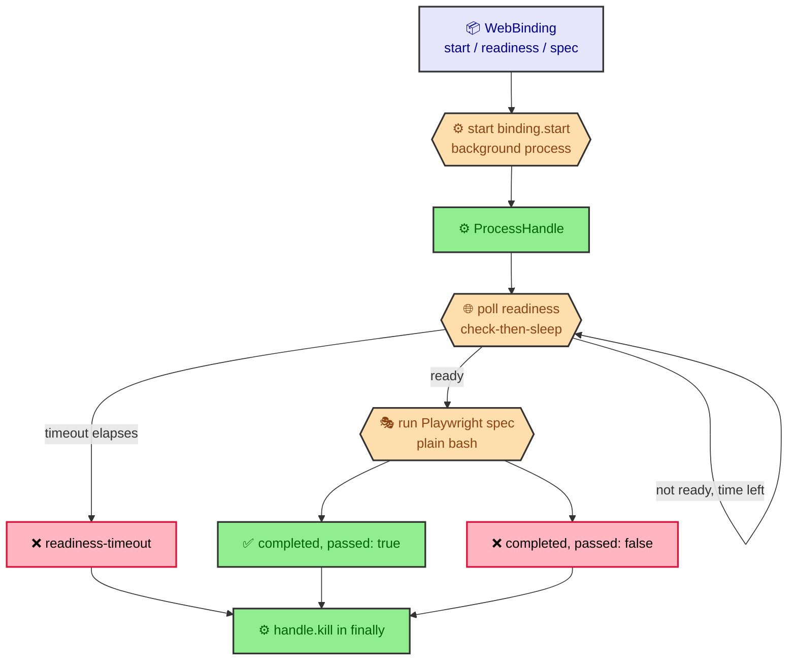

# Web binding lifecycle harness

The web binding lifecycle harness (`src/core/eval/web-lifecycle.ts`) is the
execution primitive for a `kind: web` eval binding: it starts the binding's
app, waits for it to become ready within a fail-closed timeout, runs the
binding's Playwright spec, and always tears the started process down. It is
the single place a `web` binding's start/poll/run/teardown sequence is
implemented; nothing else in the codebase spawns or polls a web binding's app.

**Not yet wired into `judgeCase`.** `judgeCase` (`src/core/eval/judge.ts`)
still throws for `web` bindings — reducing `WebLifecycleOutcome` into a
`CaseVerdict` and folding it into the `deterministic` contributor is a later
change in the `playwright-web-tier` phase. This page documents the harness's
own contract, independent of that wiring.

## Overview



## Contract

```ts
export async function runWebLifecycle(
  binding: WebBinding,
  cwd: string,
  deps: WebLifecycleDeps = {}
): Promise<WebLifecycleOutcome>;
```

- **`binding`** — a resolved `WebBinding` (`src/core/eval/spec.ts`): `start`
  (the boot command), `readiness` (a `WebReadiness` probe — exactly one of
  `url`/`command`, plus a required `timeoutMs`), and `spec` (the
  repo-relative Playwright spec path).
- **`cwd`** — the working directory every step runs in (the fixture working
  copy for an eval case).
- **`deps`** — the injectable seams below; every field defaults to a real
  implementation, so a bare `runWebLifecycle(binding, cwd)` call is
  production behavior and tests override individual seams with fakes.

### Sequence

1. **Start** — `deps.start` (default `realProcessStarter`) starts
   `binding.start` as a background process and returns immediately with a
   `ProcessHandle`, rather than awaiting completion like `BashRunner` does.
2. **Poll readiness, fail-closed** — `deps.checkReadiness` (default
   `defaultReadinessChecker`) is polled check-then-sleep (never
   sleep-then-check, so an already-ready app is not penalized one poll
   interval) while `now() < deadline`, where
   `deadline = now() + binding.readiness.timeoutMs`. The timeout elapsing
   with no success returns `{ kind: 'readiness-timeout' }` — the spec is
   never run and readiness is never assumed.
3. **Run the spec** — once ready, `` `npx playwright test ${binding.spec}` ``
   runs through `deps.bash` (default `realBashRunner`), the same seam
   `judgeCheck` (`judge.ts`) uses for `deterministic` bindings. `npx` resolves
   a locally-installed `playwright` binary regardless of which package
   manager populated `node_modules/.bin`. `passed = result.exitCode === 0` —
   Playwright's own pass/fail reduction, with no interpretation of stdout.
4. **Teardown, always** — `handle.kill()` runs in a `finally` wrapping steps 2
   and 3, so it runs on the pass path, the fail path, the readiness-timeout
   path, and when `bash`/`checkReadiness` throws unexpectedly (the exception
   still propagates; teardown just runs first).

## Injectable seams (`WebLifecycleDeps`)

```ts
export interface ProcessHandle {
  readonly pid: number | null;
  kill(): void;
}
export type ProcessStarter = (command: string, cwd: string) => ProcessHandle;

export type ReadinessChecker = (
  readiness: WebReadiness,
  cwd: string,
  bash: BashRunner
) => Promise<boolean>;

export interface WebLifecycleDeps {
  start?: ProcessStarter;
  bash?: BashRunner;
  checkReadiness?: ReadinessChecker;
  pollIntervalMs?: number;
  sleep?: (ms: number) => Promise<void>;
  now?: () => number;
}
```

| Field | Default | Purpose |
|---|---|---|
| `start` | `realProcessStarter` | Starts `binding.start` detached, in its own process group, via `spawn('bash', ['-c', command], { cwd, detached: true })`. `kill()` signals the whole group (`process.kill(-pid, 'SIGTERM')`) so a nested process a dev-server launcher forks is not leaked. |
| `bash` | `realBashRunner` (`src/core/batch/engine/proof-of-work.ts`) | Runs a command to completion and resolves with its exit code/stdout/stderr; used for command-probe readiness checks and the Playwright spec run. |
| `checkReadiness` | `defaultReadinessChecker` | Runs `bash(readiness.command, cwd)` and checks `exitCode === 0` for a command probe, or `fetch(readiness.url).ok` for a URL probe. |
| `pollIntervalMs` | `250` | Delay between readiness checks. |
| `sleep` | real `setTimeout`-backed sleep | Injectable so timeout tests advance a fake clock instead of waiting in real time. |
| `now` | `Date.now` | Injectable so tests can drive the readiness deadline deterministically. |

All defaults are production-real; every field is independently overridable
with a fake so tests never spawn a process, hit the network, or wait on a real
timer.

## `WebLifecycleOutcome`

```ts
export type WebLifecycleOutcome =
  | { kind: 'readiness-timeout' }
  | { kind: 'completed'; passed: boolean; result: BashResult };
```

- **`readiness-timeout`** — the app never became ready within
  `readiness.timeoutMs`; the Playwright spec was never run.
- **`completed`** — the spec ran; `passed` reflects `result.exitCode === 0`,
  and `result` is the full `BashResult` (`exitCode`/`stdout`/`stderr`) from
  the Playwright invocation.

`WebLifecycleOutcome` is intentionally not a `CaseVerdict` — reducing it into
that shape is out of scope for this harness (see the note above).

## Agent-neutrality

The Playwright spec runs through a plain `bash(command, cwd)` call — there is
no agent-specific runner, spawner, or adapter in the invocation path. This
satisfies the `multi-agent-support` standard by construction rather than by
special-casing: `runWebLifecycle` never branches on which coding agent is
driving `ratchet`.
