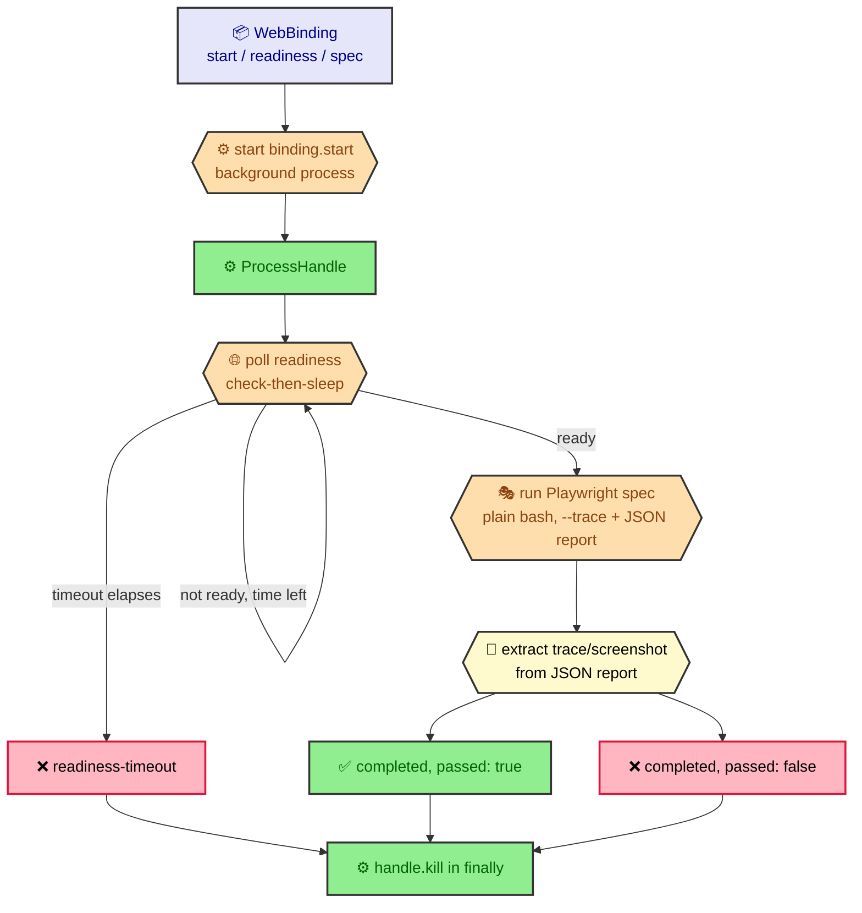

# Web binding lifecycle harness

The web binding lifecycle harness (`src/core/eval/web-lifecycle.ts`) is the
execution primitive for a `kind: web` eval binding: it starts the binding's
app, waits for it to become ready within a fail-closed timeout, runs the
binding's Playwright spec, and always tears the started process down. It is
the single place a `web` binding's start/poll/run/teardown sequence is
implemented; nothing else in the codebase spawns or polls a web binding's app.

**Wired into `judgeCase`.** `judgeCase` (`src/core/eval/judge.ts`) dispatches
`web` bindings through `runWebLifecycle` and reduces its
`WebLifecycleOutcome` into a `CaseVerdict` (`judgeWeb`), which folds into the
`deterministic` contributor alongside `deterministic`-bound cases — see
[Verdict aggregation](eval-verdict-aggregation.md). This page documents the
harness's own start/poll/run/teardown contract; the verdict-reduction step
lives in `judge.ts`.

## Overview



## Contract

```ts
export async function runWebLifecycle(
  binding: WebBinding,
  cwd: string,
  deps: WebLifecycleDeps = {}
): Promise<WebLifecycleOutcome>;
```

- **`binding`** — a resolved `WebBinding` (`src/core/eval/spec.ts`): `start`
  (the boot command), `readiness` (a `WebReadiness` probe — exactly one of
  `url`/`command`, plus a required `timeoutMs`), and `spec` (the
  repo-relative Playwright spec path).
- **`cwd`** — the working directory every step runs in (the fixture working
  copy for an eval case).
- **`deps`** — the injectable seams below; every field defaults to a real
  implementation, so a bare `runWebLifecycle(binding, cwd)` call is
  production behavior and tests override individual seams with fakes.

### Sequence

1. **Start** — `deps.start` (default `realProcessStarter`) starts
   `binding.start` as a background process and returns immediately with a
   `ProcessHandle`, rather than awaiting completion like `BashRunner` does.
2. **Poll readiness, fail-closed** — `deps.checkReadiness` (default
   `defaultReadinessChecker`) is polled check-then-sleep (never
   sleep-then-check, so an already-ready app is not penalized one poll
   interval) while `now() < deadline`, where
   `deadline = now() + binding.readiness.timeoutMs`. The timeout elapsing
   with no success returns `{ kind: 'readiness-timeout' }` — the spec is
   never run and readiness is never assumed.
3. **Run the spec** — once ready, the Playwright spec runs through `deps.bash`
   (default `realBashRunner`), the same seam `judgeCheck` (`judge.ts`) uses
   for `deterministic` bindings, as:
   `` `PLAYWRIGHT_JSON_OUTPUT_NAME=${REPORT_FILE_NAME} npx playwright test ${binding.spec} --trace=retain-on-failure --reporter=list,json` ``.
   `npx` resolves a locally-installed `playwright` binary regardless of which
   package manager populated `node_modules/.bin`. `--trace=retain-on-failure`
   forces trace capture on a failing test (Playwright's own
   conditional-capture semantics — a passing run's JSON report has no
   attachments). The `list,json` reporter pair keeps the existing
   human-readable `list` output on stdout unchanged while routing a
   machine-readable JSON report to a file named by `REPORT_FILE_NAME`
   (`.ratchet-web-report.json`, inside `cwd`) via the
   `PLAYWRIGHT_JSON_OUTPUT_NAME` env var. `passed = result.exitCode === 0` —
   Playwright's own pass/fail reduction, with no interpretation of stdout.
4. **Extract captured evidence** — `deps.readReport` (default reads the file
   with `fs.promises.readFile`) reads the JSON report, and a small internal
   walker over its `suites[].specs[].tests[].results[].attachments[]` (nested
   suites included) extracts whichever `trace`/`screenshot` attachments
   Playwright itself recorded, exposed as `artifacts?: WebArtifacts` on the
   `completed` outcome. There is no CLI override for screenshot capture — it
   is present only when the project's own `playwright.config.ts` sets
   `use.screenshot`; the harness reads whatever Playwright reports rather
   than assuming or fabricating one. Any read or parse failure (report never
   written, unexpected schema) is caught and treated as "no artifacts" —
   never thrown, and never a signal that changes `passed`.
5. **Teardown, always** — `handle.kill()` runs in a `finally` wrapping steps 2
   through 4, so it runs on the pass path, the fail path, the
   readiness-timeout path, and when `bash`/`checkReadiness` throws
   unexpectedly (the exception still propagates; teardown just runs first).

## Injectable seams (`WebLifecycleDeps`)

```ts
export interface ProcessHandle {
  readonly pid: number | null;
  kill(): void;
}
export type ProcessStarter = (command: string, cwd: string) => ProcessHandle;

export type ReadinessChecker = (
  readiness: WebReadiness,
  cwd: string,
  bash: BashRunner
) => Promise<boolean>;

export interface WebLifecycleDeps {
  start?: ProcessStarter;
  bash?: BashRunner;
  checkReadiness?: ReadinessChecker;
  pollIntervalMs?: number;
  sleep?: (ms: number) => Promise<void>;
  now?: () => number;
  readReport?: (path: string) => Promise<string>;
}
```

| Field | Default | Purpose |
|---|---|---|
| `start` | `realProcessStarter` | Starts `binding.start` detached, in its own process group, via `spawn('bash', ['-c', command], { cwd, detached: true })`. `kill()` signals the whole group (`process.kill(-pid, 'SIGTERM')`) so a nested process a dev-server launcher forks is not leaked. |
| `bash` | `realBashRunner` (`src/core/batch/engine/proof-of-work.ts`) | Runs a command to completion and resolves with its exit code/stdout/stderr; used for command-probe readiness checks and the Playwright spec run. |
| `checkReadiness` | `defaultReadinessChecker` | Runs `bash(readiness.command, cwd)` and checks `exitCode === 0` for a command probe, or `fetch(readiness.url).ok` for a URL probe. |
| `pollIntervalMs` | `250` | Delay between readiness checks. |
| `sleep` | real `setTimeout`-backed sleep | Injectable so timeout tests advance a fake clock instead of waiting in real time. |
| `now` | `Date.now` | Injectable so tests can drive the readiness deadline deterministically. |
| `readReport` | reads the file (`fs.promises.readFile`, utf-8) | Reads the Playwright JSON report at a path, mirroring `invariant-evaluator.ts`'s `FileReader` seam. Tests inject a fake returning canned JSON so no test spawns Playwright or touches a real report file. |

All defaults are production-real; every field is independently overridable
with a fake so tests never spawn a process, hit the network, or wait on a real
timer.

## `WebLifecycleOutcome`

```ts
export interface WebArtifacts {
  trace?: string;
  screenshot?: string;
}

export type WebLifecycleOutcome =
  | { kind: 'readiness-timeout' }
  | { kind: 'completed'; passed: boolean; result: BashResult; artifacts?: WebArtifacts };
```

- **`readiness-timeout`** — the app never became ready within
  `readiness.timeoutMs`; the Playwright spec was never run, and no report
  path is ever read.
- **`completed`** — the spec ran; `passed` reflects `result.exitCode === 0`,
  and `result` is the full `BashResult` (`exitCode`/`stdout`/`stderr`) from
  the Playwright invocation. `artifacts` carries whichever `trace`/
  `screenshot` paths (ephemeral, `cwd`-scoped) Playwright's own JSON report
  recorded, and is present only when at least one was found — a passing run
  captures no artifact by Playwright's own conditional-capture semantics, not
  by a harness special-case.

`WebLifecycleOutcome` is intentionally not a `CaseVerdict` itself — reducing
it into that shape (`judgeWeb`, in `judge.ts`) stays outside this harness so
`runWebLifecycle` remains independently testable in isolation from judging.

## Agent-neutrality

The Playwright spec runs through a plain `bash(command, cwd)` call — there is
no agent-specific runner, spawner, or adapter in the invocation path. This
satisfies the `multi-agent-support` standard by construction rather than by
special-casing: `runWebLifecycle` never branches on which coding agent is
driving `ratchet`.
