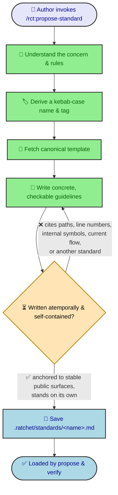

# Authoring standards

Standards are authored with `/rct:propose-standard`, which writes a single file to
`.ratchet/standards/<name>.md` and never creates a change. A standard has **no
lifecycle**: nothing re-derives, re-runs, or auto-updates it after it is written, and
no gate re-checks its prose for staleness. Because of that, the authoring workflow
requires every standard to be written **atemporally and self-contained** — true
regardless of how the implementation moves underneath it.

## Overview

The author derives a name and tag, fetches the canonical template, and fills in
concrete guidelines — but before the file is saved, the workflow holds the prose to an
atemporal, self-contained bar. Anything anchored to a location that will move (a path,
a line number, an internal symbol, a description of the current flow) or to another
standard is rewritten against a stable public surface first.

## Why standards must be atemporal

A change artifact is re-derived and re-checked as work proceeds; a standard is not.
Once written, a standard is only ever read — by `propose` (which bakes the applicable
standards into every plan) and by `verify` (which checks each change against them).
Nothing edits it back into agreement with the code. So any statement that describes a
transient snapshot of the implementation becomes a silent falsehood the moment the
implementation changes, and no gate catches it.

The authoring workflow therefore forbids the categories of prose that rot:

- **No internal file paths, line numbers, or internal symbol names.** These name a
  location that churns. A rule pinned to `src/foo/bar.ts:120` or to a private helper
  is wrong the next time the code is refactored, even though the standard still reads
  as authoritative.
- **No "current flow" walk-through.** A "which part does what today" narration
  describes a snapshot, not a durable rule. When the flow is reorganized, the
  narration is stale but the standard is never revisited.
- **Anchor to stable, public surfaces.** Guidance stays concrete to the project, but
  is framed around what stays true — the observable behavior, the public command or
  API, the user-facing contract — rather than the implementation internals that move
  underneath it.

## Why standards must be self-contained

There is **no cascading update or deletion between standards**. If a standard is
renamed or removed, nothing rewrites a reference to it in a sibling standard — that
reference simply dangles. A standard that leans on another for part of its meaning is
therefore fragile by construction.

Each standard must state everything it needs to stand on its own. The authoring
workflow forbids cross-references to other standards for exactly this reason: a
self-contained standard cannot be broken by an edit to a different file it never
mentions.

## How the rules reach every agent

The `/rct:propose-standard` skill and the `rct:propose-standard` command are rendered
from one shared authoring body, so the atemporal rules are authored once and reach
every agent in the supported-tools registry that `ratchet init` generates skills for.
The rules are phrased agent-neutrally ("your agent" / "the author"), never tuned for a
single agent.

The canonical standard template printed by `ratchet template standard` reinforces the
same discipline at the point of authoring: its Intent and Guidelines placeholders carry
short bracketed reminders to write durably and self-contained, so the structure the
author fills in nudges anti-stale wording.

## The rules stated as categories

So that the authoring guidance does not itself violate the discipline it describes, it
names the **categories** of prose to avoid — internal file paths, line numbers,
internal symbol names, current-flow walk-throughs, and cross-standard references — not
any specific file or standard. The guidance is durable for the same reason the
standards it produces are.
